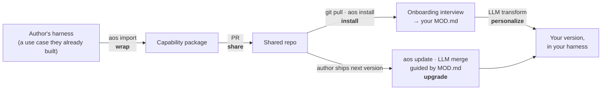
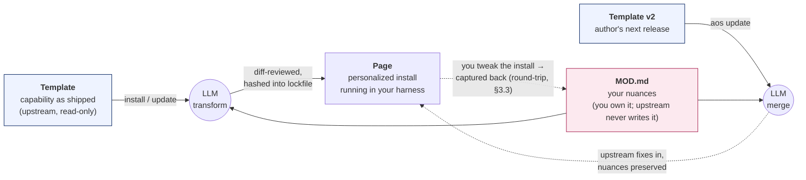
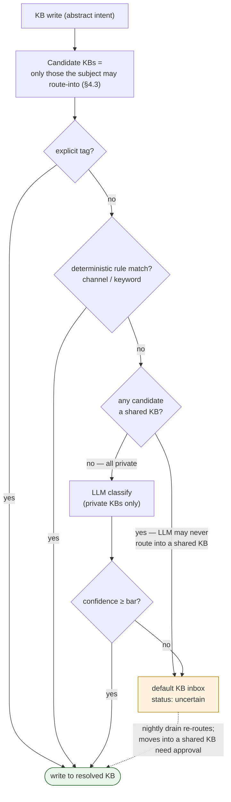
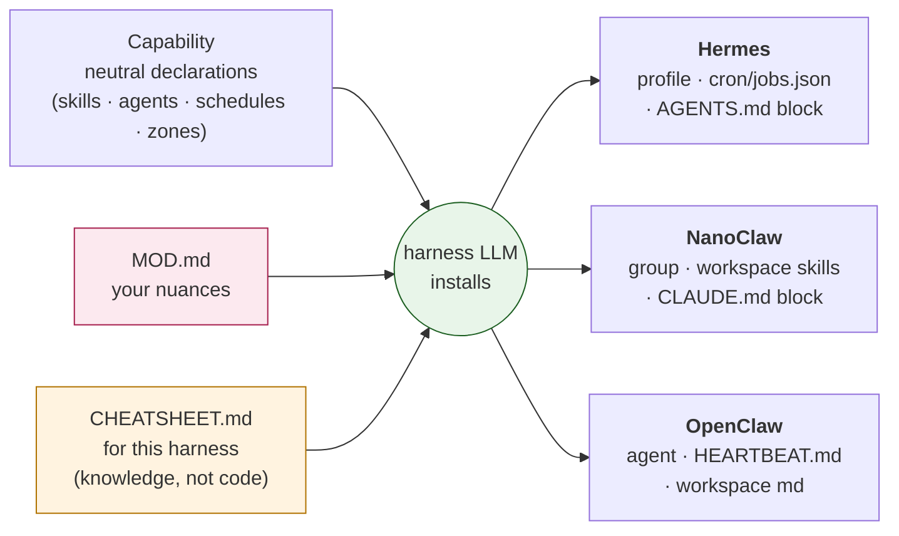

# aos — Architecture v0.1

> **`aos` is a placeholder name** (RFC-001 picks the real one). Everything else in this document is a **firm position with rationale** unless it explicitly points at an RFC. Firm ≠ final: attack any position by opening an issue against the specific section — but bring a counter-proposal, not a preference.
>
> How to read it: §1 is the story and the mental model; §3 is the one inviolable contract; §8 indexes every decision — firm positions here, open questions in [rfcs/](rfcs/). The concrete deep-dives (a capability dissected file-by-file, the install flow step-by-step, the KB/authorization layer) live in [design/](design/).

**License: MIT.** Decided, not an RFC.

---

## 1. Overview

### 1.1 What this is

**Harnesses are batteries-not-included. This kit is the batteries.**

And the batteries are a commons. Harness vendors and startups are commercializing exactly this layer — the chief-of-staff, the second brain, the building blocks. Everyone here builds it anyway, for themselves; nobody should pay rent on it, and a personal chief of staff should not be anyone's proprietary IP — it's something everybody will have. That is the reason this project is open source (MIT), and it is a design input, not a preamble: the kit optimizes for *builders owning their own setup*, never for a hosted product's convenience.

A shared, open-source layer of **capabilities** — packaged personal-ops use cases (knowledge base, GTD capture, time blocking, daily briefing, news tracking, voice interaction…) that install into the agent harness you already run (Hermes, NanoClaw, OpenClaw first; Claude Code, OpenCode next), personalize themselves to you through an onboarding interview, and keep your personalization intact across upstream updates.

**And it is not that complicated. The kit is two things: a protocol — the backbone — and a set of implementations.** (Kickoff consensus — the counterintuitive argument that won the room: keep it simple and stupid; the new software is a prompt.) The **protocol** is the agreement on how you ship a capability, change it, and keep it updated — the contracts in this document. The **implementations** are the capabilities themselves: markdown files, scripts, the thin infra layer (which is, at bottom, prompts). There is no runtime, no framework, no machinery to maintain.

What does a protocol even look like in the prompt era? **`SOUL.md` is the existence proof.** A file with an agreed name and agreed semantics that any agent, on any harness, knows how to read — that *is* a protocol now, the way a wire format used to be. The harness world already runs on this species (`SOUL.md`, `AGENTS.md`, `HEARTBEAT.md`); this kit's backbone is simply more members of it: `CAPABILITY.md`, `MOD.md`, `CHEATSHEET.md`, `kb-registry.yaml`, the `## Grants` table, the `log.md` line.

That is also why this unlocks more than we could build before: once the backbone lands, *everybody just contributes implementations* — the system evolves by contribution, not by anyone building a platform. Every section of this document should be read against that bar: anything that smells like a system rather than a protocol is a bug.

Two consequences of "batteries", stated as firm positions:

- **Capabilities ship with the kit and are designed to play along with each other.** This is a curated, composing set — gtd-capture writes through the kb router, time-blocking reads the global MOD.md working-hours model, interviewing runs on ptt-mode — not an arbitrary pile of independent packages. Composition is a merge criterion, not an accident.
- **One git repo.** Everything kit-related lives in the shared repo; you enable/disable per user. Contributing a capability means contributing it *to the repo*. **External/third-party capability sources (registries, out-of-repo packages) are explicitly out of scope for v1** — maybe someday, not now, and no contract in this document is designed around that future.

The one-story version — **the personal trainer**:

> A collaborator built a personal-trainer capability inside *their* Hermes: a skill, a cron that checks in every morning, a chunk of persona prompt. They run `aos import`, which wraps it into a capability package and splits out their personal nuances into their overlay. They open a PR; it lands in the shared repo. You install it: `aos install personal-trainer`. Onboarding interviews *you* — your goals, your gym days, your injuries — and writes *your* overlay. The harness agent takes the original capability, adapts it to your overlay, and wires it into *your* harness. Six weeks later the author ships v0.2; `aos update` merges the improvements into your personalized install without touching your nuances. Neither of you rewrote anything.

Every contract in this document exists to make that loop work: **wrap → share → install → personalize → upgrade**.

> **A note on `aos <verb>`.** `aos import`, `aos install`, `aos update` and friends are **conversational actions, not a CLI program**. You ask your harness agent in plain language — *"import my trainer use-case into the kit"*, *"install personal-trainer"*, *"update my capabilities"* — and it carries the request out by following the relevant capability's skill (§5.1: the harness's own LLM is the installer). `aos <verb>` is just readable shorthand in this document (and, on harnesses with slash-commands, an optional alias); **no external program does the work.** The only thing any helper tool ever touches is deterministic bookkeeping — hashes, the lockfile, diffs (RFC-004); every judgment is the agent's.



### 1.2 Mental model: atomic design

The layering borrows from Brad Frost's atomic design, as an analogy (the spec's own terms stay concrete):

| Atomic design | Here | Example |
|---|---|---|
| Atoms | **Skills** (Agent Skills spec folders) | `capture`, `route-to-kb`, `tts-speak` |
| Molecules | **Infrastructure capabilities** (`tags: [infra]`) | knowledge base, onboarding, ptt-mode |
| Organisms | **Use-case capabilities** (`tags: [usecase]`) | GTD capture, time blocking, personal trainer |
| Templates | **The capability as shipped** — generic structure, personalization slots empty | `capabilities/gtd-capture/` upstream |
| Pages | **The personalized install** — the template instantiated with *your* overlay in *your* harness | the GTD capture actually running in your Hermes |

<p align="center">
  
</p>

*The whole picture: **atoms** (skills) compose into **molecules** (infra capabilities) and **organisms** (use-case capabilities); your **MOD.md** overlay feeds the agentic transform, which per-harness cheat-sheets turn into the **pages** running in your harness.*

Two consequences worth making explicit:

- **Layering is metadata, not architecture.** There is one package format and a `tags` field — no separate species for "horizontal" vs "vertical" vs "harness-modifying" capabilities. A capability that ships harness-native code (a permission gate, a Hermes hook) is an ordinary capability whose harness adapter carries a `plugins/` directory (§2.4).
- **The shipped capability and the installed capability are different artifacts.** Upstream ships templates; your harness runs pages. The transform between them (§3) — not the package format — is where personalization lives, and it is the framework's load-bearing contract.

### 1.3 The seven problems — the acceptance criteria

Everything here exists to solve seven problems. If a design only hits four, it hasn't solved the problem; Appendix A maps each to its mechanism:

- **A. Share the horizontals** — build the KB / voice / scheduling / overlay layer *once* instead of everyone reinventing it.
- **B. Share the verticals** — ship "time blocking" or "meeting recap" in a form someone else can install without rewriting.
- **C. Cross-harness portability** — write a use case once; install it into Hermes, NanoClaw, OpenClaw, Claude Code, OpenCode.
- **D. Preserve personalization** — each user keeps their own nuances, hours, voice, red lines — without forking.
- **E. Enable upgrades** — `git pull` brings improvements without stomping the personalization.
- **F. Cover harness modifications** — some things (permission gates, hooks) require modifying the harness itself; they must fit the same model.
- **G. Lower the contribution barrier** — everyone already has a working version; "wrap what you already built" must feel easy, not like a rewrite.

Two ecosystem facts (researched, mid-2026) constrain everything:

1. **The Agent Skills spec (SKILL.md folders, agentskills.io) is the only primitive that is portable today** (~40 harnesses). Everything portable in a capability is expressed as spec-compliant skill folders; everything else is per-harness.
2. **Nothing else rhymes.** Hooks, schedules, sub-agent definitions, and memory files differ materially across harnesses (declarative JSON vs TS modules vs YAML recipes vs workspace markdown). Cross-harness support is therefore a **translation** concern — per-harness cheat-sheets the installing LLM reads (§5) — and a capability honestly declares what it needs from a host rather than pretending the seam doesn't exist.

---

## 2. The capability package

**The right mental model is a distro package (apt/dpkg).** Installing one package does many things — drops files in `etc/`, creates launchers, registers services, sometimes installs a kernel module. Installing one *capability* does many things — places skills, creates a sub-agent/persona, registers schedules, injects context, sometimes drops a harness plugin. And like a package, a capability **declares** all of it; the installer (here: the harness LLM, §5) performs it, records it, and can reverse it.

### 2.1 Directory layout

```
capabilities/<id>/
  CAPABILITY.md              # manifest: typed frontmatter + prose install narrative — §2.2
  README.md                  # for humans & PR review: what it does, support matrix
  skills/<skill-id>/         # Agent Skills spec folders — the portable core
    SKILL.md
    ...
  agents/<name>.agent.yaml   # neutral sub-agent/profile spec — §2.3 (only if it needs its own agent)
  ONBOARDING.md              # frontmatter = typed questions (id, prompt, type, required,
                             #   secret, re_ask) — ALSO validates MOD.md frontmatter (§3.1);
                             #   body = the conversational interview script. Same file-shape as
                             #   CAPABILITY.md. Optional; found by convention (no manifest pointer)
  MOD.example.md             # shipped seed for the user's MOD.md (§3.1); upstream owns it.
                             #   the user's own MOD.md is created here at install, never shipped
  kb/                        # only if it touches KBs: zone templates, schema fragments
  adapters/<harness>/        # only harness-specific overrides & native code (incl. plugins/)
```

**Normative:** every `skills/<id>/` folder MUST be a valid Agent Skills folder on its own — a harness with nothing but skill support can still consume the atoms. Everything outside `skills/` and `adapters/` MUST be harness-neutral. If a capability's `adapters/` content outweighs its neutral core, the linter flags it: that is a sign the "neutral" design is fictional and the capability should say so honestly in its support matrix.

### 2.2 The manifest: `CAPABILITY.md` — markdown + frontmatter, minimal by rule-of-two

**Firm position on format:** the manifest is a markdown file with typed YAML frontmatter — the same pattern as SKILL.md and MOD.md, so the whole kit speaks one format. **Frontmatter** carries the machine-checkable declarations below (CI-validated); the **body** is the prose install narrative the installing LLM reads ("installing this creates a drainer agent that…", ordering notes, judgment guidance the frontmatter can't express). `README.md` stays separate for humans: what it does, the support matrix. Pure-data files with no narrative (kb-registry.yaml, lockfile) stay YAML.

**Firm position on content:** the frontmatter contains **only fields with a day-one machine consumer** (the installer, the KB router, the linter). Anything speculative stays prose until **two in-repo capabilities need it machine-read** (the *rule of two*); then, and only then, it graduates to schema. Fields nothing consumes are deleted on sight — a dead manifest field is a lie contributors will cargo-cult.

```yaml
# CAPABILITY.md frontmatter
id: gtd-capture
version: 0.1.0                 # semver; overlays record which version onboarded them
tags: [usecase]                # infra | usecase — metadata, not architecture (§1.2)
summary: Voice/text → next-action → KB write → reminder.

depends:
  capabilities: [kb, onboarding]   # no version ranges, on purpose: one repo = one revision —
                                   # every capability in your clone is from the same commit
  host:                        # enumerated vocabulary — §5.2; per key: required | preferred | optional
    scheduler: preferred       # preferred ⇒ install proceeds degraded if absent (§5.5)
    messaging.inbound: required

schedules:
  - id: nightly-drain
    cron: "0 23 * * *"         # neutral cron; installing LLM translates per cheat-sheet
    agent: drainer
    prompt_ref: skills/capture/drain-prompt.md
    degraded: manual           # manual | skip | inline — behavior when host has no scheduler

skills:                        # every shipped skill, with SCOPE — who loads it
  - id: capture
    used_by: [main]            # the user-facing front agent gets this one
  - id: drain
    used_by: [drainer]         # ONLY the drainer agent loads it — nobody else
  - id: format-entry
    used_by: [drainer, main]

kb:
  writes: [inbox]              # abstract write intents, resolved by the KB router (§4)
  zones:
    - path: ops/inbox.md       # zone this capability asks the target KB to register
      owner_agent: drainer
```

(No `onboarding` or `mod_example` field — `ONBOARDING.md` and `MOD.example.md` sit at fixed paths, found by convention. A manifest field would be a pointer to a constant, which nothing needs; the *presence* of `ONBOARDING.md` is itself the signal that a capability has an interview.)

**Skill scoping (normative):** every skill declares `used_by` — which agents load it (`main` = the harness's front agent; other names = agents from `agents/`). The installing LLM materializes each skill **only into the workspaces of the agents that use it**. No agent ever loads a skill it isn't declared to use; a capability that scopes everything to `main` is the degenerate case and the linter asks why. This is the anti-pollution rule: ten installed capabilities must not mean every agent carries fifty skills' worth of context.

Deliberately **absent** from v0.1 (deferred by rule-of-two, listed so nobody "helpfully" adds them): a `provides` surface graph, a hooks/events vocabulary, per-capability permission grants, model/cost hints. The moment two capabilities need to compose mechanically through one of these, it gets an RFC and a schema.

### 2.3 Neutral agent spec: `*.agent.yaml`

Some capabilities need their own agent (Hermes profile ≈ NanoClaw group ≈ OpenClaw agent ≈ Claude Code sub-agent). The neutral spec carries **only what all first-tier harnesses can express**; everything else is an adapter patch (`adapters/<harness>/agents/<name>.patch.yaml`).

```yaml
name: drainer
purpose: >                     # one paragraph; becomes the system-prompt seed
  Drains ops/inbox.md nightly: classifies captures, promotes to KB zones, sets reminders.
model_class: fast | balanced | deep    # installing LLM maps to a concrete model per cheat-sheet
tools: [fs.read, fs.write, shell, web] # neutral vocabulary; installing LLM maps or drops with a warning
workspace: own | shared        # own ⇒ its own profile/group; shared ⇒ runs in the main agent's context
context_files: []              # capability files rendered into its workspace
```

No provider names, no effort/permission fields, no harness-specific tuning in the neutral file — research showed those diverge materially and pretending otherwise produces silent misconfiguration.

### 2.4 Harness-native code: capabilities ship software

Some capabilities are not prompts-plus-conventions — they are, in meaningful part, **code**. The flagship example is the **permission gate** (§7, build 9): per-group/per-user/per-task access control over inbound messaging (in one live Hermes WhatsApp deployment: some groups open to everyone but only for a specific task, some groups restricted to specific users, everything else blocked by default). Several collaborators have independently built or patched exactly this — which is the argument for packaging it.

The contract:

- **Shipped software is standalone.** A capability's code is an encapsulated, self-contained program invoked across a **process boundary** (CLI, stdin/stdout, exit codes) — never linked into the harness. Write your gate in Python; when it installs into OpenClaw (TypeScript), the OpenClaw hook is a thin shim that *calls* your program. Language is the author's business; the protocol is the interface. A plugin that only works linked into one harness's runtime has failed this rule and says so in its support matrix.
- Harness-native shims live in `adapters/<harness>/plugins/`, installed only on that harness (the cheat-sheet tells the installing LLM where it goes). The neutral part of such a capability (the *policy* — rules format, onboarding that captures them, docs — and the standalone program itself) stays harness-neutral; only the thin hook/shim is per-harness.
- **Hook where possible, patch where necessary.** If the harness exposes a hook/middleware surface, the plugin uses it. If not, the capability may carry a **maintained patch** against the harness — with the standing obligation to upstream it as a PR and delete the patch when it merges. Patches are declared in the adapter dir (`patches/` + the upstream PR link), so `doctor` can warn when the harness version drifts from what the patch targets.
- The capability's README carries a **support matrix** — the honesty rule: a capability claims a harness only if someone actually runs it there, and marks each harness `hook` / `patched` / `unsupported` so users know what they're installing.

No portable hook contract exists in v0.1, deliberately: the ecosystems' hook models are incompatible (§1.3), and an abstraction over them today would be fiction.

---

## 3. Overlay & onboarding — the inviolable contract

Personalization is the whole product — it's the reason nobody shipped this layer before us. This section is the one part of the architecture that is **inviolable**: every other contract may evolve by RFC; breaking this one breaks every user's install.

### 3.1 The overlay: co-located `MOD.md`

A user's personalization lives **next to the thing it personalizes**, inside their clone of the capabilities repo:

```
<repo>/
  MOD.md                       # global: identity, timezone, working hours, sacred time, red lines
  kb-registry.yaml             # the user's KB registry (§4.1) — user-owned like MOD.md
  capabilities/gtd-capture/
    ...                        # upstream template files
    MOD.md                     # this user's nuances for gtd-capture
  .aos/                        # machine-local state, always gitignored
    installs.lock.yaml         # what's installed where, versions, artifact hashes
    backups/                   # pre-upgrade snapshots
```

`MOD.md` format: markdown with typed YAML frontmatter. Frontmatter = onboarding answers, validated against the questions in the capability's `ONBOARDING.md` frontmatter — the questions *are* the allowed-frontmatter definition, so there is no second schema (agents mutate keys reliably); body = free-text nuance injected as prompt context (humans write prose). At install the user's `MOD.md` is seeded from the shipped `MOD.example.md`, then the interview fills it. Example:

```markdown
---
capability: time-blocking
onboarded_version: 0.1.0
answers:
  deep_work_windows: ["Sun-Thu 09:00-12:00"]
  min_block: 45m
  calendar: work-google
secrets:
  google_token: {store: hermes-auth, key: gog.oauth}   # reference only — never the value
---
Never schedule over kids pickup (17:30). Prefer batching calls on Tue/Thu.
```

**The invariant (normative, CI-enforced):**

The **user-owned overlay family** is: every `MOD.md` (global + per-capability) and `kb-registry.yaml`.

1. Upstream never ships, writes, or merges into any overlay-family path. CI rejects them in PRs to the shared repo.
2. Onboarding writes **only** overlay-family files (and harness secret stores — see below).
3. Every render/merge treats the overlay family as input, never output — except the explicit round-trip in §3.3.

How a user's `MOD.md` files are versioned — committed in a private fork (full git history of your nuances) vs gitignored-untracked (simplest, backed up by `aos backup`) — is genuinely open: **RFC-005**.

**Secrets** are stored as references `{store, key}` only; actual values go into the harness-native store (Hermes `auth.json`, OpenClaw `credentials/`, NanoClaw `data/env`) at install time. A `MOD.md` can be shared, synced, or committed without leaking credentials.

### 3.2 Install flow: interview → MOD.md → agentic transform

Installation of a capability proceeds:

1. **Onboarding runs first.** The onboarding capability (itself `tags: [infra]`) interviews the user, driven by the capability's `ONBOARDING.md` (frontmatter questions + body script) — the questions are exactly the nuances the capability needs. Interviews are **re-runnable and diffable**: re-running asks only missing or `re_ask`-triggered questions; `--refresh` re-asks everything and shows a diff before writing. Nothing self-deletes.
2. **Answers create the overlay.** Typed answers land in `MOD.md` frontmatter; prose nuances land in the body.
3. **The harness agent transforms the template into the page.** The LLM takes the *original* capability (never edited) plus `MOD.md` and produces the personalized artifacts — adapted skills, agent definitions, schedules, context blocks — and materializes them into the harness per its cheat-sheet (§5). **The transform is agentic, not deterministic**: it is prompt-guided judgment, not templating. What *is* required to be deterministic is the bookkeeping around it: `installs.lock.yaml` records versions and hashes of every materialized artifact, and every install/upgrade is presented as a reviewable diff before it lands.

### 3.3 Round-trip: edits flow back to MOD.md

Users will tweak their installed (rendered) capability directly — that is normal, not drift. The contract: **whenever the user changes their installed capability, the change is also captured back into `MOD.md`** (the installing agent does this as part of the edit, or `aos sync-mod` reconciles on demand, using the lockfile hashes to detect what changed). `MOD.md` therefore remains the single durable source of truth for personalization; the rendered install is always reconstructible from `(original × MOD.md)`.

### 3.4 Upgrade flow: LLM merge, guided by the overlay

On `aos update`:

1. Pull the new upstream version of the capability (a `git pull` — which by the invariant cannot touch `MOD.md`).
2. Snapshot the current install to `.aos/backups/`.
3. **The LLM merges**: new original + current personalized install, guided by `MOD.md` — upstream improvements in, personal nuances preserved.
4. The merge is presented as a diff for user review before materializing; the lockfile is updated after.

This is problem E (§1.3) answered: `git pull` brings new capabilities and improvements; the overlay plus an agentic merge keeps personalization intact. The honest risk — LLM merge fidelity (silently dropped nuances or dropped upstream fixes) — is tracked in Appendix B with a concrete falsifier, and the diff-review step exists precisely because the transform is not deterministic.

The whole of §3 in one picture — **the load-bearing contract**. The template is upstream and never edited; `MOD.md` is yours and upstream never touches it; the *page* is always reconstructible from `template × MOD.md`:



---

## 4. Knowledge bases: registry, routing, authorization

The KB is the most load-bearing infrastructure capability: nearly every use-case capability reads or writes one. v0.1 supports **multiple KBs per user** — a KB is a repo (`kb == repo`): work, personal, management, per-client…

### 4.1 The registry: `kb-registry.yaml`

User-owned (lives at repo root next to the global `MOD.md`; same invariant — upstream never touches it):

```yaml
default: personal
kbs:
  - name: work
    path: ~/work-kb
    remote: git@...
    sync: rebase-5min          # rebase-5min | manual | none
    audience: shared           # shared | private — drives authorization (§4.3)
    methodology: karpathy-3layer
    purpose: >
      Acme company knowledge: product, customers, marketing, engineering.
    routing:                   # deterministic hints, evaluated before any LLM call
      channels: ["slack:*", "linear:*"]
      keywords: [acme, customer, pipeline]
  - name: personal
    path: ~/personal-kb
    audience: private
    methodology: karpathy-3layer
    purpose: Personal ops, relationships, life admin, drafts.
    routing:
      channels: ["whatsapp:*", "telegram:*"]
```

Capabilities never name KBs directly; they declare abstract write intents (`kb.writes: [inbox]` in the manifest) and the **router** resolves them.

### 4.2 Routing: rules first, LLM above a confidence bar, never block capture

Resolution order for every KB write:

1. **Explicit tag wins** — user prefix ("work: …") or a capability-supplied hint.
2. **Deterministic rules** — source channel/agent binding, then keyword/entity match against each KB's index. String matching; no model call.

**Before any of it: the candidate set.** The router only ever considers KBs the writing subject (agent/capability) holds a `route-into` grant for (§4.3). Authorization shapes routing, not the other way round — a KB the subject may not write to is invisible to every routing step, including the LLM classifier and the uncertain-fallback (whose "default" is the default *among the subject's writable KBs*).
3. **LLM classification** — a single cheap call with the registries' `purpose` fields as rubric, returning `{kb, confidence}`. Used only above a confidence threshold.
4. **Uncertain → default KB's inbox**, frontmatter-tagged `kb_routing: uncertain`, queued for the nightly drain to re-route with review.



Principle (inherited from the capture-inbox pattern that already runs in production): **capture latency is sacred**. Routing is allowed to be wrong cheaply and corrected asynchronously; it is never a synchronous "work or personal?" prompt in the capture path. The one hard safety property the diagram makes visible: **no path leads from the LLM classifier into a shared KB** — machine judgment only ever chooses among private KBs; anything touching a shared boundary is rule-matched, explicitly tagged, or human-approved.

### 4.3 Authorization: routing's twin

A misroute across a privacy boundary is not a bug, it is a trust-terminating event — a personal health note synthesized into a KB colleagues pull. Routing therefore sits on top of an **access-control layer**, and it is the same shape as the inter-agent permission gate (§7, build 9): **subjects** (agents, capabilities) × **objects** (KBs, zones) × **verbs** (read, write, route-into).

Normative rules in v0.1:

- **`audience: shared` KBs accept LLM-routed writes never** — rule-matched or explicitly tagged writes only. The classifier may only choose among `private` KBs.
- Zone ownership (the maintainer-zone table each KB's `AGENTS.md` carries — §4.4) is authorization data: a capability's declared `kb.zones` are grants, appended at install time, revoked at removal.
- The **permission-gate capability** (build 9, §7) implements this same model at the messaging/tool-call layer — one live implementation already exists (the Hermes WhatsApp gate). This section defines the shared vocabulary so KB routing and inbound gating don't grow two incompatible ACLs.

### 4.4 The default methodology, and the pluggable seam

v0.1 ships **exactly one** KB methodology: `karpathy-3layer` — the production-proven stack extracted from the maintainers' live KB. It rests on two named pillars:

1. **The Karpathy knowledge-base methodology** (LLM-wiki): immutable `raw/` sources with sha256 dedup → a synthesized semantic layer with `[[wikilinks]]` + frontmatter schema. Knowledge accumulates; it is never edited in place at the source layer.
2. **A rolling-window current-state mechanism**: `state/` — high-churn files holding *what is going on right now* (current status, priorities, pipeline, north star). Unlike the knowledge layers, state is a rolling window: frequently rewritten, always current, never an archive. This is what lets any agent cold-start into "where things stand" without replaying history.

Around the pillars: a maintainer-zone table in `AGENTS.md` (one writer per zone; also the zone-registration mechanism other capabilities append to), append-only `log.md`, `_ops/` lint + review queues, and an Archiver agent with sync/lint/promotion schedules.

The seam is a directory contract — a methodology is `init/` templates + `lint/` skill + archiver prompt + schema fragment — so a second methodology *can* exist, but none ships until someone actually brings one (rule-of-two again: standardize the default, keep the substrate pluggable). The full knowledge-model design — the three layers, the page schema, growth stages, the synthesis loop, and retrieval — is in [design/kb-methodology.md](design/kb-methodology.md); the routing + access-control layer that sits on top is in [design/kb-authorization.md](design/kb-authorization.md).

`kb init <name>` creates + registers a KB from the methodology templates. `kb adopt <path>` registers an **existing** KB, runs the linter, and reports divergence — it never rewrites anyone's live knowledge base.

## 5. Installation: the harness installs the batteries

### 5.1 The LLM is the installer

**Firm position: installation is performed by the harness's own agent, not by external installer code.** A capability *encapsulates its installation* declaratively — its manifest and files say **what must exist** ("this needs its own sub-agent/persona", "this runs nightly at 23:00", "the main agent must know this context", "this secret goes in your store"), never *how* to create it. Two knowledge sources meet in the middle:

- **The harness understands part of the lingo natively** — it knows its own primitives and its own filesystem.
- **The kit ships a per-harness cheat-sheet** that teaches the rest: how *this* harness expresses "agent", "schedule", "context injection", "secret store".

The install is then a conversation the harness agent has with the capability's declarations, `MOD.md`, and the cheat-sheet — the same agentic transform as §3.2, extended to the wiring itself. One neutral capability, three harnesses, no installer code — the cheat-sheet is the only per-harness thing, and it is *knowledge*, not a program:



### 5.2 Cheat-sheets: the adapter is knowledge, not code

`harnesses/<harness>/CHEATSHEET.md` is the kit's per-harness knowledge artifact. Required sections (a contract of *content*, not an API):

- **Primitive mapping** — what "agent" means here (Hermes: profile · NanoClaw: group · OpenClaw: agent + workspace · Claude Code: sub-agent), what "schedule" means, what "context block" means, with file locations and formats.
- **Materialization guide** — where each artifact kind is written and how (the §5.3 table, in prose the LLM can follow).
- **Introspection guide** — how to enumerate what already exists on this harness (powers the importer, §6).
- **Secrets** — the native store and how references resolve.
- **Removal** — how to cleanly take a capability back out.
- **Feature notes** — which `depends.host` features exist here, and the degraded-mode translation when they don't.

Terminology note: a capability's `adapters/<harness>/` directory holds its per-harness *content* (override patches, native plugins); the kit-level translation lives in the cheat-sheet. **There are no adapter programs anywhere.**

The research finding stands — harness primitives don't rhyme — but the consequence is a **richer cheat-sheet per harness, not per-harness code**. When the wiring genuinely can't be expressed as instructions — native hooks, patches — that's the §2.4 `plugins/` escape hatch, and the cheat-sheet tells the LLM where to put them.

The `depends.host` vocabulary is fixed and enumerated: `scheduler`, `messaging.inbound`, `messaging.outbound`, `voice.stt`, `voice.tts`, `calendar.read`, `calendar.write`, `email`, `secrets-store`. Adding a word requires updating every cheat-sheet — deliberate friction that keeps the neutral surface small.

### 5.3 What the cheat-sheets direct the LLM to write

| Artifact | **Hermes** | **OpenClaw** | **NanoClaw** |
|---|---|---|---|
| skill | `~/.hermes/skills/<id>/` (native SKILL.md) | workspace `skills/<id>/` | group workspace `skills/` + reference in group context file |
| agent | profile dir `~/.hermes/profiles/<name>/` + entry in `config.yaml` | agent dir + workspace files (`AGENTS.md`, `SOUL.md`) | group in `groups/<name>/` |
| schedule | entry in `~/.hermes/cron/jobs.json`, tagged `origin: aos:<cap>@<ver>` | cron job or `HEARTBEAT.md` block | jobs/heartbeat mechanism |
| context block | profile `workspace/AGENTS.md` | `AGENTS.md` / `USER.md` / `HEARTBEAT.md` | group `CLAUDE.md` |
| secret | `auth.json` / profile env | `credentials/` | `data/env` |

Every artifact written during install is tagged with its origin (a frontmatter key, a JSON field, or a marker comment) so `doctor`, `remove`, and the round-trip (§3.3) can attribute it. Claude Code and OpenCode cheat-sheets are explicitly **later**: when they land, the Claude Code one points the LLM at the native plugin/marketplace machinery (userConfig, plugin data dirs) rather than rebuilding it.

**Support matrix rule:** a capability lists a harness in its README support matrix only if someone runs it there. Honesty over abstraction.

### 5.4 Guardrails: agentic install, honest bookkeeping

The installer being an LLM does not relax the discipline — it is *why* the discipline exists:

- Every mutation is **diff-previewed** before it lands in a live harness.
- Everything materialized is **recorded** in `.aos/installs.lock.yaml` (capability, version, artifact paths, hashes).
- Every upgrade takes a **pre-merge backup**.
- `doctor` reports drift (lockfile hash ≠ on-disk artifact), degraded installs, orphaned artifacts, and patch/version mismatches (§2.4).

What is *not* open: prose-driven mutation of live configs with no lockfile, no diff, and no backup — hand-mutated harness configs accumulate `.bak` graveyards. **RFC-004** (narrowed accordingly) decides whether a small helper tool carries the bookkeeping (hashing, lockfile, diff rendering) or the playbook is prose all the way down.

### 5.5 Degraded modes

A missing `preferred`/`optional` host feature does not block install. Per-schedule `degraded:` policy: `manual` (register an invocable skill + a run-card the user or a heartbeat can trigger), `skip`, or `inline` (fold into an existing scheduled agent's prompt). `doctor` lists every degradation. This is how one capability serves harnesses with real schedulers and harnesses with none.

**Single-owner rule for schedules (normative):** a capability may be installed into several harnesses from one clone, but each of its `schedules[]` entries runs in **exactly one** harness at a time — the lockfile records which. Two harnesses running the same nightly drain against the same KB is a one-writer violation waiting to fire; the installing agent must ask (or reassign) when a second install would duplicate a schedule, and `doctor` flags duplicates.

---

## 6. The importer

The importer is a first-class v0.1 capability — it is how the commons gets seeded ("wrap what you already built" — problem G, §1.3) and how the personal-trainer loop starts. It is also, deliberately, a capability itself: it dogfoods the package contract.

Like everything else in the kit, **it is invoked conversationally, not by a CLI** (see the note on `aos <verb>` in §1.1) — and it is *more* agentic than install, because it is pure judgment (introspect → cluster → map → split) and it only *reads* your harness and writes a draft; it never mutates the live setup. You tell your harness agent, in plain language:

> *"import my trip-planning use-case — the skill and its agent — into the aos kit."*

The importer's skill then drives your harness agent (which already knows its own setup, and reads the cheat-sheet's introspection section) through this pipeline:

1. **Inventory** — the harness agent, guided by its cheat-sheet's introspection section, enumerates skills, cron entries, profiles/groups, workspace files, plugins.
2. **Cluster** — the LLM groups artifacts into candidate use cases ("these two skills + this cron + this persona fragment = trip planning").
3. **Map** — each artifact to its package primitive: skill → `skills/`, cron entry → `schedules[]` (prompt extracted to `prompt_ref`), profile → `agents/*.agent.yaml`, persona fragment → context block, KB conventions the use case relies on (directory structures, entry formats) → `kb/` zone templates + `kb.zones` declarations. **Inline secrets are flagged and never copied.**
4. **Split generic from personal** — the inverse of the install transform: reusable mechanism goes into the package skeleton; user nuance goes into a draft `MOD.md`. This split is the importer's hardest judgment and its core value.
5. **Emit** — `capabilities/<id>-draft/` + draft `MOD.md` + `GAP.md` (hardcoded paths, harness-only APIs, unmappable pieces, flagged secrets). The importer **never installs and never opens PRs itself** — output is a reviewable draft the author cleans up and submits.

Acceptance fixtures: the maintainers' existing Hermes-built trip-planning and time-blocking; the cross-user acceptance test is the personal-trainer loop end-to-end (§1.1).

---

## 7. Reference capabilities & build order

Eleven capabilities ship as v0.1's reference set (one-page specs in `capabilities/`). Order is chosen so each step exercises exactly one new seam; a step is done when the seam holds:

| # | Capability | Tags | New seam it proves |
|---|---|---|---|
| 1 | **kb** | infra | The whole neutral contract + first cheat-sheet, Hermes (registry, router, methodology, Archiver agent) |
| 2 | **onboarding** | infra | Interview engine → MOD.md; re-runnable diffs; secret references |
| 3 | **gtd-capture** | usecase | First vertical composing on kb + schedules; first real routing traffic |
| 4 | **importer** | infra | Cheat-sheet-guided introspection + the generic/personal split; format's stress test via GAP reports |
| 5 | **time-blocking** | usecase | `calendar.write` host feature + degraded modes (calendar write path is new) |
| 6 | **ptt-mode** | infra | `voice.*` host vocabulary (wraps existing TTS/PTT pieces) |
| 7 | **interviewing** | infra | Capability-depends-on-capability (consumes ptt-mode optionally) |
| 8 | **news-tracker** | usecase | Nothing new — the "boring port" proving the contract is cheap to use |
| 9 | **permission-gate** | infra | Capabilities-ship-code: `adapters/*/plugins/`, hook-vs-patch, the §4.3 ACL model enforced |
| 10 | **router** | infra | Front-door persona dispatch (fixes "multiple-personality disorder"); adopt-native-router vs kit-provided per harness |
| 11 | **agent-comms** | infra | The side doors: agent→agent envelope, the glass-box rule (no dark channels), loop/budget guards |

kb and onboarding are built together (the installer needs both); the importer lands as early as possible after them because its GAP reports are the fastest source of spec fixes.

---

## 8. Decision index

### Firm positions (argue via issues against the section)

| Decision | Position | § |
|---|---|---|
| License | MIT | header |
| Distribution | Batteries-included: one repo, curated composing set; external capability sources out of scope for v1 | §1.1 |
| Simplicity | The kit = **protocol (backbone) + implementations** — no runtime, no framework; "the new software is a prompt" | §1.1 |
| Shipped software | Standalone programs behind a process boundary; per-harness hooks are thin shims that call them | §2.4 |
| Capability format | Agent Skills superset + minimal manifest as `CAPABILITY.md` (md + typed frontmatter — one format everywhere), rule-of-two growth | §2 |
| Layering | One package kind + tags; harness code is an adapter concern | §1.2, §2.4 |
| Overlay | Co-located `MOD.md`, markdown + typed frontmatter, inviolable invariant | §3.1 |
| Install transform | Agentic end-to-end: the harness LLM installs, personalizes, and wires — with honest bookkeeping + diff review | §3.2, §5.1, §5.4 |
| Personalization round-trip | User edits flow back into MOD.md; overlay is the source of truth | §3.3 |
| Upgrades | LLM merge guided by MOD.md, backup + diff-reviewed | §3.4 |
| Multi-KB | Registry + rules-first routing, LLM only above confidence bar, uncertain → default inbox | §4.1–4.2 |
| KB authorization | Shared KBs never accept LLM-routed writes; ACL model shared with future permission gate | §4.3 |
| KB substrate | One shipped methodology (karpathy-3layer) behind a pluggable directory contract | §4.4 |
| Cross-harness | Per-harness cheat-sheets (knowledge, not code) + support-matrix honesty; no portable hook fiction | §5.2 |
| Importer | First-class in v0.1; drafts only, never installs | §6 |
| Concept name | "capability" (a capability *contains* skills; "skill"/"plugin"/"recipe" are ecosystem-reserved) | §1.2 |

### Open — RFCs (group decides)

| RFC | Question |
|---|---|
| [RFC-001](rfcs/RFC-001-naming.md) | Project name (replaces `aos` placeholder) |
| [RFC-002](rfcs/RFC-002-testing-quality.md) | How a capability proves it works before merge |
| [RFC-003](rfcs/RFC-003-governance.md) | Decision process, merge policy, cadence |
| [RFC-004](rfcs/RFC-004-installer.md) | Install bookkeeping: small helper tool, or prose all the way down |
| [RFC-005](rfcs/RFC-005-overlay-persistence.md) | MOD.md versioning: tracked in private fork vs gitignored + backup |
| [RFC-006](rfcs/RFC-006-multi-kb-routing.md) | Multi-KB routing & authorization: does §4.2–4.3 hold? (kb's contested core; decided by replay evidence) |
| [RFC-007](rfcs/RFC-007-permission-gate-vocabulary.md) | Permission-gate policy vocabulary (inventory the group's existing gates first) |
| [RFC-008](rfcs/RFC-008-agent-comms-opinionation.md) | Agent-to-agent comms: how opinionated? (normative envelope + glass-box rule vs advisory pattern) |

## Appendix A: Problems A–G → mechanism

| Problem (§1.3) | Mechanism | § |
|---|---|---|
| A. Share the horizontals | Infrastructure capabilities (kb, onboarding, ptt-mode…) in the shared repo | §2, §7 |
| B. Share the verticals | The capability package: Agent Skills core + manifest + onboarding + overlay slots | §2 |
| C. Cross-harness portability | Portable skill core + per-harness cheat-sheets read by the installing LLM + support-matrix honesty | §5 |
| D. Preserve personalization | Co-located MOD.md, inviolable invariant, round-trip | §3.1, §3.3 |
| E. Enable upgrades | `git pull` can't touch MOD.md; LLM merge guided by it, backup + diff review | §3.4 |
| F. Harness modifications | `adapters/<harness>/plugins/` in ordinary capabilities; no third layer | §2.4 |
| G. Lower the contribution barrier | The importer: introspect → cluster → map → split → draft + GAP report | §6 |

## Appendix B: Risk register

| # | Risk | Falsifier / test | Fallback |
|---|---|---|---|
| 1 | **LLM merge fidelity** — upgrades silently drop personal nuances or upstream fixes | Replay an upgrade of a personalized capability against a hand-made expected result; diff | Tighten MOD.md structure (more typed frontmatter, less prose); worst case, constrain merges to marker-block regions |
| 2 | **Routing accuracy** — misroutes poison trust in multi-KB | Replay 2 weeks of real captures, hand-labeled; misroute rate must stay <5% and the review queue must drain nightly | Drop LLM routing entirely; channel-pinned KBs + explicit tags only |
| 3 | **The "primitives rhyme" bet** — the neutral declarations + cheat-sheet translation can't express real harness needs | After porting 2 capabilities to all 3 first-tier harnesses, measure per-capability `adapters/` override volume; >~35% of neutral core falsifies the bet | Invert: portable SKILL.md core + thick per-harness packages, drop the neutral middle |
| 4 | **Round-trip discipline** — user edits to rendered installs don't make it back to MOD.md, overlay rots | `doctor` drift reports trending up over weeks of live use | Make renders read-only-by-convention + route all tweaks through a `mod` skill |
| 5 | **Spec-before-use** — contracts here that no build validates | Every § names its consuming build step (§7); a § no reference capability exercises by build 9 gets cut | Rule-of-two applies to the spec itself |
| 6 | **Duplicate schedules across harnesses** — same drain installed twice violates one-writer | `doctor` duplicate-schedule check across the lockfile | Single-owner rule (§5.5); worst case, schedules become explicitly harness-pinned in MOD.md |
