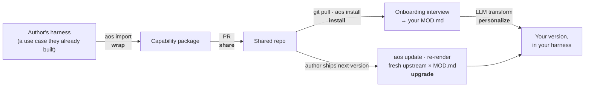
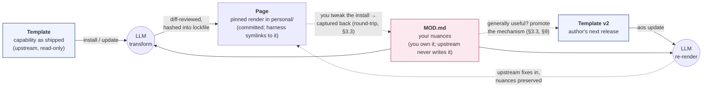
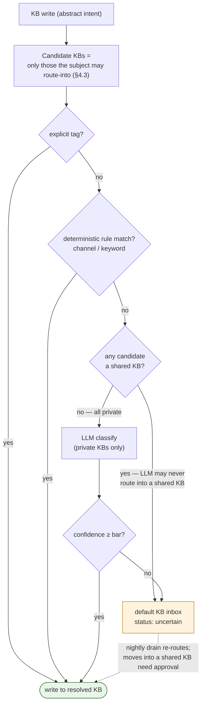
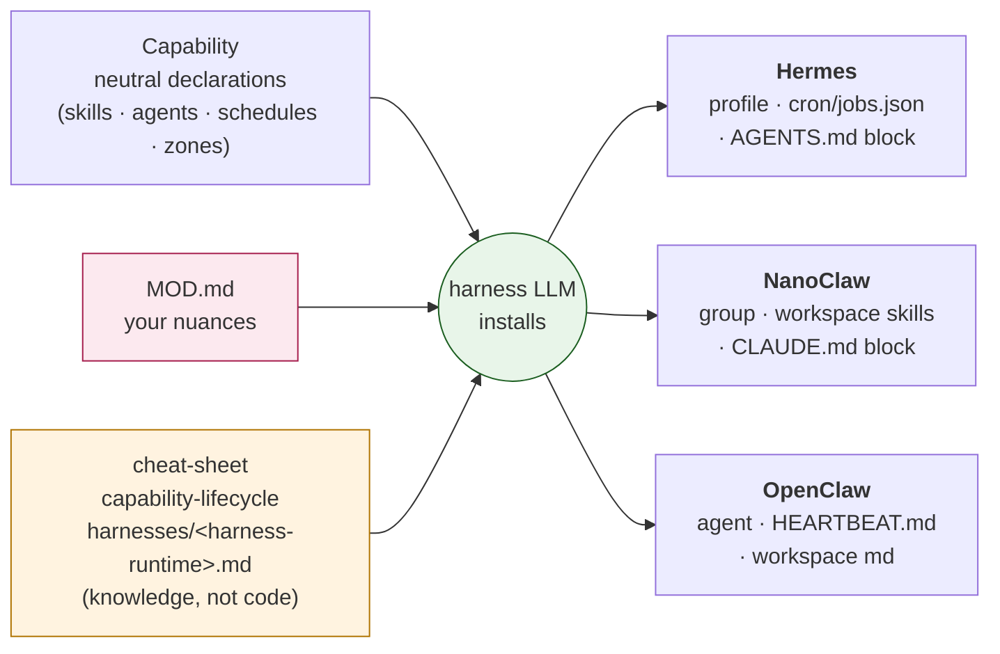

# aos — Architecture v0.1

> **`aos` is a placeholder name** (RFC-001 picks the real one). Everything else in this document is a **firm position with rationale** unless it explicitly points at an RFC. Firm ≠ final: attack any position by opening an issue against the specific section — but bring a counter-proposal, not a preference.
>
> How to read it: §1 is the story and the mental model; §3 is the one inviolable contract; §8 indexes every decision — firm positions here, open questions in [rfcs/](rfcs/). The concrete deep-dives (a capability dissected file-by-file, the install flow step-by-step, the KB/authorization layer) live in [design/](design/).

**License: MIT.** Decided, not an RFC.

---

## 1. Overview

### 1.1 What this is

**Harnesses are batteries-not-included. This kit is the batteries.**

And the batteries are a commons. Harness vendors and startups are commercializing exactly this layer — the chief-of-staff, the second brain, the building blocks. Everyone here builds it anyway, for themselves; nobody should pay rent on it, and a personal chief of staff should not be anyone's proprietary IP — it's something everybody will have. That is the reason this project is open source (MIT), and it is a design input, not a preamble: the kit optimizes for *builders owning their own setup*, never for a hosted product's convenience.

A shared, open-source layer of **capabilities** — packaged personal-ops use cases (knowledge base, GTD capture, time blocking, daily briefing, news tracking, voice interaction…) that install into the agent harness you already run (Hermes, NanoClaw, OpenClaw, Nanobot first; Claude Code, OpenCode next), personalize themselves to you through an onboarding interview, and keep your personalization intact across upstream updates.

**And it is not that complicated. The kit is two things: a protocol — the backbone — and a set of implementations.** (Kickoff consensus — the counterintuitive argument that won the room: keep it simple and stupid; the new software is a prompt.) The **protocol** is the agreement on how you ship a capability, change it, and keep it updated — the contracts in this document. The **implementations** are the capabilities themselves: markdown files, scripts, the thin infra layer (which is, at bottom, prompts). There is no runtime, no framework, no machinery to maintain.

What does a protocol even look like in the prompt era? **`SOUL.md` is the existence proof.** A file with an agreed name and agreed semantics that any agent, on any harness, knows how to read — that *is* a protocol now, the way a wire format used to be. The harness world already runs on this species (`SOUL.md`, `AGENTS.md`, `HEARTBEAT.md`); this kit's backbone is simply more members of it: `CAPABILITY.md`, `MOD.md`, the cheat-sheet (`capabilities/capability-lifecycle/harnesses/<harness-runtime>.md`, §5.2), `kb-registry.yaml`, the `## Grants` table, the `log.md` line.

That is also why this unlocks more than we could build before: once the backbone lands, *everybody just contributes implementations* — the system evolves by contribution, not by anyone building a platform. Every section of this document should be read against that bar: anything that smells like a system rather than a protocol is a bug.

Two consequences of "batteries", stated as firm positions:

- **Capabilities ship with the kit and are designed to play along with each other.** This is a curated, composing set — gtd-capture writes through the kb router, time-blocking reads the global MOD.md working-hours model, interviewing runs on ptt-mode — not an arbitrary pile of independent packages. Composition is a merge criterion, not an accident.
- **One git repo.** Everything kit-related lives in the shared repo; you enable/disable per user. Contributing a capability means contributing it *to the repo*. A clarification the household layout (§3.1) makes necessary: **locally registered source roots are in scope** — the user's own `personal/` root holds their private capabilities, and future sibling roots ("distributions", e.g. an org's shared capability repo) are the named seam for that growth. What remains **explicitly out of scope for v1 is external capability *distribution*** — registries, marketplaces, out-of-repo discovery; maybe someday, not now, and no contract in this document is designed around that future.

The one-story version — **the personal trainer**:

> A collaborator built a personal-trainer capability inside *their* Hermes: a skill, a cron that checks in every morning, a chunk of persona prompt. They run `aos import`, which wraps it into a capability package and splits out their personal nuances into their overlay. They open a PR; it lands in the shared repo. You install it: `aos install personal-trainer`. Onboarding interviews *you* — your goals, your gym days, your injuries — and writes *your* overlay. The harness agent takes the original capability, adapts it to your overlay, and wires it into *your* harness. Six weeks later the author ships v0.2; `aos update` re-renders your install from the new version plus your MOD.md — nuances intact by construction. Neither of you rewrote anything.

Every contract in this document exists to make that loop work: **wrap → share → install → personalize → upgrade**.

> **A note on `aos <verb>`.** `aos import`, `aos install`, `aos update` and friends are **conversational actions, not a CLI program**. You ask your harness agent in plain language — *"import my trainer use-case into the kit"*, *"install personal-trainer"*, *"update my capabilities"* — and it carries the request out by following the relevant capability's skill (§5.1: the harness's own LLM is the installer). `aos <verb>` is just readable shorthand in this document (and, on harnesses with slash-commands, an optional alias); **no external program does the work.** The only thing any helper tool ever touches is deterministic bookkeeping — hashes, the lockfile, diffs (RFC-004); every judgment is the agent's.


```mermaid
flowchart LR
    A["Author's harness<br/>(a use case they already built)"] -->|"aos import<br/><b>wrap</b>"| B["Capability package"]
    B -->|"PR<br/><b>share</b>"| C["Shared repo"]
    C -->|"git pull · aos install<br/><b>install</b>"| D["Onboarding interview<br/>→ your MOD.md"]
    D -->|"LLM transform<br/><b>personalize</b>"| E["Your version,<br/>in your harness"]
    C -->|"author ships next version"| F["aos update · re-render<br/>fresh upstream × MOD.md<br/><b>upgrade</b>"]
    F --> E
```

### 1.2 Mental model: atomic design

The layering borrows from Brad Frost's atomic design, as an analogy (the spec's own terms stay concrete):

| Atomic design | Here | Example |
|---|---|---|
| Atoms | **Skills** (Agent Skills spec folders) | `capture`, `route-to-kb`, `tts-speak` |
| Molecules | **Infrastructure capabilities** (`tags: [infra]`) | knowledge base, onboarding, ptt-mode |
| Organisms | **Use-case capabilities** (`tags: [usecase]`) | GTD capture, time blocking, personal trainer |
| Templates | **The capability as shipped** — generic structure, personalization slots empty | `capabilities/gtd-capture/` upstream |
| Pages | **The personalized install** — the template instantiated with *your* overlay in *your* harness | the GTD capture actually running in your Hermes |

<p align="center">
  
</p>

*The whole picture: **atoms** (skills) compose into **molecules** (infra capabilities) and **organisms** (use-case capabilities); your **MOD.md** overlay feeds the agentic transform, which per-harness cheat-sheets turn into the **pages** running in your harness.*

Two consequences worth making explicit:

- **Layering is metadata, not architecture.** There is one package format and a `tags` field — no separate species for "horizontal" vs "vertical" vs "harness-modifying" capabilities. A capability that ships harness-native code (a permission gate, a Hermes hook) is an ordinary capability whose harness adapter carries a `plugins/` directory (§2.4).
- **The shipped capability and the installed capability are different artifacts.** Upstream ships templates; your harness runs pages. The transform between them (§3) — not the package format — is where personalization lives, and it is the framework's load-bearing contract.

### 1.3 The seven problems — the acceptance criteria

Everything here exists to solve seven problems. If a design only hits four, it hasn't solved the problem; Appendix A maps each to its mechanism:

- **A. Share the horizontals** — build the KB / voice / scheduling / overlay layer *once* instead of everyone reinventing it.
- **B. Share the verticals** — ship "time blocking" or "meeting recap" in a form someone else can install without rewriting.
- **C. Cross-harness portability** — write a use case once; install it into Hermes, NanoClaw, OpenClaw, Nanobot, Claude Code, OpenCode.
- **D. Preserve personalization** — each user keeps their own nuances, hours, voice, red lines — without forking.
- **E. Enable upgrades** — `git pull` brings improvements without stomping the personalization.
- **F. Cover harness modifications** — some things (permission gates, hooks) require modifying the harness itself; they must fit the same model.
- **G. Lower the contribution barrier** — everyone already has a working version; "wrap what you already built" must feel easy, not like a rewrite.

Two ecosystem facts (researched, mid-2026) constrain everything:

1. **The Agent Skills spec (SKILL.md folders, agentskills.io) is the only primitive that is portable today** (~40 harnesses). Everything portable in a capability is expressed as spec-compliant skill folders; everything else is per-harness.
2. **Nothing else rhymes.** Hooks, schedules, sub-agent definitions, and memory files differ materially across harnesses (declarative JSON vs TS modules vs YAML recipes vs workspace markdown). Cross-harness support is therefore a **translation** concern — per-harness cheat-sheets the installing LLM reads (§5) — and a capability honestly declares what it needs from a host rather than pretending the seam doesn't exist.

---

## 2. The capability package

**The right mental model is a distro package (apt/dpkg).** Installing one package does many things — drops files in `etc/`, creates launchers, registers services, sometimes installs a kernel module. Installing one *capability* does many things — places skills, creates a sub-agent/persona, registers schedules, injects context, sometimes drops a harness plugin. And like a package, a capability **declares** all of it; the installer (here: the harness LLM, §5) performs it, records it, and can reverse it.

### 2.1 Directory layout

```
capabilities/<id>/
  CAPABILITY.md              # manifest: typed frontmatter + prose install briefing — §2.2
  README.md                  # for humans & PR review: what it does, support matrix
  skills/<id>/               # the ENTRY SKILL (same name as the capability) — §2.5
    SKILL.md                 #   the capability's runtime face: a short map
    reference/               #   on-demand depth, one level from SKILL.md
    scripts/                 #   bundled executables (run, never loaded) — §2.4
  skills/<skill-id>/         # further Agent Skills folders — the portable core
    SKILL.md
    templates/ | scripts/    #   skills bundle their own assets (Agent Skills pattern)
  agents/<name>.agent.yaml   # neutral sub-agent/profile spec — §2.3 (only if it needs its own agent)
  agents/<name>/             #   that agent's prompt bodies, co-located with its spec
  ONBOARDING.md              # frontmatter = typed questions (id, prompt, type, required,
                             #   secret, re_ask) — ALSO validates MOD.md frontmatter (§3.1);
                             #   body = the conversational interview script. Same file-shape as
                             #   CAPABILITY.md. Optional; found by convention (no manifest pointer)
  MOD.example.md             # shipped seed for the user's MOD.md (§3.1); upstream owns it.
                             #   the user's own MOD.md is created here at install, never shipped
  kb/                        # only if it touches KBs: zone templates, schema fragments
  tool/                      # only if it ships an installable deterministic tool (§2.4):
                             #   a uv package (pyproject + src/) whose install step the briefing names
  harnesses/<runtime>.md     # capability-lifecycle only: the per-harness cheat-sheets (§5.2)
  adapters/<harness>/        # only harness-specific overrides & native code (incl. plugins/)
```

**Normative:** every `skills/<id>/` folder MUST be a valid Agent Skills folder on its own — a harness with nothing but skill support can still consume the atoms. Everything outside `skills/` and `adapters/` MUST be harness-neutral (the capability-lifecycle capability's `harnesses/` cheat-sheets are the sanctioned exception — per-harness *knowledge*, §5.2, never code). If a capability's `adapters/` content outweighs its neutral core, the linter flags it: that is a sign the "neutral" design is fictional and the capability should say so honestly in its support matrix.

**Skill packaging (normative, per the Agent Skills best-practices):** a SKILL.md body stays under 500 lines; anything deeper moves to files the skill references **one level deep** (no reference chains); deterministic assets — templates, scripts — ship *inside* the skill directory (scripts are **executed, never loaded into context**); descriptions are third-person and carry concrete triggers (activities, literal user phrases, proper nouns). Skills state their one load-bearing invariant up front, and mark each section's authority explicitly: may auto-fix, report-only, or ask-first. **Skill ids must be self-descriptive out of context** — they materialize into a crowded harness where a generic verb (`install`, `update`) says nothing; `capability-installer` does. And **in-capability cross-skill references are by skill *name*, never by relative path** (materialization renders the whole folder once into `personal/` and links it as `<capability>-<id>`, so link names differ from shipped directory names; names ship unchanged) — relative paths stay inside the skill's own folder, which the whole-folder render keeps intact.

### 2.2 The manifest: `CAPABILITY.md` — markdown + frontmatter, minimal by rule-of-two

**Firm position on format:** the manifest is a markdown file with typed YAML frontmatter — the same pattern as SKILL.md and MOD.md, so the whole kit speaks one format. **Frontmatter** carries the machine-checkable declarations below (CI-validated); the **body** is the prose install narrative the installing LLM reads ("installing this creates a drainer agent that…", ordering notes, judgment guidance the frontmatter can't express). `README.md` stays separate for humans: what it does, the support matrix. Pure-data files with no narrative (kb-registry.yaml, lockfile) stay YAML.

**Firm position on content:** the frontmatter contains **only fields with a day-one machine consumer** (the installer, the KB router, the linter). Anything speculative stays prose until **two in-repo capabilities need it machine-read** (the *rule of two*); then, and only then, it graduates to schema. Fields nothing consumes are deleted on sight — a dead manifest field is a lie contributors will cargo-cult. The `x-*` prefix is reserved as the extension namespace (the `x-aos-origin` precedent): predefined fields are strict, `x-*` is free, nothing else is tolerated — the lint allowance lands when someone actually needs it.

```yaml
# CAPABILITY.md frontmatter
id: gtd-capture
version: 0.1.0                 # semver; overlays record which version onboarded them
tags: [usecase]                # infra | usecase — metadata, not architecture (§1.2)
summary: Voice/text → next-action → KB write → reminder.

depends:
  capabilities: [kb, onboarding]   # no version ranges, on purpose: a capability resolves against the roots on this machine —
                                   # every capability in your clone is from the same commit
  host:                        # enumerated vocabulary — §5.2; per key: required | preferred | optional
    cron: preferred            # preferred ⇒ install proceeds degraded if absent (§5.5)
    messaging.inbound: required

schedules:
  - id: nightly-drain
    cron: "0 23 * * *"         # neutral cron; installing LLM translates per cheat-sheet
    agent: drainer             # judgment work: an agent wakes with a prompt…
    prompt_ref: agents/drainer/nightly-drain.md   # prompt bodies co-locate with their agent (§2.1)
    degraded: manual           # manual | skip | inline — behavior when host has no cron
  - id: sync
    cron: "*/5 * * * *"
    exec: base sync --all      # …or mechanical work: the harness cron runs a
    degraded: manual           # program directly. `exec` and `agent`+`prompt_ref` are mutually
                               # exclusive per entry (lint-enforced). A bare command is provided
                               # by the capability's tool install (§2.4); a capability-relative
                               # path runs via the zero-install runner. exec programs are
                               # deterministic-only — they never call an LLM (§2.4); failures
                               # surface via files/exit codes, not by summoning an agent

skills:                        # every shipped skill, with SCOPE — who loads it
  - id: gtd-capture
    used_by: [main, drainer]   # the entry skill (§2.5) — everyone gets the map
  - id: capture
    used_by: [main]            # the user-facing front agent gets this one
  - id: drain
    used_by: [drainer]         # ONLY the drainer agent loads it — nobody else

kb:
  zones:                       # grants requested into the target base at install (§4.3)
    - path: "_ops/next-actions.md"
      owner_agent: drainer
```

(No `onboarding` or `mod_example` field — `ONBOARDING.md` and `MOD.example.md` sit at fixed paths, found by convention. A manifest field would be a pointer to a constant, which nothing needs; the *presence* of `ONBOARDING.md` is itself the signal that a capability has an interview.)

**Skill scoping (normative):** every skill declares `used_by` — which agents load it (`main` = the harness's front agent; other names = agents from `agents/`). The installing LLM materializes each skill **only into the workspaces of the agents that use it**. No agent ever loads a skill it isn't declared to use; a capability that scopes everything to `main` is the degenerate case and the linter asks why. This is the anti-pollution rule: ten installed capabilities must not mean every agent carries fifty skills' worth of context.

Deliberately **absent** from v0.1 (deferred by rule-of-two, listed so nobody "helpfully" adds them): a `provides` surface graph, a hooks/events vocabulary, per-capability permission grants, model/cost hints. The moment two capabilities need to compose mechanically through one of these, it gets an RFC and a schema.

### 2.3 Neutral agent spec: `*.agent.yaml`

Some capabilities need their own agent (Hermes profile ≈ NanoClaw group ≈ OpenClaw agent ≈ Claude Code sub-agent). The neutral spec carries **only what all first-tier harnesses can express**; everything else is an adapter patch (`adapters/<harness>/agents/<name>.patch.yaml`).

```yaml
name: drainer
purpose: >                     # one paragraph; becomes the system-prompt seed
  Drains the pending-capture view nightly: turns captures into next-actions and reminders.
model_class: fast | balanced | deep    # installing LLM maps to a concrete model per cheat-sheet
tools: [fs.read, fs.write, shell, web] # neutral vocabulary; installing LLM maps or drops with a warning
workspace: own | shared        # own ⇒ its own profile/group; shared ⇒ runs in the main agent's context
context_files: []              # capability files rendered into its workspace
```

No provider names, no effort/permission fields, no harness-specific tuning in the neutral file — research showed those diverge materially and pretending otherwise produces silent misconfiguration.

### 2.4 Harness-native code: capabilities ship software

Some capabilities are not prompts-plus-conventions — they are, in meaningful part, **code**. The flagship example is the **permission gate** (§7, build 9): per-group/per-user/per-task access control over inbound messaging (in one live Hermes WhatsApp deployment: some groups open to everyone but only for a specific task, some groups restricted to specific users, everything else blocked by default). Several collaborators have independently built or patched exactly this — which is the argument for packaging it.

The contract:

- **Shipped software is standalone.** A capability's code is an encapsulated, self-contained program invoked across a **process boundary** (CLI, stdin/stdout, exit codes) — never linked into the harness. Write your gate in Python; when it installs into OpenClaw (TypeScript), the OpenClaw hook is a thin shim that *calls* your program. Language is the author's business; the protocol is the interface. A plugin that only works linked into one harness's runtime has failed this rule and says so in its support matrix.
- Harness-native shims live in `adapters/<harness>/plugins/`, installed only on that harness (the cheat-sheet tells the installing LLM where it goes). The neutral part of such a capability (the *policy* — rules format, onboarding that captures them, docs — and the standalone program itself) stays harness-neutral; only the thin hook/shim is per-harness.
- **Hook where possible, patch where necessary.** If the harness exposes a hook/middleware surface, the plugin uses it. If not, the capability may carry a **maintained patch** against the harness — with the standing obligation to upstream it as a PR and delete the patch when it merges. Patches are declared in the adapter dir (`patches/` + the upstream PR link), so `doctor` can warn when the harness version drifts from what the patch targets. A patch may also be **agentically applied**: the install briefing can instruct the installing LLM to add a missing harness function (e.g. a gateway verb the capability needs) rather than shipping a static diff — the same upstream-PR obligation and drift-warning discipline apply.
- **Capability tools — the canonical deterministic executor.** A capability whose skills contain deterministic checklists (schema validation, glob matching, table lookups, index maintenance) SHOULD ship them as one bundled tool rather than prose-executing them per skill — as entry-skill `scripts/` (the minimal form, run via the ecosystem's zero-install runner) or, once it outgrows a single file, as an **installable package under `capabilities/<id>/tool/`** whose install step the briefing documents (e.g. `uv tool install --from <home>/upstream/capabilities/kb/tool` → a real command on PATH; recorded in the lockfile, uninstalled at removal): prose-executed glob math is what LLMs fumble silently, and one discoverable `--help` beats five checklists. The boundary is absolute: **the tool performs deterministic operations only — it never calls an LLM and never invokes an agent.** The dependency arrow points one way (skills call the tool); the tool reports back through exit codes, stdout, and files — files are the async message bus (a conflict becomes a review-queue block, not a callback). Per-harness variance is **composition at install time** — the cheat-sheet tells the installing LLM how to wire the cron line, env, and an optional notify wrapper around the call — never a plugin API inside the tool. There is deliberately no kit-level helper tool (RFC-004): tools belong to capabilities.
- The capability's README carries a **support matrix** — the honesty rule: a capability claims a harness only if someone actually runs it there, and marks each harness `hook` / `patched` / `unsupported` so users know what they're installing.

No portable hook contract exists in v0.1, deliberately: the ecosystems' hook models are incompatible (§1.3), and an abstraction over them today would be fiction.

### 2.5 The capability lifecycle: briefing, then building blocks

A capability is the composition of **five building blocks** around one use case or infrastructure need: **skills** (knowledge agents load), **agents** (personas that run scheduled or delegated work), **tools/scripts** (deterministic executables, §2.4), **crons** (schedules, agent-type or exec-type), and **patches** (harness modifications, §2.4). The capability directory is how they ship together; after installation, only the building blocks exist in the harness.

Two lifecycle roles follow:

- **`CAPABILITY.md` is the installer's briefing.** The installing LLM (§5) consumes it to materialize the building blocks *with understanding* — why each agent exists and how it should be shaped on this harness, why each cron runs when it does, which agents get which skills. Once materialization is done, the document's job is done: it is not loaded at runtime, and operator knowledge does not belong in it.
- **The entry skill is the runtime face.** Every capability ships a skill named after itself (`skills/<id>/`) — deliberately small: the philosophy in a few lines, where things live, the mechanics map, and pointers to the focused skills and tool verbs for each job. Its description is the capability's broad front door (any intent in the capability's domain that doesn't match a narrower skill); the focused skills keep narrow triggers. This matters most for infrastructure capabilities, which have no obvious user-facing verb: the entry skill is the one thing an agent can always "hold" to understand how the pieces play together. `BOOTSTRAP.md` and the capability-lifecycle skills point at it as "start here" (an aos-side rule — cheat-sheets stay lean, §5.2).

---

## 3. Overlay & onboarding — the inviolable contract

Personalization is the whole product — it's the reason nobody shipped this layer before us. This section is the one part of the architecture that is **inviolable**: every other contract may evolve by RFC; breaking this one breaks every user's install.

### 3.1 The overlay: the `personal/` root, mirrored paths

A user's personalization lives at **mirrored capability paths inside their `personal/` root** — one private git repo in the **aos household** (`<home>`, default `~/aos`, overridable via `aos-lock --home` / `$AOS_HOME`), sibling to a pristine clone of the capabilities repo:

```
~/aos/                         # the household — a plain directory, itself never a git repo
  upstream/                    # the kit clone: pristine, contributor-shaped; nothing personal
                               # in it, ever — not even untracked files
  personal/                    # the user's ONE private repo — "my aos, as built"
    MOD.md                     # global: identity, timezone, working hours, sacred time, red lines
    kb-registry.yaml           # the user's KB registry (§4.1) — user-owned like MOD.md
    capabilities/gtd-capture/  # personalized twin of upstream/capabilities/gtd-capture/
      MOD.md                   # this user's nuances for gtd-capture
      skills/...               # the pinned render (§3.2) — rendered artifacts, tracked
  .aos/                        # machine-local state at household level, outside every repo
    installs.lock.yaml         # what's installed where: versions, source roots, links, hashes
  <org>/                       # future seam: further source roots ("distributions") as siblings
```

**Resolution (normative):** a capability id resolves against `personal/` first, then `upstream/`; a personal package shadowing an upstream id is reported loudly at install and upgrade, never silently preferred, and the lockfile records which root a capability came from. Further sibling roots (`<org>/`) are illustrative — how a third root is registered is out of scope for v1 (§1.1).

Vocabulary: sibling source roots (`upstream/`, future org roots) are **distributions**; `personal/` is **your instance** — it syncs across machines via its private remote (the machine-local state is `.aos/`). `personal/` also holds the user's own private capabilities as full §2.1 packages. **The pinned render**: because the §3.2 transform is agentic, its output is committed in `personal/` — the committed render is to the transform what a lockfile is to dependency resolution, and it is what harnesses link to (§5.3).

`MOD.md` format: markdown with typed YAML frontmatter. Frontmatter = onboarding answers, validated against the questions in the capability's `ONBOARDING.md` frontmatter — the questions *are* the allowed-frontmatter definition, so there is no second schema (agents mutate keys reliably); body = free-text nuance injected as prompt context (humans write prose). At install the user's `MOD.md` is seeded from the shipped `MOD.example.md`, then the interview fills it. Example:

```markdown
---
capability: time-blocking
onboarded_version: 0.1.0
answers:
  deep_work_windows: ["Sun-Thu 09:00-12:00"]
  min_block: 45m
  calendar: work-google
secrets:
  google_token: {store: hermes-env, key: GOG_OAUTH_TOKEN}   # reference only — never the value
---
Never schedule over kids pickup (17:30). Prefer batching calls on Tue/Thu.
```

**The invariant (normative, CI-enforced):**

The **user-owned overlay family** is: every `MOD.md` (global + per-capability) and `kb-registry.yaml`.

1. Upstream never ships, writes, or merges into any overlay-family path. CI rejects them in PRs to the shared repo.
2. Onboarding writes **only** overlay-family files (and harness secret stores — see below).
3. Every render/merge treats the overlay family as input, never output — except the explicit round-trip in §3.3.

Rule 2 governs the *interview*: it writes only overlay-family files (and harness secret stores). Installing the onboarding capability materializes artifacts like any other capability (§5.3) — its context block into the front agent's identity file is an install-time write, not an interview write.

How a user's `MOD.md` files are versioned is resolved (proposed, closing after dogfood — **RFC-005**): they are committed in the `personal/` repo alongside the pinned renders, auto-committed by the lifecycle skills after every ledger write.

**Secrets** are stored as references `{store, key}` only; actual values go into the harness-native store named by its cheat-sheet (the `.env`-family: Hermes root/profile `.env`, OpenClaw's global `.env`, NanoClaw's checkout `.env`, Nanobot's `nanobot.env` — installs never write harness credential state such as Hermes `auth.json`). A `MOD.md` — and the whole `personal/` repo — can be shared, synced, or committed without leaking credentials.

### 3.2 Install flow: interview → MOD.md → agentic transform

Installation of a capability proceeds:

1. **Onboarding runs first.** The onboarding capability (itself `tags: [infra]`) interviews the user, driven by the capability's `ONBOARDING.md` (frontmatter questions + body script) — the questions are exactly the nuances the capability needs. Interviews are **re-runnable and diffable**: re-running asks only missing or `re_ask`-triggered questions; `--refresh` re-asks everything and shows a diff before writing. Nothing self-deletes.
2. **Answers create the overlay.** Typed answers land in `MOD.md` frontmatter; prose nuances land in the body.
3. **The harness agent transforms the template into the page.** The LLM takes the *original* capability (never edited) plus `MOD.md` and produces the personalized artifacts — adapted skills, agent definitions, schedules, context blocks. Whole artifacts land in `personal/capabilities/<id>/` (the pinned render, committed) and are **symlinked** into the harness per its cheat-sheet (§5.3); in-file injections (context blocks, cron registrations, env lines) stay harness-native. **The transform is agentic, not deterministic**: it is prompt-guided judgment, not templating. What *is* required to be deterministic is the bookkeeping around it: `installs.lock.yaml` records versions, links, and hashes of every materialized artifact, and every install/upgrade is presented as a reviewable diff before it lands.

### 3.3 Round-trip: edits flow back to MOD.md — and sometimes onward, upstream

Users will tweak their installed (rendered) capability directly — that is normal, not drift. The contract: **whenever the user changes their installed capability, the change is also captured back into `MOD.md`** — `MOD.md` is a *ledger of personalization the agent re-applies*, and the capability-lifecycle `capability-evolver` skill is the ledger's named write path (it applies the change *and* records it as part of the same edit, or captures hand-edits on demand, using the lockfile hashes to detect what changed). `MOD.md` therefore remains the single durable source of truth for personalization; the rendered install is always reconstructible from `(original × MOD.md)`.

The ledger also has an **exit side**. A ledger line whose mechanism would serve other users is *promotable*: the agent extracts the generic mechanism (a `{{mod:}}` slot plus an `ONBOARDING.md` question, or a plain fix — the importer's mechanism/nuance split at line granularity; the user's literal nuance text never ships) and offers a contribution — judgment is signal-gated and thresholds live in §9. Once an upgrade lands the upstream version that covers the line, the now-redundant line is **retired**: shown as a diff, user-confirmed, written only through the evolver. Promotion is user-driven and PR-shaped; the §3.1 invariant is untouched — overlay-family paths still never enter upstream.

### 3.4 Upgrade flow: re-render, guided by the ledger

On `aos update` (the ledger model — kit-wide by default, per-capability on request; one procedure at two scopes):

1. Pull the new upstream version into `upstream/` (a `git pull` from the canonical remote — which by construction cannot touch `personal/`, a different repo in a different directory).
2. Verify against the lockfile hashes: uncaptured hand-edits found → fold them into `MOD.md` first (§3.3 — the ledger stays complete before it is re-applied). A fold that captures a *beyond-slots* (mechanism-shaped) edit is also the moment the §9 promotion judgment fires. **Commit the fold before step 3**, so step 4's diff shows the re-render alone.
3. **Re-render**: fresh upstream × `MOD.md` — the same transform as install — written into `personal/`'s working tree. The current install is a drift *source* (step 2), never a merge *input*: reconstructibility (§3.3) is the whole point of the ledger.
4. **The review gate is a git diff in the user's own repo**: commit = accept; `git revert` = rollback. The `personal/` history is the primary safety net; harness-native snapshots, where a harness offers them, are additive. The lockfile is re-hashed after.
5. **Retirement pass** (§3.3): fresh upstream now covers a ledger line (a new interview question, or behavior baked in) → offer to retire it.

This is problem E (§1.3) answered: `git pull` brings new capabilities and improvements; re-applying the overlay ledger keeps personalization intact. The honest risk — re-render fidelity (silently dropped nuances or dropped upstream fixes) — is tracked in Appendix B with a concrete falsifier, and the git-diff review step exists precisely because the transform is not deterministic.

The whole of §3 in one picture — **the load-bearing contract**. The template is upstream and never edited; `MOD.md` is yours and upstream never touches it; the *page* is always reconstructible from `template × MOD.md`:


```mermaid
flowchart LR
    T["<b>Template</b><br/>capability as shipped<br/>(upstream, read-only)"]
    M["<b>MOD.md</b><br/>your nuances<br/>(you own it; upstream never writes it)"]
    P["<b>Page</b><br/>pinned render in personal/<br/>(committed; harness symlinks to it)"]

    T -->|"install / update"| X(("LLM<br/>transform"))
    M --> X
    X -->|"diff-reviewed,<br/>hashed into lockfile"| P
    P -.->|"you tweak the install →<br/>captured back (round-trip, §3.3)"| M
    M -.->|"generally useful? promote<br/>the mechanism (§3.3, §9)"| T2
    T2["<b>Template v2</b><br/>author's next release"] -->|"aos update"| Y(("LLM<br/>re-render"))
    M --> Y
    Y -.->|"upstream fixes in,<br/>nuances preserved"| P

    style M fill:#FCE9EF,stroke:#A61E4D
    style T fill:#EEF3FF,stroke:#001F5C
    style T2 fill:#EEF3FF,stroke:#001F5C
```

---

## 4. Knowledge bases: registry, routing, authorization

The KB is the most load-bearing infrastructure capability: nearly every use-case capability reads or writes one. v0.1 supports **multiple KBs per user** — a KB instance is called a **base**, and a base is a repo (`base == repo`): work, personal, management, per-client… (The capability id stays `kb`; "base" is the noun for one instance.)

### 4.1 The registry: `kb-registry.yaml`

User-owned (lives at the personal root next to the global `MOD.md` — `<home>/personal/kb-registry.yaml`, §3.1; same invariant — upstream never touches it):

```yaml
default: personal
kbs:
  - name: work
    path: ~/work-kb
    remote: git@...
    sync: rebase-5min          # rebase-5min | manual | none
    audience: shared           # shared | private — drives authorization (§4.3)
    methodology: karpathy-llm-wiki
    purpose: >
      Acme company knowledge: product, customers, marketing, engineering.
    routing:                   # deterministic hints, evaluated before any LLM call
      channels: ["slack:*", "linear:*"]
      keywords: [acme, customer, pipeline]
  - name: personal
    path: ~/personal-kb
    audience: private
    methodology: karpathy-llm-wiki
    purpose: Personal ops, relationships, life admin, drafts.
    routing:
      channels: ["whatsapp:*", "telegram:*"]
```

Capabilities never name bases directly: a capturing skill invokes kb's route skill, which resolves the destination. (A manifest MAY declare abstract `kb.writes` intents as routing hints — currently unexercised by any built capability; the field stays in the schema as prose-documented, consumer-pending.)

The registry is the *user-side* registration of a base (path, sync mode, routing hints, which one is default). The *base-side* machine configuration — its zones, types, state cap, layout version — lives in the base's own `BASE.yaml` and travels with the repo (design/kb-methodology.md). One field exists on both sides deliberately: **`audience` is declared in `BASE.yaml`** (so a shared base's shared-ness is visible to every member pulling it) **and mirrored in the registry; the effective audience is the more restrictive of the two.** A user may treat a base as more shared than it declares, never less.

### 4.2 Routing: rules first, LLM above a confidence bar, never block capture

Resolution order for every KB write:

1. **Explicit tag wins** — user prefix ("work: …") or a capability-supplied hint.
2. **Deterministic rules** — source channel/agent binding, then keyword/entity match against each KB's index. String matching; no model call.

**Before any of it: the candidate set.** The router only ever considers KBs the writing subject (agent/capability) holds a `route-into` grant for (§4.3). Authorization shapes routing, not the other way round — a KB the subject may not write to is invisible to every routing step, including the LLM classifier and the uncertain-fallback (whose "default" is the default *among the subject's writable KBs*).
3. **LLM classification** — a single cheap call with the registries' `purpose` fields as rubric, returning `{kb, confidence}`. Used only above a confidence threshold.
4. **Uncertain → default KB's inbox**, frontmatter-tagged `kb_routing: uncertain`, queued for the nightly drain to re-route with review.


```mermaid
flowchart TD
    W["KB write (abstract intent)"] --> C0["Candidate KBs =<br/>only those the subject may route-into (§4.3)"]
    C0 --> Q1{"explicit tag?"}
    Q1 -->|yes| DONE(["write to resolved KB"])
    Q1 -->|no| Q2{"deterministic rule match?<br/>channel / keyword"}
    Q2 -->|yes| DONE
    Q2 -->|no| Q3{"any candidate<br/>a shared KB?"}
    Q3 -->|"yes — LLM may never<br/>route into a shared KB"| DEF["default KB inbox<br/>status: uncertain"]
    Q3 -->|"no — all private"| L["LLM classify<br/>(private KBs only)"]
    L --> Q4{"confidence ≥ bar?"}
    Q4 -->|yes| DONE
    Q4 -->|no| DEF
    DEF -.->|"nightly drain re-routes;<br/>moves into a shared KB need approval"| DONE

    style DEF fill:#FFF3E0,stroke:#B07300
    style DONE fill:#E8F5E9,stroke:#1B5E20
```

Principle (inherited from the capture-inbox pattern that already runs in production): **capture latency is sacred**. Routing is allowed to be wrong cheaply and corrected asynchronously; it is never a synchronous "work or personal?" prompt in the capture path. The one hard safety property the diagram makes visible: **no path leads from the LLM classifier into a shared KB** — machine judgment only ever chooses among private KBs; anything touching a shared boundary is rule-matched, explicitly tagged, or human-approved.

### 4.3 Authorization: routing's twin

A misroute across a privacy boundary is not a bug, it is a trust-terminating event — a personal health note synthesized into a KB colleagues pull. Routing therefore sits on top of an **access-control layer**, and it is the same shape as the inter-agent permission gate (§7, build 9): **subjects** (agents, capabilities) × **objects** (KBs, zones) × **verbs** (read, write, route-into).

Normative rules in v0.1:

- **`audience: shared` KBs accept LLM-routed writes never** — rule-matched or explicitly tagged writes only. The classifier may only choose among `private` KBs.
- Zone ownership (the maintainer-zone table each KB's `AGENTS.md` carries — §4.4) is authorization data: a capability's declared `kb.zones` are grants, appended at install time, revoked at removal.
- The **permission-gate capability** (build 9, §7) implements this same model at the messaging/tool-call layer — one live implementation already exists (the Hermes WhatsApp gate). This section defines the shared vocabulary so KB routing and inbound gating don't grow two incompatible ACLs.

### 4.4 The base engine: store, curation, state

A base is a **governed file system with a lifecycle**, organized around three pillars — the engine contract the kb capability provides:

1. **Store** — the structured knowledge itself: immutable `raw/` sources (sha256 dedup) and the **wiki pages** (entities, concepts, projects…) with `[[wikilinks]]` and frontmatter, plus the grants and schema that govern them. The doctrine of the wiki pages is **current truth only**: a page states what is true *now*; when a fact changes, the line changes — history is git, and a page's `## Timeline` (added only when a page needs one) is an append-only ledger of *events that happened*, never a museum of old facts. The one unresolved-state marker is `Contested` (a recorded disagreement *is* current truth).
2. **Curation** — the loop that keeps the store trustworthy: capture → catalog (mechanical, instant) → skeptical promotion into wiki pages (**default-empty**: promotion writes nothing without a logged justification), plus lint hygiene and the answers-filed-back loop from recall. Curation has two named write modes: *fast capture* (raw now, promote async — capture latency is sacred, §4.2) and *deliberate ingest* (synchronous, user-invoked).
3. **State** — one small, hard-capped, rewritten-in-place `state.yaml` per base: the rolling **attention window** ("where is my head on this subject") — one-line items pointing into the wiki pages, never bodies. It exists because attention is the one thing a scan of the files cannot recompute. Any agent cold-starts by reading the state of the bases it is registered into, private first.

Around the pillars: `BASE.yaml` (the base's machine-readable configuration — types, zones, caps, layout version — which the capability's `base` tool reads and enforces), the grants table in `AGENTS.md` (§4.3; also the zone-registration mechanism other capabilities append to), append-only `log.md`, `_ops/` review queues, one Archiver agent serving all of a user's bases (it must see across bases to propose cross-base moves; shared-base writes remain review-gated), and the **`base` tool** — the capability-shipped deterministic executor (§2.4) for catalog/state/lint/search/sync operations.

**The kb capability *is* the methodology** (lineage: Karpathy's LLM-wiki pattern, extended). v0.1 ships no pluggable methodology seam — that abstraction was speculative machinery this spec's own rule-of-two forbids; the `methodology: karpathy-llm-wiki` registry field remains as one line of forward-compatibility, and a genuine second methodology is an RFC-level event that pays for the seam when it is real. The full engine design — the base tree, page schema, lifecycle, curation loop, state mechanics, retrieval — is in [design/kb-methodology.md](design/kb-methodology.md); the routing + access-control layer on top is in [design/kb-authorization.md](design/kb-authorization.md).

`kb init <name>` interviews, writes `BASE.yaml`, scaffolds, and registers a base. `kb adopt <path>` registers an **existing** tree, runs the linter, and reports divergence — it never rewrites anyone's live knowledge base. Honest scoping note: for a single user with a single private base, the routing and grants layers are the degenerate case — plain ownership prose; they earn their machinery exactly when bases multiply or an audience shares one. And a known ceiling, stated plainly: structure-navigation plus BM25 over files carries a curated base to roughly ten thousand pages; past that, the sanctioned escape is **rebuildable derived caches** (`.base/`, gitignored — delete it and lose nothing), never a store that outranks the files.

## 5. Installation: the harness installs the batteries

### 5.1 The LLM is the installer

**Firm position: installation is performed by the harness's own agent, not by external installer code.** A capability *encapsulates its installation* declaratively — its manifest and files say **what must exist** ("this needs its own sub-agent/persona", "this runs nightly at 23:00", "the main agent must know this context", "this secret goes in your store"), never *how* to create it. Two knowledge sources meet in the middle:

- **The harness understands part of the lingo natively** — it knows its own primitives and its own filesystem.
- **The kit ships a per-harness cheat-sheet** that teaches the rest: how *this* harness expresses "agent", "schedule", "context injection", "secret store".

The install is then a conversation the harness agent has with the capability's declarations, `MOD.md`, and the cheat-sheet — the same agentic transform as §3.2, extended to the wiring itself. One neutral capability, four first-tier harnesses, no installer code — the cheat-sheet is the only per-harness thing, and it is *knowledge*, not a program:

**The lifecycle is itself a capability.** `capability-lifecycle` (build 13) ships the install/upgrade/remove/evolve skills (materialized into the harness at bootstrap, so day-N operations trigger real skills), the overlay mechanism (§3), the manifest parser, and the lockfile bookkeeping tool `aos-lock` (§5.4 — the lockfile is the tool's file; agents call verbs, never edit the YAML). `BOOTSTRAP.md` is a warm stub: prerequisites (git and `uv` — `uv` is **required**, it carries the bookkeeping tool), household creation (fork-and-clone of the kit into `~/aos/upstream/` — fork by default, plain clone still works — and `personal/` git-init with a private-remote offer, before the first interview), one inline install of capability-lifecycle (the only chicken-and-egg break), hand-over. BOOTSTRAP also defines the install *experience* — welcome and explain before anything runs, tone contract in the entry skill's Experience section, the diff gate as the standing safety net rather than repeated consent prompts.


```mermaid
flowchart LR
    CAP["Capability<br/>neutral declarations<br/>(skills · agents · schedules · zones)"] --> LLM(("harness LLM<br/>installs"))
    MOD["MOD.md<br/>your nuances"] --> LLM
    CS["cheat-sheet<br/>capability-lifecycle<br/>harnesses/&lt;harness-runtime&gt;.md<br/>(knowledge, not code)"] --> LLM
    LLM --> H1["<b>Hermes</b><br/>profile · cron/jobs.json<br/>· AGENTS.md block"]
    LLM --> H2["<b>NanoClaw</b><br/>group · workspace skills<br/>· CLAUDE.md block"]
    LLM --> H3["<b>OpenClaw</b><br/>agent · HEARTBEAT.md<br/>· workspace md"]

    style LLM fill:#E8F5E9,stroke:#1B5E20
    style CS fill:#FFF3E0,stroke:#B07300
    style MOD fill:#FCE9EF,stroke:#A61E4D
```

### 5.2 Cheat-sheets: the adapter is knowledge, not code

`capabilities/capability-lifecycle/harnesses/<harness-runtime>.md` is the kit's per-harness knowledge artifact — the *cheat-sheet*, shipped inside the capability that uses it. The **harness runtime** is the agent program hosting the install, and the file is named after it: Hermes → `harnesses/hermes.md` · NanoClaw → `harnesses/nanoclaw.md` · OpenClaw → `harnesses/openclaw.md` · Nanobot → `harnesses/nanobot.md` · Claude Code → `harnesses/claude-code.md` · OpenCode → `harnesses/opencode.md` (paths relative to the capability). (The kit itself has no runtime — §1.1; `<harness-runtime>` always names the harness's.) Required sections (a contract of *content*, not an API):

- **Primitive mapping** — what "agent" means here (Hermes: profile · NanoClaw: group · OpenClaw: agent + workspace · Claude Code: sub-agent), what "schedule" means, what "context block" means, what "plan mode" means (the read-only staging mode STAGE→GATE→EXECUTE and §9 ride — native where the harness has one, prompt-enforced where it doesn't), with file locations and formats.
- **Materialization guide** — where each artifact kind is written and how (the §5.3 table, in prose the LLM can follow).
- **Introspection guide** — how to enumerate what already exists on this harness (powers the importer, §6).
- **Secrets** — the native store and how references resolve.
- **Removal** — how to cleanly take a capability back out.
- **Feature notes** — which `depends.host` features exist here, and the degraded-mode translation when they don't.

Three rules govern how the cheat-sheet is used:

- **Aid, never gate.** Capabilities are self-describing prompts; the harness LLM can interpret them directly. The cheat-sheet only saves it re-deriving the mapping to its own primitives. A harness without one is still installable: the installer follows the **generic mapping contract** — map each §5.3 artifact kind to a native primitive by live introspection, honoring the §3.2/§5.4 invariants (operationalized in the capability-lifecycle no-cheat-sheet reference) — and may draft the sheet itself (diff-gated like any write); a self-drafted sheet verified by a real install is a ready-made contribution.
- **Loaded per operation, never standing context.** The installer loads the cheat-sheet at the steps that make mapping decisions — e.g. capability install, capability onboarding, upgrade re-render, import introspection, secrets handling, removal — not up front for the whole session.
- **Lean: the harness half only.** The aos-side install invariants (provenance formats, the lockfile, marker blocks, secret references, degraded-mode meanings, removal discipline) are defined once (§3.2, §5.3–§5.5, install-flow §4) and operationalized in the capability-lifecycle capability's contract reference (`BOOTSTRAP.md` points there); a cheat-sheet translates them to native primitives and must not restate them.

Terminology note: a capability's `adapters/<harness>/` directory holds its per-harness *content* (override patches, native plugins); the kit-level translation lives in the cheat-sheet. **There are no adapter programs anywhere.**

The research finding stands — harness primitives don't rhyme — but the consequence is a **richer cheat-sheet per harness, not per-harness code**. When the wiring genuinely can't be expressed as instructions — native hooks, patches — that's the §2.4 `plugins/` escape hatch, and the cheat-sheet tells the LLM where to put them.

The `depends.host` vocabulary is fixed and enumerated: `cron`, `messaging.inbound`, `messaging.outbound`, `voice.stt`, `voice.tts`, `calendar.read`, `calendar.write`, `email`, `secrets-store`. Adding a word requires updating every cheat-sheet — deliberate friction that keeps the neutral surface small.

### 5.3 What the cheat-sheets direct the LLM to write

**Whole artifacts have one canonical home — the pinned render in `personal/capabilities/<id>/` (§3.1) — and harnesses receive symlinks to it, never copies.** The lockfile records each link as path→target (structural: `verify` reports missing, re-targeted, dangling, or replaced-by-a-copy); the render's *files* carry the sha256s. In-file injections (context blocks, cron registrations, env lines) remain harness-native as below. Where a harness runs agents in containers (NanoClaw), its cheat-sheet requires a read-only mount of `<home>/personal` in the group's container config so links resolve.

| Artifact | **Hermes** | **OpenClaw** | **NanoClaw** | **Nanobot** |
|---|---|---|---|---|
| skill | symlink `~/.hermes/skills/<capability>-<id>` or `profiles/<p>/skills/<capability>-<id>` per `used_by` → the pinned render (dirs named at materialization, §2.1) | symlink workspace `skills/<capability>-<id>` → pinned render (per-agent workspaces = `used_by` scoping) | symlink checkout `.claude/skills/<capability>-<id>` → pinned render (requires the `~/aos/personal` ro mount); per-group scoping via the group config `skills` field | symlink workspace `skills/<capability>-<id>` → pinned render + each agent's `skills:` list |
| agent | profile dir `~/.hermes/profiles/<name>/` (directory-defined — `hermes profile create`; no `config.yaml` registry entry exists) | `openclaw agents add` — agent dir + own workspace (`SOUL.md`, `AGENTS.md`…) | agent group (per-group container): `ncl groups create` (v2) / registered via the main agent (v1) | `agents/<id>.md` (frontmatter + body-as-instructions) |
| schedule | cron job via `hermes cron create` in the owning profile's home — provenance = `aos:<cap>:<id>` name prefix + job id in the lockfile (never a hand-written `jobs.json` field: the file is scheduler-owned and its `origin` key already means chat provenance) | `openclaw cron add` (Gateway-hosted; `cron/jobs.json` store) | `ncl tasks create` (DB-sweep task, v2) / `scheduled_tasks` via the main agent (v1) | `createScheduledTask` runtime tool (DB-backed; no config-file form) |
| context block | profile `SOUL.md` (identity) / `workspace/AGENTS.md` (working-dir instructions), inside `<!-- aos:… -->` markers | workspace bootstrap files (`AGENTS.md`, `SOUL.md`, …; sub-agents receive only `AGENTS.md`+`TOOLS.md`) | `instructions.prepend.md` → composed `CLAUDE.md` (v2) / group `CLAUDE.md` (v1) | the agent md body (no auto-loaded context file exists) |
| secret | `.env` (root or profile — `auth.json` is Hermes's own provider-credential state, never written by installs) | global `~/.openclaw/.env` (+ SecretRef; workspace `.env` blocks credentials) | checkout `.env` (+ OneCLI vault, v2) | `nanobot.env` + the config `env:` map |

Every artifact written during install is tagged with its origin (a frontmatter key, a marker comment, or — where the file is harness-owned, like Hermes `jobs.json` — a name prefix plus the lockfile record) so `doctor`, `remove`, and the round-trip (§3.3) can attribute it. The NanoClaw (one sheet covering v1 and v2), OpenClaw, and Nanobot cheat-sheets ship **research-drafted** — a shipped sheet is not a verified harness; the support-matrix rule below governs. Claude Code and OpenCode cheat-sheets are explicitly **later** (until then the capability-lifecycle no-cheat-sheet reference covers them): when they land, the Claude Code one points the LLM at the native plugin/marketplace machinery (userConfig, plugin data dirs) rather than rebuilding it.

**Support matrix rule:** a capability lists a harness in its README support matrix only if someone runs it there. Honesty over abstraction.

### 5.4 Guardrails: agentic install, honest bookkeeping

The installer being an LLM does not relax the discipline — it is *why* the discipline exists:

- Every mutation is **diff-previewed** before it lands in a live harness; renders are additionally reviewed as a git diff in `personal/` (§3.4).
- Everything materialized is **recorded** in `<home>/.aos/installs.lock.yaml` — at household level, spanning source roots (capability, version, source root, artifact paths, links, hashes).
- Upgrade rollback is `git revert` in `personal/` — the pinned-render history is the primary safety net.
- `aos-lock verify` reports drift (lockfile hash ≠ on-disk artifact) and link damage (missing, re-targeted, dangling, or replaced by a copy); the deferred `doctor` verb (RFC-004) will add degraded installs, orphaned artifacts, and patch/version mismatches (§2.4).

What is *not* open: prose-driven mutation of live configs with no lockfile, no diff, and no revertible history — hand-mutated harness configs accumulate `.bak` graveyards. The bookkeeping is carried by a capability tool: **the lockfile is `aos-lock`'s file** (capability-lifecycle) — agents call verbs, never edit the YAML. That is RFC-004's named reopen path, taken; the RFC's no-kit-level-tool decision stands.

### 5.5 Degraded modes

A missing `preferred`/`optional` host feature does not block install. Per-schedule `degraded:` policy: `manual` (register an invocable skill + a run-card the user or a heartbeat can trigger), `skip`, or `inline` (fold into an existing scheduled agent's prompt). `doctor` lists every degradation. This is how one capability serves harnesses with real schedulers and harnesses with none.

**Single-owner rule for schedules (normative):** a capability may be installed into several harnesses from one household, but each of its `schedules[]` entries runs in **exactly one** harness at a time. The lockfile's `schedules_owned` lists the ids the capability owns; *which* harness runs them is established by the installing agent's cross-agent introspection before it creates a job (a per-harness owner field would be a lockfile schema change — rule of two applies). Two harnesses running the same nightly drain against the same KB is a one-writer violation waiting to fire; the installing agent must ask (or reassign) when a second install would duplicate a schedule, and `doctor` flags duplicates.

---

## 6. The importer

The importer is a first-class v0.1 capability — it is how the commons gets seeded ("wrap what you already built" — problem G, §1.3) and how the personal-trainer loop starts. It is also, deliberately, a capability itself: it dogfoods the package contract.

Like everything else in the kit, **it is invoked conversationally, not by a CLI** (see the note on `aos <verb>` in §1.1) — and it is *more* agentic than install, because it is pure judgment (introspect → cluster → map → split) and it only *reads* your harness and writes a draft; it never mutates the live setup. You tell your harness agent, in plain language:

> *"import my trip-planning use-case — the skill and its agent — into the aos kit."*

The importer's skill then drives your harness agent (which already knows its own setup, and reads the cheat-sheet's introspection section) through this pipeline:

1. **Inventory** — the harness agent, guided by its cheat-sheet's introspection section, enumerates skills, cron entries, profiles/groups, workspace files, plugins.
2. **Cluster** — the LLM groups artifacts into candidate use cases ("these two skills + this cron + this persona fragment = trip planning").
3. **Map** — each artifact to its package primitive: skill → `skills/`, cron entry → `schedules[]` (prompt extracted to `prompt_ref`), profile → `agents/*.agent.yaml`, persona fragment → context block, KB conventions the use case relies on (directory structures, entry formats) → `kb/` zone templates + `kb.zones` declarations. **Inline secrets are flagged and never copied.**
4. **Split generic from personal** — the inverse of the install transform: reusable mechanism goes into the package skeleton; user nuance goes into a draft `MOD.md`. This split is the importer's hardest judgment and its core value.
5. **Emit** — `<home>/personal/capabilities/<id>-draft/` + draft `MOD.md` + `GAP.md` (hardcoded paths, harness-only APIs, unmappable pieces, flagged secrets). The importer **never installs and never opens PRs itself** — output is a reviewable draft the author cleans up and submits.

Acceptance fixtures: the maintainers' existing Hermes-built trip-planning and time-blocking; the cross-user acceptance test is the personal-trainer loop end-to-end (§1.1).

---

## 7. Reference capabilities & build order

Thirteen capabilities ship as v0.1's reference set (one-page specs in `capabilities/`). Order is chosen so each step exercises exactly one new seam; a step is done when the seam holds:

| # | Capability | Tags | New seam it proves |
|---|---|---|---|
| 1 | **kb** | infra | The whole neutral contract + first cheat-sheet, Hermes (registry, router, base engine: store/curation/state, `base` tool, Archiver agent, entry skill) |
| 2 | **onboarding** | infra | Interview engine → MOD.md; re-runnable diffs; secret references |
| 3 | **gtd-capture** | usecase | First vertical composing on kb + schedules; first real routing traffic |
| 4 | **importer** | infra | Cheat-sheet-guided introspection + the generic/personal split; format's stress test via GAP reports |
| 5 | **time-blocking** | usecase | `calendar.write` host feature + degraded modes (calendar write path is new) |
| 6 | **ptt-mode** | infra | `voice.*` host vocabulary (wraps existing TTS/PTT pieces) |
| 7 | **interviewing** | infra | Capability-depends-on-capability (consumes ptt-mode optionally) |
| 8 | **news-tracker** | usecase | Nothing new — the "boring port" proving the contract is cheap to use |
| 9 | **permission-gate** | infra | Capabilities-ship-code: `adapters/*/plugins/`, hook-vs-patch, the §4.3 ACL model enforced |
| 10 | **router** | infra | Front-door persona dispatch (fixes "multiple-personality disorder"); adopt-native-router vs kit-provided per harness |
| 11 | **agent-comms** | infra | The side doors: agent→agent envelope, the glass-box rule (no dark channels), loop/budget guards |
| 12 | **capability-builder** | infra | The MARS building-mode boundary (§9): a structural, prompt-enforced mode-switch gated by user approval before anything durable is written |
| 13 | **capability-lifecycle** | infra | The lifecycle itself as a capability: install/upgrade/remove/evolve skills materialized into the harness, the MOD.md ledger operationalized, the lockfile tool-owned (`aos-lock`), cheat-sheets shipped in-capability |

kb and onboarding are built together (the installer needs both); the importer lands as early as possible after them because its GAP reports are the fastest source of spec fixes. `capability-builder` and `capability-lifecycle` are appended rather than resequenced near the front, where they conceptually belong — see each one-pager's build-order note; both were built at the maintainer's direction, out of the original sequence.

---

## 8. Decision index

### Firm positions (argue via issues against the section)

| Decision | Position | § |
|---|---|---|
| License | MIT | header |
| Distribution | Batteries-included: one repo, curated composing set; locally registered source roots in scope (the `personal/` root; org "distributions" the named future seam); external capability *distribution* out of scope for v1 | §1.1, §3.1 |
| Simplicity | The kit = **protocol (backbone) + implementations** — no runtime, no framework; "the new software is a prompt" | §1.1 |
| Shipped software | Standalone programs behind a process boundary; per-harness hooks are thin shims that call them | §2.4 |
| Capability tools | Deterministic-executor tools ship inside capabilities (entry-skill `scripts/`), never as a kit-level helper; [D]-only, never call an LLM; files+exit codes are the interface (RFC-004 resolved) | §2.4 |
| Capability anatomy | Five building blocks (skills · agents · tools · crons · patches); CAPABILITY.md = installer briefing, dead after install; entry skill named after the capability = runtime face | §2.5 |
| Skill packaging | ≤500-line SKILL.md, one-level references, assets bundled in skills (scripts executed, never loaded), trigger-rich third-person descriptions | §2.1 |
| Schedules | `exec:` (mechanical, deterministic-only) xor `agent`+`prompt_ref` (judgment) per entry | §2.2 |
| Capability format | Agent Skills superset + minimal manifest as `CAPABILITY.md` (md + typed frontmatter — one format everywhere), rule-of-two growth | §2 |
| Layering | One package kind + tags; harness code is an adapter concern | §1.2, §2.4 |
| Overlay | `MOD.md` at mirrored paths in the `personal/` root (the household layout), markdown + typed frontmatter, inviolable invariant; renders pinned (tracked) beside their ledgers | §3.1 |
| Install transform | Agentic end-to-end: the harness LLM installs, personalizes, and wires — with honest bookkeeping + diff review. The procedure is owned by the capability-lifecycle capability (skills + `aos-lock` tool); MOD.md is a ledger the agent re-applies | §3.2, §3.3, §5.1, §5.4 |
| Personalization round-trip | User edits flow back into MOD.md; overlay is the source of truth; ledger lines are promotable upstream (genericized, signal-gated per §9) and retire once upstream covers them | §3.3, §9 |
| Upgrades | Ledger re-render: uncaptured drift folded into MOD.md, fresh upstream × MOD.md re-applied into `personal/`; review = git diff, commit = accept, revert = rollback | §3.3, §3.4 |
| Multi-KB | Registry + rules-first routing, LLM only above confidence bar, uncertain → default inbox | §4.1–4.2 |
| KB authorization | Shared KBs never accept LLM-routed writes; ACL model shared with future permission gate | §4.3 |
| KB substrate | The kb capability IS the methodology (three-pillar base engine: store / curation / state; current-truth doctrine; `base` tool + BASE.yaml). No pluggable seam in v0.1 — `methodology:` field kept as forward-compat; a second methodology is an RFC-level event | §4.4 |
| KB trust model | Two fields: `verified: true\|false` (agent-written pages start false; user confirmation flips) + `origin:` back-pointer; one skill rule — don't build conclusions solely on unverified pages | §4.4, design/kb-methodology.md |
| Cross-harness | Per-harness cheat-sheets (knowledge, not code) — aids never gates (generic-mapping fallback), loaded per operation, lean (harness half only), shipped in capability-lifecycle; support-matrix honesty; no portable hook fiction | §5.2 |
| Importer | First-class in v0.1; drafts only, never installs | §6 |
| Concept name | "capability" (a capability *contains* skills; "skill"/"plugin"/"recipe" are ecosystem-reserved) | §1.2 |
| Building-mode enforcement | A conversational mode-switch `main` enforces on itself via skill instructions, gated by an explicit user-approved design before anything durable is written — not a separate materialized agent/profile; no harness in scope exposes a live conversation-handoff primitive | §9 |

### Open — RFCs (group decides)

| RFC | Question |
|---|---|
| [RFC-001](rfcs/RFC-001-naming.md) | Project name (replaces `aos` placeholder) |
| [RFC-002](rfcs/RFC-002-testing-quality.md) | How a capability proves it works before merge |
| [RFC-003](rfcs/RFC-003-governance.md) | Decision process, merge policy, cadence |
| [RFC-004](rfcs/RFC-004-installer.md) | **Decided 2026-07-23:** no kit-level helper tool; capabilities ship their own deterministic tools per §2.4 (kb's `base` tool is the first instance) |
| [RFC-005](rfcs/RFC-005-overlay-persistence.md) | **Resolved 2026-07-25 (proposed, closing after dogfood):** the `personal/` repo — one private git holding ledger + pinned renders + private capabilities (§3.1) |
| [RFC-006](rfcs/RFC-006-multi-kb-routing.md) | Multi-KB routing & authorization: does §4.2–4.3 hold? (kb's contested core; decided by replay evidence) |
| [RFC-007](rfcs/RFC-007-permission-gate-vocabulary.md) | Permission-gate policy vocabulary (inventory the group's existing gates first) |
| [RFC-008](rfcs/RFC-008-agent-comms-opinionation.md) | Agent-to-agent comms: how opinionated? (normative envelope + glass-box rule vs advisory pattern) |
| [RFC-009](rfcs/RFC-009-capability-composition.md) | Cross-capability skill dependency: can capability B's agents use capability A's skills? (`used_by` can't cross capabilities; `provides` graph deferred; gtd-capture→kb is real consumer #1) |

## 9. Capability-authoring mode

The mode boundary rides the harness's native plan/read-only mode where one exists (cheat-sheet Primitive mapping, `plan mode` row) and is prompt-enforced where none does; either way, the approval gate is the only exit.

The building-mode boundary from **MARS — the Mode-Aware Runtime System pattern**: a personal harness runs in two modes, *operating* (handle requests) and *building* (design and compose capabilities), and the runtime enforces the line between them rather than trusting each conversation to notice which side it's on. Personal harnesses read as chatbots, but they're runtimes — a chat message can just as easily seed a persistent, unattended artifact (a cron, a persona, a standing automation) as it can a one-off answer. Nothing about a casual conversational turn marks that moment, and agents don't reliably self-throttle on how consequential a request is — they react to what's ambiguous, not to how much a wrong assumption could cost. The `capability-builder` capability (§7, build 12) makes that boundary structural instead of leaving it to in-the-moment judgment.

The detector watches for use-case-shaped requests — recurring, systemic, or defining new persistent behavior — as distinct from task-shaped ones, and interrupts before anything is built: *"should we plan this methodically?"* Decline, and operating mode continues uninterrupted. The gate is deliberately narrow — it fires on persistence, not on word choice — because gating everything trains a user to stop reading what they approve, which defeats the point.

Agreeing crosses into building mode, which is a **procedural mode-switch `main` enforces on itself, not a separate materialized agent or profile** — no harness in this kit's scope exposes a live mid-conversation handoff primitive, and a hard process boundary isn't required for the boundary to hold; it only needs to be consistently enforced. The procedure:

1. **Intake** — surface gaps instead of silently filling them.
2. **Research** — subagents investigate reuse, feasibility, and precedent; report only, never write.
3. **Design** — one proposal artifact, shaped like this document's own one-pager convention, that the user evaluates as a whole rather than absorbing one reply at a time.
4. **Approval** — nothing proceeds without it. The moment a durable artifact would be created is exactly the moment ceremony is cheapest to add and most expensive to skip.
5. **Build** — materializes a capability package into the user's `personal/` root (§3.1). Like the importer (§6), it never installs, and it never opens a PR unprompted — only on the user's explicit yes; the already-specified install flow (§5) picks up from there. At build completion the builder runs the generality judgment below: pass → it *offers* "want to contribute this?" (yes → duplicate the **shipped** package — §2.1 files only, never the MOD ledger or the pinned render — onto a topic branch in `upstream/` cut from canonical `main`, scrub, quality gate, PR opened on confirm; that branch is the one legitimate write into the clone and stays overlay-free by construction); clearly niche → no prompt, one soft "say *contribute it* anytime" line; borderline → suggest a signal issue.

The same capability evolves capabilities that already exist: feedback is classified small (applied directly, summarized afterward — no gate) or major (re-runs the research/design/approval shape, scaled to a diff rather than a full proposal) by agent judgment against worked examples, not a fixed checklist.

**Promotion judgment (shared by the evolver's ledger exit, §3.3, and the builder's contribute offer).** Promotion is **signal-gated, never reflexive** — the default fate of every evolution is the user's MOD, silently. An offer fires only on: objectively broken; forced mechanism override (the render was edited *beyond* the `{{mod:}}` slots — lockfile drift flags *that* a render changed; establishing *beyond-slots* means comparing against a fresh render — never their value); or user-initiated. Contribution takes the **lightest sufficient rung**: +1 an existing signal issue → a new signal issue (the `promotion-signal` label is the maintainers' demand ledger) → knob/fix PR → capability PR; uncertain generality always goes issue-first, and the governing principle is **one user's need is a MOD line; two users' need is a knob** (rule of two, applied socially). False positives are priced with the user's attention first — a nagging agent drives users out — so offers are one-liners at a conversation's natural end, at most one per conversation, once per ledger line ever.

**Hard invariant (normative):** the agent **never** opens a PR, files an issue, comments, +1s, or pushes anything to upstream — or to any repo the user does not own — without the user's explicit approval or request. No exceptions, regardless of judgment confidence. The framework above decides what to *offer*; only the user decides what leaves the machine, and `gh pr create` / `gh issue create` confirm once more before firing.

## Appendix A: Problems A–G → mechanism

| Problem (§1.3) | Mechanism | § |
|---|---|---|
| A. Share the horizontals | Infrastructure capabilities (kb, onboarding, ptt-mode…) in the shared repo | §2, §7 |
| B. Share the verticals | The capability package: Agent Skills core + manifest + onboarding + overlay slots | §2 |
| C. Cross-harness portability | Portable skill core + per-harness cheat-sheets read by the installing LLM + support-matrix honesty | §5 |
| D. Preserve personalization | The `personal/` root (ledgers + pinned renders), inviolable invariant, round-trip | §3.1, §3.3 |
| E. Enable upgrades | `git pull` can't touch `personal/` (different repo); the ledger re-applied to fresh upstream, git-diff review in `personal/`, revert = rollback | §3.4 |
| F. Harness modifications | `adapters/<harness>/plugins/` in ordinary capabilities; no third layer | §2.4 |
| G. Lower the contribution barrier | The importer (introspect → cluster → map → split → draft + GAP report) + the promotion funnel (ledger exit §3.3, signal-gated judgment §9, builder's contribute offer) | §6, §3.3, §9 |

## Appendix B: Risk register

| # | Risk | Falsifier / test | Fallback |
|---|---|---|---|
| 1 | **Re-render fidelity** — upgrades silently drop personal nuances or upstream fixes | Replay an upgrade of a personalized capability against a hand-made expected result; diff. Live signal: the per-file `git diff` in `personal/` a user actually reviews before committing | Tighten MOD.md structure (more typed frontmatter, less prose); `git revert` restores the prior render; worst case, constrain re-renders to marker-block regions |
| 2 | **Routing accuracy** — misroutes poison trust in multi-KB | Replay 2 weeks of real captures, hand-labeled; misroute rate must stay <5% and the review queue must drain nightly | Drop LLM routing entirely; channel-pinned KBs + explicit tags only |
| 3 | **The "primitives rhyme" bet** — the neutral declarations + cheat-sheet translation can't express real harness needs | After porting 2 capabilities to all 4 first-tier harnesses, measure per-capability `adapters/` override volume; >~35% of neutral core falsifies the bet | Invert: portable SKILL.md core + thick per-harness packages, drop the neutral middle |
| 4 | **Round-trip discipline** — user edits to rendered installs don't make it back to MOD.md, overlay rots | Uncommitted changes lingering in `personal/` (`git status`) and `aos-lock verify` drift trending up over weeks of live use | Route all tweaks through `capability-evolver`; the persist hook makes an unfolded edit visible as an uncommitted diff rather than silent drift |
| 5 | **Spec-before-use** — contracts here that no build validates | Every § names its consuming build step (§7); a § no reference capability exercises by build 9 gets cut | Rule-of-two applies to the spec itself |
| 6 | **Duplicate schedules across harnesses** — same drain installed twice violates one-writer | `doctor` duplicate-schedule check across the lockfile | Single-owner rule (§5.5); worst case, schedules become explicitly harness-pinned in MOD.md |
| 7 | **File-retrieval ceiling** — structure + BM25 degrade on bases past ~10K pages | Dogfood: recall quality on the largest live base; complaints of missed hits with confirmed on-disk answers | Rebuildable derived caches in `.base/` (gitignored, delete-and-lose-nothing) — never a store that outranks the files (§4.4) |
| 9 | **Symlink/mount fragility** — a harness doesn't follow symlinked skill dirs, or a container can't see `personal/`, so installs silently degrade or break | Per-harness e2e: install, confirm the harness loads the linked skill, and `aos-lock verify` reports no link damage. Hermes is verified; OpenClaw/NanoClaw/Nanobot are research-drafted claims | No silent fallback: the contract bans copies (one canonical render), so a harness that cannot follow links is documented as unsupported in its cheat-sheet and support matrix until the mount/link path works. Introducing a copy mode would need a lockfile field and a `verify` mode — an RFC-level change, not an install-time improvisation |
| 8 | **Authorization read-surface leaks** — a grant honored on the write path but not by search/list/graph surfaces | e2e probes leakage explicitly (ungranted reads via every surface), not just happy-path routing | Any surface that reads a base must consult grants; a surface that can't is documented as such in the capability README |
