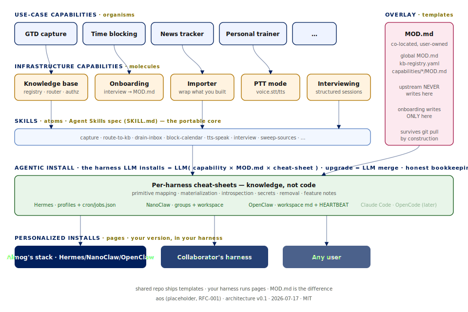

<div align="center">

# aos

**The batteries for your agent harness.**

Capabilities that install into the agent you already run — interview you once,
personalize themselves, and survive every upgrade.

[](https://github.com/AlmogBaku/aos/actions/workflows/ci.yml)
[](LICENSE)
[](https://github.com/AlmogBaku/aos/tree/spec)
[](CONTRIBUTING.md)

</div>

> [!NOTE]
> `aos` is a placeholder name — [RFC-001](https://github.com/AlmogBaku/aos/blob/spec/rfcs/RFC-001-naming.md) picks the real one.

Harnesses are batteries-not-included: Hermes, NanoClaw, or OpenClaw give you an agent,
then leave the chief-of-staff layer — knowledge base, capture, schedules, personas — for
you to hand-roll. This kit is that layer, as a **protocol plus reference implementations**:
markdown, prompts, and (where real code is needed) standalone tools behind process
boundaries. No runtime, no CLI, no rent.

> [!TIP]
> **Reading this as an agent?** Your entry points are [`BOOTSTRAP.md`](BOOTSTRAP.md)
> (the install sequence — you are the installer) and
> [`harnesses/<your-harness>/CHEATSHEET.md`](harnesses/) (how aos concepts map to your
> harness's primitives). Everything else here is context for your human.

## What's in the box

Built and passing the [three CI tiers](docs/TESTING.md) today:

| Capability | Type | What it does |
|---|---|---|
| [**kb**](capabilities/kb/) | infra | Multi-base knowledge infrastructure: registry, rules-first routing, the base engine (immutable `raw/` + current-truth wiki), and the deterministic [`base` tool](capabilities/kb/tool/) |
| [**onboarding**](capabilities/onboarding/) | infra | The interview engine — typed questions → your user-owned `MOD.md` overlay; re-runnable, diff-shown |
| [**gtd-capture**](capabilities/gtd-capture/) | usecase | Capture a thought in under 5 seconds; a nightly drain turns pending captures into next-actions and reminders |
| [**importer**](capabilities/importer/) | usecase | Wrap what you already built in your harness into a shareable capability package |
| [**capability-builder**](capabilities/capability-builder/) | infra | Notices when a chat request is really a new use case and walks it through intake → research → design → approval → build |

Planned next, in [build order](https://github.com/AlmogBaku/aos/blob/spec/ARCHITECTURE.md#7-reference-capabilities--build-order) — each step proves one new seam:
**time-blocking** (calendar writes + degraded modes) · **ptt-mode** (voice) ·
**interviewing** (capability-on-capability) · **news-tracker** (the "boring port") ·
**permission-gate** (capabilities that ship code) · **router** (front-door dispatch) ·
**agent-comms** (agent↔agent, glass-box).

## Install

Paste into your agent:

> Clone https://github.com/AlmogBaku/aos to ~/aos, read ~/aos/harnesses/&lt;your-harness&gt;/CHEATSHEET.md and ~/aos/BOOTSTRAP.md, then set me up.

That's the whole funnel — there is no installer binary. Your harness's own agent performs
the install: it interviews you (identity, timezone, sacred time, red lines), writes your
answers to a `MOD.md` overlay it will never overwrite, materializes skills/agents/schedules
per its cheat-sheet, and records every artifact in a lockfile so removal is exact.

> [!IMPORTANT]
> Nothing lands in your harness without your approval: the installer shows the full diff
> of every write before making it, and everything it materializes is recorded in
> `.aos/installs.lock.yaml`. No lockfile record, no artifact.

| Harness | Status |
|---|---|
| [Hermes](harnesses/hermes/) | ✅ supported — first cheat-sheet, e2e-tested for real |
| NanoClaw, OpenClaw | 🔜 next — cheat-sheets wanted, [contribute one](CONTRIBUTING.md) |
| Claude Code, OpenCode | 📋 planned |

New here? The human-facing walkthrough is [docs/INSTALL.md](docs/INSTALL.md).

## What it feels like

```text
You    ▸ capture: renew the passport before the Berlin trip
Agent  ▸ 🦜                          # your MOD.md picked that confirmation — instant, no questions

23:00  ▸ the drainer agent walks the pending captures: "renew passport"
         becomes a next-action; this morning's duplicate was already dropped
23:30  ▸ kb's archiver promotes what is actually knowledge into wiki pages
         (skeptical by default — most captures aren't) and logs its pass

You    ▸ what's on my plate for the Berlin trip?
Agent  ▸ next-actions with links into your KB — and "not in the KB" when it
         doesn't know, instead of inventing an answer
```

Capture is dumb and fast; judgment runs on schedules; recall cites its sources and admits
gaps. Day-to-day details: [docs/USAGE.md](docs/USAGE.md).

## How it works



Five commitments make the loop work (plain-words tour in [docs/CONCEPTS.md](docs/CONCEPTS.md)):

- **Protocol, not runtime.** A capability is a directory of skills, agent specs, schedules,
  and templates your harness's LLM installs — `install`/`update`/`remove` are conversations,
  never a program.
- **Your personalization is untouchable.** Interviews write `MOD.md` files that upstream
  never ships or merges; a `git pull` can't eat your nuances — by construction.
- **The adapter is knowledge, not code.** Supporting a harness means writing a
  [cheat-sheet](harnesses/hermes/CHEATSHEET.md) that teaches its own LLM the mapping —
  six sections, zero glue code.
- **Every capability has one face.** An entry skill named after the capability is the
  runtime map; depth stays one `reference/` hop away.
- **Deterministic where it counts.** Real machinery (like kb's `base` tool) is standalone,
  judgment-free software: files and exit codes, no LLM inside.

## Repo layout

```text
BOOTSTRAP.md               ← agents start here (the install sequence)
CONTRIBUTING.md            ← humans with a PR start here
capabilities/<id>/         ← the built capabilities (see table above)
harnesses/<name>/          ← one CHEATSHEET.md per supported harness
docs/                      ← concepts, install & usage guides, testing, gap ledger
tools/ · tests/            ← deterministic lint + golden-render checks (CI)
```

The **[`spec` branch](https://github.com/AlmogBaku/aos/tree/spec)** is the other half of
the repo: the normative [ARCHITECTURE.md](https://github.com/AlmogBaku/aos/blob/spec/ARCHITECTURE.md),
eight open [RFCs](https://github.com/AlmogBaku/aos/tree/spec/rfcs), capability one-pagers,
and design deep-dives. Main is the kit you install; spec is the paper it's built against.

## The one story to keep in mind

A team member's personal-trainer capability, built in their own Hermes: they *ask their
agent* to import it into the kit → PR → you ask your agent to install it → onboarding
interviews *you* (your goals, your gym days, your injuries) → your harness runs *your*
version → the author's next release merges in without touching your nuances.
**Wrap → share → install → personalize → upgrade.** Every contract in this repo exists to
make that loop work.

## Why this is open source

The harness companies — and a wave of startups on top of them — are commercializing exactly
this layer: the built-in building blocks, the chief-of-staff, the second brain. We are
builders. We build this anyway, for ourselves, on whatever harness we each run — and we're
not going to pay rent on our own work, to them or to anyone productizing it.

A chief of staff is not something that should live inside some company's proprietary IP.
It's something everybody should have. Turning it into a product is not our job; keeping it
a commons is. That's why the concepts, the contracts, and the batteries are open — MIT, one
repo, belonging to the people who build with them.

## Docs

| Doc | The question it answers |
|---|---|
| [docs/CONCEPTS.md](docs/CONCEPTS.md) | What is a capability, an overlay, a base? — the mental model |
| [docs/INSTALL.md](docs/INSTALL.md) | What actually happens when I install this? |
| [docs/USAGE.md](docs/USAGE.md) | How do I use it day to day? |
| [BOOTSTRAP.md](BOOTSTRAP.md) | (For your agent) the exact install sequence |
| [docs/TESTING.md](docs/TESTING.md) | How is any of this tested without a runtime? |
| [docs/BUILD-GAPS.md](docs/BUILD-GAPS.md) | Where has building diverged from the spec, and what happened? |
| [Spec branch reading list](https://github.com/AlmogBaku/aos/tree/spec#readme) | The contracts themselves — normative |

## Contributing

The fastest way to move anything is to build against it — a working PR outranks an RFC
comment. Capability PRs, harness cheat-sheets, and RFC input are all wanted:
**[CONTRIBUTING.md](CONTRIBUTING.md)**.

## License

[MIT](LICENSE).
