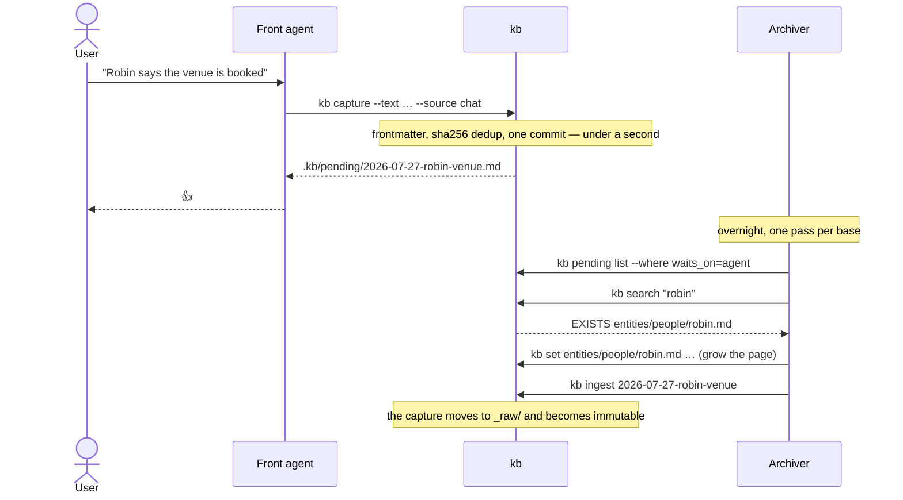
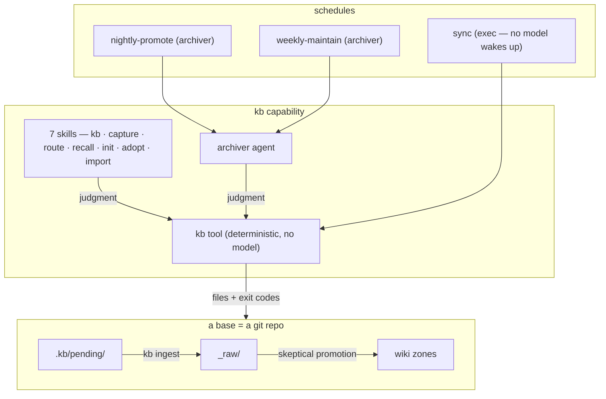

# How the base is designed

Explanation, not instructions. If you want to *do* something, the skills tell you how and
[reference.md](reference.md) lists the surfaces. This page is why any of it is shaped the
way it is.

## What a base is

A base is a git repository of markdown files. That is the whole storage layer — no database,
no server, no index that has to be rebuilt before a read is correct. Everything the tool
maintains (the search index, the link graph) is a **rebuildable derivative** living in
`.kb/cache/`, which is gitignored: delete it and lose nothing.

Why go this far: the store has to survive the tooling. A user who stops running any of this
still has folders of markdown in git, readable in Obsidian, greppable, diffable, and
restorable to any point in time. Anything that would make the files unreadable without the
tool is a design error here, not a feature.

`base == repo` is a concept, not a command name. The command is `kb`, because `base32`,
`base64` and `basename` ship on every Linux box, so `base<TAB>` is ambiguous forever.

## The three pillars

**Store.** `_raw/` is source material — what actually arrived, flat and immutable once
ingested. The wiki zones (`entities/`, `concepts/`, `projects/`, `profile/`) hold **current
truth only**: a page states what is true now, and when a fact changes the line changes. The
old value lives in `git log -p`. No supersession fields, no strikethrough, no "as of March"
qualifiers accumulating until nobody can tell what is current. The immutable layer and the
mutable layer are separate directories precisely so neither has to compromise.

**Curation.** Capture is instant and dumb. Promotion is slow and skeptical, and it is
**default-empty**: most captures never become a page. The bar is *would the user plausibly
look this up again?* — because a junk page degrades every future search, while an unpromoted
capture stays fully reachable through full-text search. The asymmetry is deliberate: the
cost of not promoting is one extra search, and the cost of over-promoting is a store nobody
trusts.

**State.** One capped attention window per base, one-line items pointing into pages. It
answers "where is my head", never "what do I know". The cap is the feature — a list that can
grow without bound stops being a summary.

## The life of a capture



The user's part of that finishes in under a second. Everything requiring judgment happens
later, unattended, and nothing about it is on the person's critical path. That is the single
most important property of the whole design: **capture latency is sacred**, because a
capture path that asks questions is a capture path people stop using.

## Why one file per record

The pending queue is a directory of files, not a file of lines. So is the review queue that
used to be one appended document, and so is a shared base's state.

The reason is git. A single file every agent on every machine appends to is precisely the
shape that conflicts on every sync — and it bites a single person with one base on two
laptops, long before anyone shares anything. Distinct filenames never conflict. We looked at
merge drivers and rejected them: `merge=union` reorders under rebase, dedups only when hunk
boundaries happen to coincide, and forge-side merges ignore `.gitattributes` outright.

The corollary is the rule that decides whether a queue file should exist at all:

> A queue **file** is only justified when the work item has no artifact of its own.

A pending capture already *is* a file with frontmatter. An unresolved mention is one too. A
refusal and a sync conflict are the only two things with nothing to attach to, because
nothing was written and nothing was committed. So everything pending lives in one directory,
what it waits on is metadata, and everything else is a query — which is why there is no
next-actions file, no entity queue, and no lint report file. Each of those had writers and
zero readers.

## Why git is the audit trail

Every write verb makes its own commit, with **author = the human principal whose knowledge
it is** and **committer = the acting agent**, plus the verb and path in trailers. Trailers
survive rebase and cherry-pick, which `git notes` does not (notes are not even pushed by
default).

There used to be a separate append-only log file alongside this, described as a second audit
substrate that the grants audit would cross-check. The cross-check was never built, batched
commits were exempted from enforcement *on the grounds that the log covered them*, and the
log guaranteed a sync conflict on every write. Once every write is its own attributed
commit, the grants audit is real for the first time: nothing is batched, so a write with no
matching grant row is a finding every time, and only the bootstrap scaffold is exempt.

## Expiry, the only lifecycle rule

kb knows exactly one thing about how long a page lives:

```
expires passed  →  kb prune deletes it, reports what went, git is the undo
no expires      →  it lives forever
```

That is the entire mechanism, and most pages never carry the field. There is no second
staleness concept, because there is nothing honest for one to key on — a page being old is
not evidence of anything.

What about a page that genuinely stopped mattering? That is a **judgment**, not a date, so
it goes through `kb archive <page> --reason …`: a `git rm` plus an attributed commit
carrying the reason. Which is strictly more than an archive *directory* ever captured, and
is why there no longer is one.

The split is worth stating plainly, because the two look like they conflict:

| | Set by | Acted on by | Nature |
|---|---|---|---|
| `expires:` | whoever knows the item is time-bound | `kb prune`, deterministically | declared end of life |
| eviction | the archiver, as a proposal | a human | judged end of life |

Neither has to bend. Deadlines are a third thing entirely: `due:` is a work-tracker field
declared in that base's `frontmatter.extensions`, and kb never interprets it. Filtering on
it works only because `--where` is generic over frontmatter — which is exactly what keeps
the layering clean.

`_raw/` never expires. Answers cite pages and pages cite raw, so it is the trust chain.

## Principals and curation

Nobody used to have a name: the acting subject was an environment variable with a default,
and scaffolding a base *overwrote* the repository's git identity. So a shared base could not
express "Alice's agent may write here, Bob's may not", and could not say whose captures were
whose.

Now the tool establishes an identity for itself on the first verb call and stores it in
`<home>/.aos/kb-principal.yml`, machine-local and gitignored. It is a **list**, because one
person is not one identity — a work address should not author a personal base — matched
against base names with first-match-wins.

It **never blocks and never prompts.** A weak value (synthesized, `noreply@`) is not an
error: the write proceeds and lint reports it. The tool detects and stores; the onboarding
interview fixes what detection got wrong. Anything else would put a tty prompt on a path a
cron has to run.

There is no separate roster. Grant rows name principal ids directly, so the grants table
**is** the roster — one source instead of two that can disagree.

`curation` says who reviews what agents propose on a base several people write to: `self`
(each person curates their own captures) or `designated` (one curator drains everyone's,
which also means that curator's agent reads everyone's raw material — worth saying out loud
before anyone picks it).

## How the pieces fit



The division of labour is the point. **The tool is judgment-free by contract**: no model, no
agent, files and exit codes as the interface. **Skills are judgment**: which base, which
page, whether this is worth keeping. **Agents are roles**: the archiver is a librarian, and
its most valuable behaviour is cross-base, which is why there is one of it rather than one
per base. **Schedules are when**, and the one with no model in it (`sync`) is an exec job
precisely so that nothing wakes up to move bytes between machines.

Every one of those boundaries exists so that the deterministic part can be tested without a
model and the judgment part can be changed without touching code.
