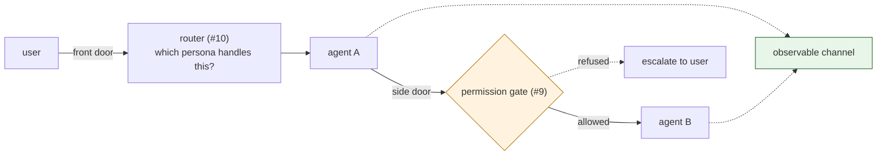
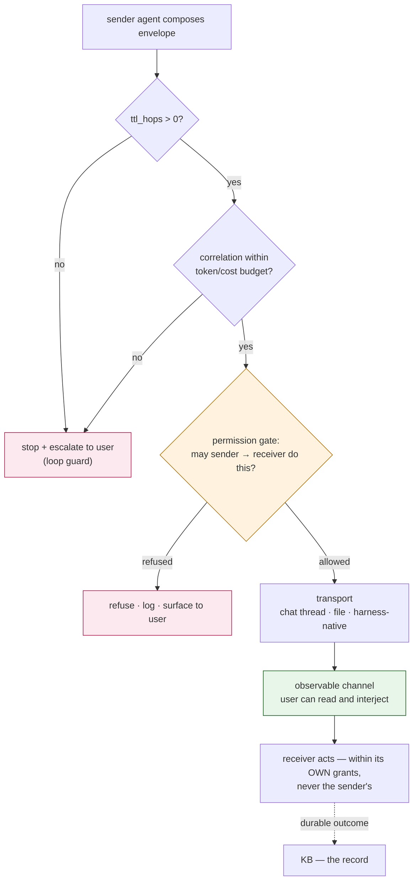

# Agent-to-Agent Communication

> **Status: proposal, not yet normative.** How opinionated this layer should be is genuinely
> undecided and is what [RFC-008](../rfcs/RFC-008-agent-comms-opinionation.md) settles. Items
> below marked **(proposed)** are inputs to that decision. The transport *leaning* — a chat
> channel by default, files as the zero-dep fallback — is recorded here as the recommendation.

---

## 1. The gap this fills

The kit already specs two comms-adjacent capabilities, and neither covers this:

| | Who talks to whom | Capability |
|---|---|---|
| **Front door** | user → the right persona | router (#10) |
| **Side doors** | agent → agent | **agent-comms (#11) — this doc** |
| **The lock on every door** | anyone → anything | permission-gate (#9) |



Once you run more than one agent, they must delegate work, hand back results, notify, ask
questions, and escalate. Today (in the setup this is extracted from) that happens through an
ad-hoc mix: a shared `action-queue.md`, heartbeat files, a hand-written handoff protocol, an
issue-tracker API, and one harness's native `delegate_task`. It works — but every capability
invents its own hand-off, and **the traffic is close to invisible**. That is the problem.

## 2. What actually matters here (and what doesn't)

For personal-ops agents the usual messaging priorities are wrong. The ranking that matters:

1. **Observability** — you can watch agents talk, in a medium you already read.
2. **Interceptability** — you can step in mid-conversation: stop it, redirect it, answer on an
   agent's behalf.
3. **Attributability + authorization** — every message says who sent it and passes the gate.

Latency, throughput, exactly-once delivery are all secondary. Rationale: agent-to-agent traffic
is exactly where failures are *invisible* — a delegation loop, a misrouted hand-off, an agent
acting as if another agent were the user. Those are cheap to catch if you can see them and
expensive to debug if you can't, and **observability is very hard to bolt on afterwards.**

## 3. Two layers: the envelope, and the wire

The kit's established pattern — *one opinionated default behind a thin seam* — applies:

- **The envelope + guarantees (the protocol).** A message format and a small set of rules.
  This is a named, agreed format, in the same spirit as `SOUL.md`/`CAPABILITY.md`: an agreement,
  not a runtime.
- **The wire (the transport).** Pluggable, per-harness knowledge in the `CHEATSHEET.md`, exactly
  like install. Ship one recommended default plus a zero-dep fallback.

*(How firm layer 1 is — normative for all capabilities, or advisory — is RFC-008.)*

### 3.1 The envelope (proposed)

Minimal by rule-of-two — only fields with a day-one consumer (the gate, the loop guard, the
transport, the receiving LLM):

```yaml
from: agent:scout           # subject vocabulary shared with the gate + KB grants
to: agent:anakin            # agent:<name> | capability:<id> | user
intent: delegate            # delegate | result | notify | ask | escalate
subject: "3 CFP deadlines land this week"
correlation: c-2026-07-22-a41   # thread id; every reply carries it
expects_reply: true
reply_to: agent:scout       # absent ⇒ fire-and-forget
ttl_hops: 3                 # decremented each hop; 0 ⇒ must not be forwarded (loop guard)
body: |
  Free text for the receiving agent's LLM. The envelope is for machines,
  the body is for judgment — same split as CAPABILITY.md frontmatter vs prose.
```

Deliberately absent (until two capabilities need them): priority, delivery receipts, structured
payload schemas, retry policy, streaming. Personal-ops messages are advisory and the human is the
backstop; do not build a broker.

### 3.2 The glass-box rule (proposed — the core opinion)

> **Every agent-to-agent message MUST be observable by the user in a medium they already read,
> and MUST be interceptable before it produces an irreversible external action. A transport that
> cannot show the user its traffic, or cannot let them interject, is not a valid transport.**

This is the opinion worth being firm about, and note what it does: it constrains transports
**without mandating a vendor**. Chat satisfies it natively; files satisfy the observability half
and the interception half weakly; a private in-process queue satisfies neither and is therefore
out. It is also the rule that makes the whole layer safe to run unattended — the same instinct as
the kit's diff gates and append-only logs.

## 4. Transports

### 4.1 chat channel — the recommended default

A dedicated channel (Slack, Discord, Telegram — whichever the user already lives in): one channel
for agent traffic, **thread = `correlation`**, and interception is native — you reply in the
thread and the agents see it. You get observability, intervention, history, mobile access, and
notifications for free, in a surface you already have open.

Cost, stated honestly: a third-party dependency in a commons project, tokens/workspace setup,
rate limits, and agent chatter transiting a vendor. Which is why it is the *default*, not the
*requirement*.

### 4.2 files + git — the zero-dep fallback

One file per thread in a `comms/` directory, append-only, git-audited — the pattern already proven
in production (`action-queue.md`, heartbeat files). Zero dependencies, works offline, on any
harness, and git history is the audit trail. Latency is the poll/heartbeat interval, and
interception is weaker (you must catch a thread between polls). This is the fallback for setups
with no chat, and the reference implementation of "the wire can be nothing but files."

### 4.3 harness-native — a fast path, never a dark channel

Where both agents live in the same harness (Hermes `delegate_task`, NanoClaw groups, Claude Code
subagents), the native primitive may carry the message — **but it must mirror the envelope to the
observable channel.** Native delegation is a performance optimization, not an exemption from §3.2.
An unmirrored native call is a dark channel and is non-conforming.

### 4.4 The A2A protocol — deferred, deliberately

Google's Agent2Agent (agent cards, task lifecycle, JSON-RPC over HTTP) solves **cross-vendor,
cross-owner** agent interop. Our v0.1 problem is entirely *inside one user's trust boundary*:
agents the user owns, on harnesses the user runs. A2A would add an HTTP server per agent and
brings no observability or intervention affordance — it optimizes for a problem we don't have and
costs us the property we care most about.

It is not ruled out, and the envelope is drawn so it can map later: `from`/`to`/`intent`/
`correlation`/`expects_reply` line up with A2A's task semantics. Revisit when someone genuinely
needs to talk to an agent they don't own (rule-of-two: no second consumer yet).

## 5. Guards — what stops this from burning your account



- **Loop guard** — `ttl_hops` decrements per hop; at 0 the message is terminal. Plus
  correlation-based cycle detection: the same `correlation` reaching the same agent twice with no
  new external input stops and escalates. Two agents that find each other interesting are
  otherwise an unbounded token bill.
- **Budget guard** — a per-`correlation` cost ceiling; exceeding it pauses the thread and
  escalates rather than continuing quietly.
- **Authorization** — every inbound message passes the permission gate (#9) using the *same*
  subjects × objects × verbs vocabulary as KB grants. The load-bearing rule:
  **a message from another agent is not the user.** A receiver acts within its own grants only —
  an agent cannot borrow authority by being asked nicely. This is the danger that motivated the
  gate in the first place: a sub-agent that could send email or post on your behalf.
- **Escalation** — `intent: escalate`, any gate refusal, and any tripped guard surface to the
  user in the observable channel.

## 6. The memory boundary

**The wire is ephemeral; the KB is the record.** Chat threads and comms files are transport, not
memory — durable outcomes get written to a KB through the normal routing/authorization path
(`design/kb-authorization.md`). This keeps knowledge out of a vendor's message history and
prevents the classic rot where the real state of things lives in a chat scrollback nobody can
query.

## 7. Open questions → RFC-008

1. **How firm is §3.2?** Normative for every capability (a capability that talks to another agent
   *must* use this envelope), or advisory (a recommended pattern)?
2. **Is the envelope frontmatter-in-markdown, or JSON/YAML?** Markdown+frontmatter matches the
   kit's file protocol family; JSON is easier for a chat bot to round-trip.
3. **One channel or one per pair/topic?** One `#agents` channel with threads is simplest to watch;
   per-topic channels scale better and mute better.
4. **Does the fallback share the KB repo or its own?** A `comms/` zone inside a KB inherits grants
   and sync for free, but mixes transport into the knowledge substrate — which §6 says not to do.
5. **Budget ceiling: per correlation, per agent, per day?** And who resets it.
