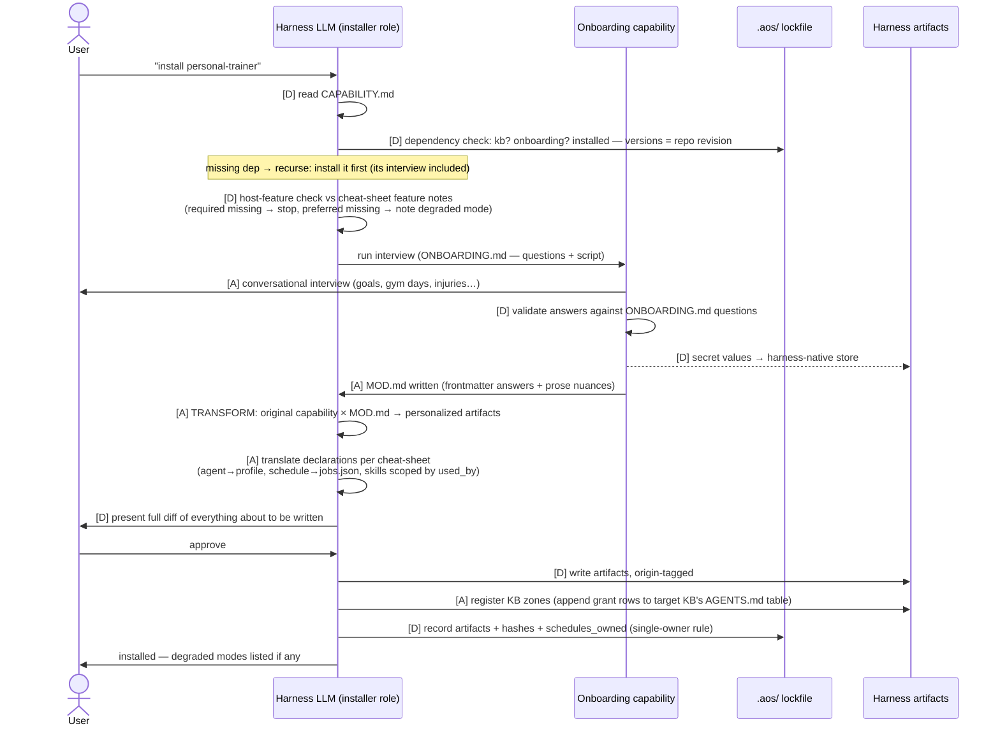
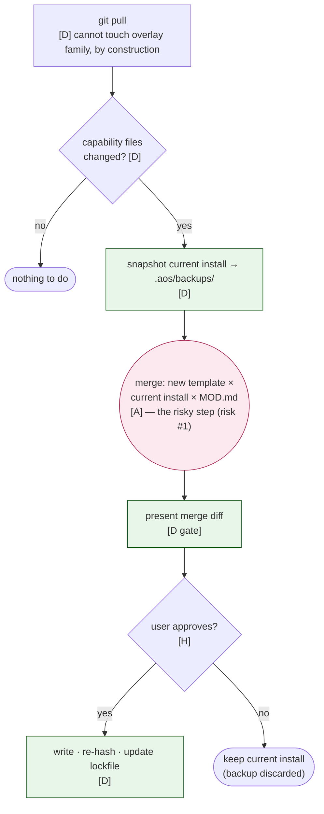

# Design deep-dive: installation, end to end

*Companion to ARCHITECTURE §3 + §5. Every flow the installer story implies: bootstrap, dependency-ordered install, upgrade, removal — with the deterministic/agentic boundary marked on every step: **[D]** = mechanical (checkable, scriptable — RFC-004 decides if a helper tool does it), **[A]** = LLM judgment.*

## 1. Bootstrap: the first five minutes

There is no installer binary to download. The kit's README opens with a paste-block (the gstack lesson — paste-to-install is the whole funnel — minus their Bun/bash dependency):

> Paste into your agent: *"Clone https://…/aos to ~/aos, read ~/aos/harnesses/<your-harness>/CHEATSHEET.md and ~/aos/docs/BOOTSTRAP.md, then set me up."*

Bootstrap sequence the agent then follows (from `docs/BOOTSTRAP.md`):

1. **[D]** Clone; verify the harness has a cheat-sheet; create `.aos/` + empty lockfile.
2. **[A]** **Global interview** (the onboarding capability's bootstrap script): identity, timezone, working hours, sacred time, red lines → writes root `MOD.md`.
3. **[A]** **KB setup**: existing KBs → `kb adopt` each (register + lint-report, never rewrite); none → `kb init personal`. Writes `kb-registry.yaml`.
4. **[D]** Install the two root capabilities — kb, onboarding — per §2 below (they have no interviews beyond what just ran; chicken-and-egg is broken by BOOTSTRAP.md carrying their install steps inline).
5. Done. Everything after is `install <capability>` on demand.

## 2. Installing a capability



Rules the diagram compresses:

- **Dependencies install first, recursively**, each with its own interview. No version solving exists or is needed — one repo, one revision (§2.2).
- **Already installed** = present in lockfile at current version → skip; at older version → this is an upgrade, go to §3.
- **The diff gate is not optional.** No artifact lands without the user seeing the diff. (Degenerate case: user says "always accept" in global MOD.md — their right, recorded there.)
- **Second-harness install** of the same capability re-runs only the transform + materialize steps (interview answers already in MOD.md), and takes **no schedules** unless the user reassigns them (single-owner rule, §5.5).

## 3. Upgrade

The riskiest operation, so every agentic step (merge) is fenced by deterministic gates — backup before, diff-approval after:



Two honesty notes: CI requires a `version:` bump when a capability's files change (or the lockfile compares file hashes, not versions — belt and braces); and the merge is the least-trustworthy [A] step in the system, which is exactly why it is fenced by a backup before and a diff gate after. Long skills split into `sections/*.md` (gstack lesson) so merges happen per-section, not per-monolith.

## 4. Removal

```
read lockfile artifacts for <capability> on this harness  [D]
un-write each (cheat-sheet Removal section)               [A] (shared files need surgery, e.g. jobs.json entry)
revoke KB zone grants (remove rows it added)              [D]
MOD.md is NOT deleted                                     — nuances survive reinstall; delete is the user's explicit choice
doctor verifies nothing orphaned                          [D]
```

## 5. The deterministic/agentic boundary, summarized

| Step | D/A | Backstop |
|---|---|---|
| Manifest/schema/dep/feature checks | D | CI lints the same things upstream |
| Interview | A | schema validation [D] on every answer |
| Transform + cheat-sheet translation | A | diff gate [D] + origin tags |
| Writing artifacts | D | hashes into lockfile |
| Zone grant registration | A (edits a live KB file) | append-only + lint audits the table |
| Upgrade merge | A | backup before, diff gate after, sections/ granularity |
| Drift detection, duplicate schedules | D | `doctor` |

The pattern is deliberate: **every [A] step is sandwiched between [D] checks.** The LLM is trusted with judgment, never with bookkeeping — and RFC-004 only decides whether the [D] column is enforced by a tiny helper tool or by discipline.
