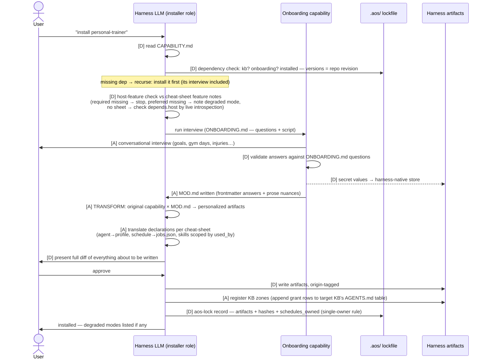
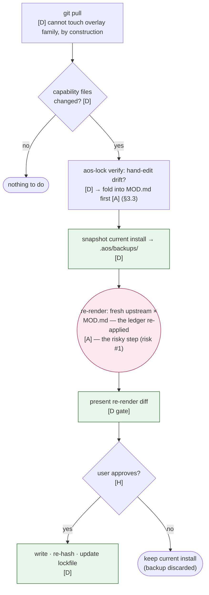

# Design deep-dive: installation, end to end

*Companion to ARCHITECTURE §3 + §5. Every flow the installer story implies: bootstrap, dependency-ordered install, upgrade, removal — with the deterministic/agentic boundary marked on every step: **[D]** = mechanical (checkable, scriptable — `aos-lock` carries the bookkeeping verbs; RFC-004's reopen path, taken), **[A]** = LLM judgment.*

## 1. Bootstrap: the first five minutes

There is no installer binary to download. The kit's README opens with a paste-block (the gstack lesson — paste-to-install is the whole funnel — minus their Bun/bash dependency):

> Paste into your agent: *"Clone https://…/aos to ~/aos, read ~/aos/BOOTSTRAP.md, then set me up."*

One file, on purpose: `BOOTSTRAP.md` is a warm stub — it defines the install *experience* (welcome and explain first; tone contract in the capability-lifecycle entry skill's Experience section) and hands the machinery to the capability-lifecycle capability, whose skills carry the contract and load the cheat-sheet (`capabilities/capability-lifecycle/harnesses/<harness-runtime>.md`, §5.2) — the human never has to name their harness.

Bootstrap sequence the agent then follows (from `BOOTSTRAP.md`, at the clone root beside the README — the human's door and the agent's door side by side):

0. The paste-block already cloned (silent, harmless). **Welcome first** — what the kit is, what will happen, questions answered — before any other action; then **[D]** prerequisites: `git` and `uv` (required — `uv` carries the bookkeeping tool; offer the official installer, refuse to continue without).
1. **[D]** Verify the clone; inline-install the **capability-lifecycle** capability (the only chicken-and-egg break): read its contract reference in full, `uv tool install … aos-lock`, `aos-lock init`, copy its five skills to the front agent per its cheat-sheet (none for this harness → its no-cheat-sheet reference: generic mapping contract, self-drafted sheet, diff-gated — never a stop), STAGE→GATE→EXECUTE, `aos-lock record`.
2. Hand over to `capability-installer`: install **onboarding** (its interview = the global one → root `MOD.md`) then **kb** (its interview + KB adopt/init → `kb-registry.yaml`) as ordinary §2 installs.
3. Done — celebratory specific summary. Everything after is `install <capability>` on demand, triggering the materialized skills.

## 2. Installing a capability


```mermaid
sequenceDiagram
    actor U as User
    participant H as Harness LLM (installer role)
    participant O as Onboarding capability
    participant L as .aos/ lockfile
    participant HA as Harness artifacts

    U->>H: "install personal-trainer"
    H->>H: [D] read CAPABILITY.md
    H->>L: [D] dependency check: kb? onboarding? installed — versions = repo revision
    Note over H: missing dep → recurse: install it first (its interview included)
    H->>H: [D] host-feature check vs cheat-sheet feature notes<br/>(required missing → stop, preferred missing → note degraded mode,<br/>no sheet → check depends.host by live introspection)
    H->>O: run interview (ONBOARDING.md — questions + script)
    O->>U: [A] conversational interview (goals, gym days, injuries…)
    O->>O: [D] validate answers against ONBOARDING.md questions
    O-->>HA: [D] secret values → harness-native store
    O->>H: [A] MOD.md written (frontmatter answers + prose nuances)
    H->>H: [A] TRANSFORM: original capability × MOD.md → personalized artifacts
    H->>H: [A] translate declarations per cheat-sheet<br/>(agent→profile, schedule→jobs.json, skills scoped by used_by)
    H->>U: [D] present full diff of everything about to be written
    U->>H: approve
    H->>HA: [D] write artifacts, origin-tagged
    H->>HA: [A] register KB zones (append grant rows to target KB's AGENTS.md table)
    H->>L: [D] aos-lock record — artifacts + hashes + schedules_owned (single-owner rule)
    H->>U: installed — degraded modes listed if any
```

Rules the diagram compresses:

- **Dependencies install first, recursively**, each with its own interview. No version solving exists or is needed — one repo, one revision (§2.2).
- **Already installed** = present in lockfile at current version → skip; at older version → this is an upgrade, go to §3.
- **The diff gate is not optional.** No artifact lands without the user seeing the diff. (Degenerate case: user says "always accept" in global MOD.md — their right, recorded there.)
- **Second-harness install** of the same capability re-runs only the transform + materialize steps (interview answers already in MOD.md), and takes **no schedules** unless the user reassigns them (single-owner rule, §5.5).

## 3. Upgrade

The riskiest operation, so every agentic step (the re-render) is fenced by deterministic gates — drift folded into the ledger and a backup before, diff-approval after. MOD.md is a *ledger* the agent re-applies (§3.3/§3.4): the current install is a drift source, never a merge input. Kit-wide (`update` after a `git pull`) and per-capability are one procedure at two scopes:


```mermaid
flowchart TB
    A["git pull<br/>[D] cannot touch overlay family, by construction"] --> B{"capability files<br/>changed? [D]"}
    B -->|no| Z(["nothing to do"])
    B -->|yes| V["aos-lock verify: hand-edit drift?<br/>[D] → fold into MOD.md first [A] (§3.3)"]
    V --> C["snapshot current install → .aos/backups/<br/>[D]"]
    C --> M(("re-render: fresh upstream ×<br/>MOD.md — the ledger re-applied<br/>[A] — the risky step (risk #1)"))
    M --> D["present re-render diff<br/>[D gate]"]
    D --> Q{"user approves?<br/>[H]"}
    Q -->|yes| W["write · re-hash · update lockfile<br/>[D]"]
    Q -->|no| K(["keep current install<br/>(backup discarded)"])

    style M fill:#FCE9EF,stroke:#A61E4D
    style C fill:#E8F5E9,stroke:#1B5E20
    style D fill:#E8F5E9,stroke:#1B5E20
    style W fill:#E8F5E9,stroke:#1B5E20
```

Two honesty notes: CI requires a `version:` bump when a capability's files change (or the lockfile compares file hashes, not versions — belt and braces); and the re-render is the least-trustworthy [A] step in the system, which is exactly why it is fenced by the drift-fold + backup before and a diff gate after. Long skills split their depth into `reference/*.md` files one level from SKILL.md (gstack lesson, aligned with the §2.1 packaging law) so re-renders diff per-file, not per-monolith.

## 4. Removal

```
read lockfile artifacts for <capability> on this harness  [D]
un-write each (cheat-sheet Removal section;               [A] (shared files need surgery, e.g. jobs.json entry)
  no sheet → reverse origin-tagged writes)
revoke KB zone grants (remove rows it added)              [D]
MOD.md is NOT deleted                                     — nuances survive reinstall; delete is the user's explicit choice
doctor verifies nothing orphaned                          [D]
```

## 5. The deterministic/agentic boundary, summarized

| Step | D/A | Backstop |
|---|---|---|
| Manifest/schema/dep/feature checks | D | CI lints the same things upstream |
| Interview | A | schema validation [D] on every answer |
| Transform + cheat-sheet translation | A | diff gate [D] + origin tags |
| Writing artifacts | D | hashes into lockfile |
| Zone grant registration | A (edits a live KB file) | append-only + lint audits the table |
| Upgrade re-render (ledger re-apply) | A | drift-fold + backup before, diff gate after, reference/-file granularity |
| Drift detection, duplicate schedules | D | `doctor` |

The pattern is deliberate: **every [A] step is sandwiched between [D] checks.** The LLM is trusted with judgment, never with bookkeeping — the [D] bookkeeping column is enforced by `aos-lock` (capability-lifecycle), the outcome of RFC-004's reopen path.
