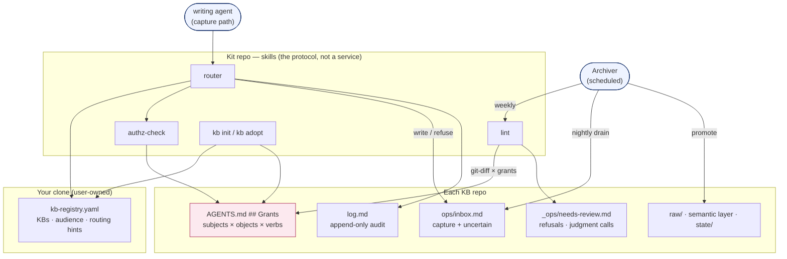
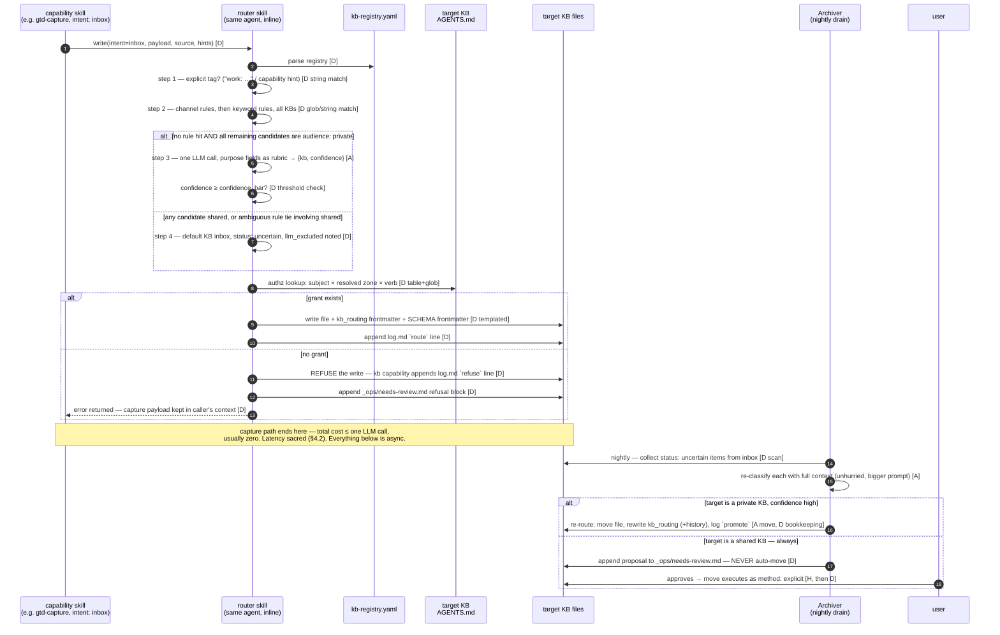
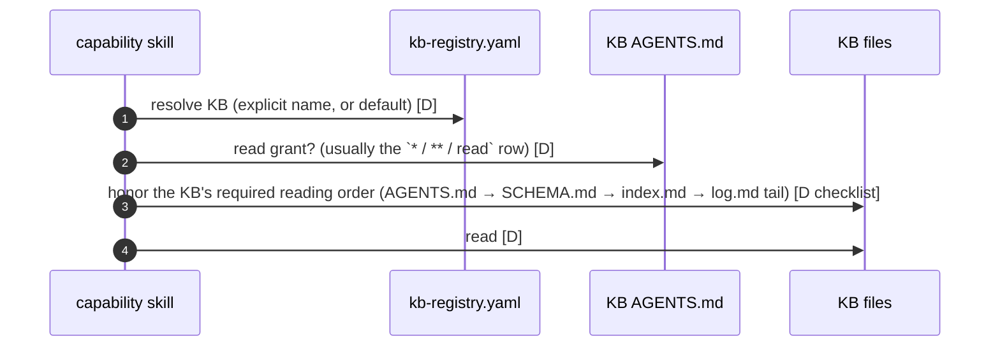
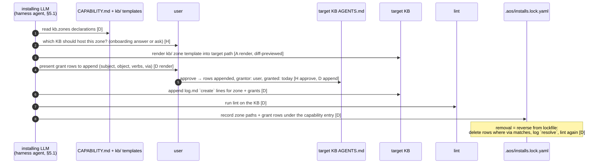
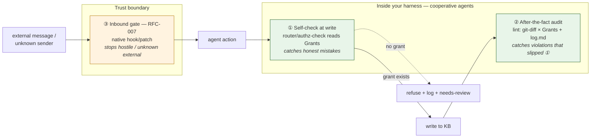

# KB & Authorization Layer — Concrete Design

> ARCHITECTURE §4 says *what* the KB layer does. This document says what it **is**: every
> file format with an example, every component with an owner and an executor, every step
> in every flow marked **[D] deterministic** (string match, file check, schema validation —
> executable by a dumb script or trivially checkable when an LLM does it) or
> **[A] agentic** (LLM judgment, backstopped, never trusted alone).
>
> Where ARCHITECTURE already decided, this document is **normative** and cites the section.
> Where it goes deeper than the spec, items are marked **(proposed)** — they are inputs to
> RFC-006/007, not decisions. Everything here is extracted from, and checked against, a KB
> that has been running this pattern in production since 2026-06-30.

---

## 1. Component inventory

Every moving part, what it physically is, where it lives, who executes it.

| # | Component | What it physically is | Lives in | Executed / consumed by |
|---|---|---|---|---|
| 1 | `kb-registry.yaml` | A user-owned YAML file (§4.1). Data, not code. | Root of the **user's clone**, next to global `MOD.md`. Upstream never touches it (overlay-family invariant). | Read by the router skill on every routed write; written by `kb init`/`kb adopt` and by the user directly. |
| 2 | **Router** | A skill — `capabilities/kb/skills/route/SKILL.md`. Steps 1–2 and 4 of §4.2 are deterministic instructions (RFC-004 helper candidate); step 3 is one cheap LLM call. There is **no router daemon**. | Kit repo (skill); runs inside whatever agent is performing the capture. | The writing agent, inline in the capture path. |
| 3 | **Authz check** | A sub-step of the router skill + a standalone skill `kb/skills/authz-check/` (so non-routed direct writes can call it too). A table lookup, nothing more. | Kit repo. | The writing agent, immediately before any KB write. |
| 4 | **Zone/grant table** | A machine-readable markdown table inside each KB's `AGENTS.md` (§4.4 "maintainer-zone table", evolved — format in §2.2 below). Human-first, lint-parsed. | **Each KB repo**, in its `AGENTS.md`. | Read by router/authz-check and lint; appended by install-time zone registration; the user edits it freely. |
| 5 | **Archiver agent** | `capabilities/kb/agents/archiver.agent.yaml` (neutral spec) — materialized per harness as a real scheduled agent. Live reference: the production Archiver profile. | Spec in kit repo; the running instance in the **harness**. | The harness scheduler: nightly drain (23:00), weekly lint, 5-min git sync. |
| 6 | **Lint** | A skill — `kb/skills/lint/SKILL.md` — whose checks are all deterministic (schema validation, glob checks, log/diff audit). Prime RFC-004 helper-tool candidate; until then, trivially-checkable LLM execution. | Kit repo (part of the `karpathy-3layer` methodology contract, §4.4). | Archiver on schedule; also invoked one-shot by `kb adopt` and after zone registration. |
| 7 | **Review / drain queue** | Two markdown files per KB: `ops/inbox.md` (uncertain-routed captures) and `_ops/needs-review.md` (judgment calls, authz refusals, lint criticals — generalizes the live `the production needs-review queue file`). | Each KB repo. | Archiver appends; the **user** (or their chief-of-staff agent) drains; Archiver never resolves its own judgment calls. |
| 8 | **`log.md` append** | A convention, not a component: one appended line per mutation, format fixed by SCHEMA (§2.5 below). | Each KB repo root. | Every writer, as the last step of every write. Lint audits it. |
| 9 | **`kb init` / `kb adopt`** | Skills. `init` = template scaffold + registry append + grant-table seed. `adopt` = registry append + lint run + divergence report; **never rewrites** the existing KB (§4.4, normative). | Kit repo. | The user's main agent, on request. |
| 10 | **`state/` rolling-window maintenance** | A convention (single writer per file, §7) + a lint staleness check + per-capability declarations in the manifest (proposed, §7.2). | Each KB repo (`state/`). | The declared single-writer agent per file; lint backstops. |
| 11 | **Zone registration (install-time)** | Part of the §5 agentic install: the installing LLM renders `kb/` zone templates into the target KB and appends grant rows — with user approval per row. | Capability `kb/` dirs; results land in KB repos. | The harness's installing LLM; user approves grants. |
| 12 | **RFC-004 helper (candidate)** | *If* RFC-004 lands a tool: a tiny CLI doing exactly the [D] set — registry parse, grant-table parse, glob match, schema validation, log/diff audit, log append. No routing judgment ever. | Kit repo. | Called by the skills above instead of prose-executing the same checks. |
| 13 | **Git sync** | The existing 5-min rebase-only cron, per KB, honoring the registry `sync:` field. | Each KB repo / harness cron. | Harness scheduler. Conflicts surface in the morning brief, never auto-resolved. |

The load-bearing observation: **there is no enforcement daemon and no service anywhere in
this table.** Every component is a file, a skill, or a scheduled agent. Trust comes from
the audit loop (§4.5), not from a kernel.

The same table as a map — what reads what, and where it lives:



---

## 2. Data model

### 2.1 Registry entries — `kb-registry.yaml` (normative base §4.1, extensions proposed)

```yaml
# kb-registry.yaml — user-owned; upstream never writes it (overlay-family invariant)
default: personal                # uncertain captures land in THIS KB's inbox
confidence_bar: 0.7              # (proposed) global LLM-routing threshold; RFC-006 tunes

kbs:
  - name: personal
    path: ~/personal-kb
    remote: git@github.com:you/personal-kb.git
    sync: rebase-5min            # rebase-5min | manual | none
    audience: private            # private | shared — drives §4 authorization
    methodology: karpathy-3layer
    purpose: >                   # doubles as the LLM classifier's rubric — write it well
      Personal ops, relationships, life admin, drafts.
    inbox: ops/inbox.md          # (proposed) the zone `intent: inbox` and uncertain
                                 # routings resolve to; default ops/inbox.md
    routing:
      channels: ["whatsapp:*", "telegram:*"]
      keywords: []
```

**(proposed) Rule identity.** Every deterministic rule gets a stable generated id so the
routing decision record (§2.4) can cite it: `<kb>/channel[<pattern>]` and
`<kb>/keyword[<word>]` — e.g. `personal/channel[whatsapp:*]`, `work/keyword[acme]`.
No separate rules DSL in v0.1 (rule-of-two: channels + keywords are what the production
KB actually needed; anything richer waits for a second real user).

**(proposed) Precedence within the rules step** (§4.2 step 2, made exact): all channel
rules across all KBs are evaluated before any keyword rule; first match wins within a
tier. If **two different KBs match in the same tier**, the item is treated as
rule-ambiguous: → LLM step if all candidates are private, → default inbox (flagged) if
any candidate is shared. Rationale: a tie that involves a shared KB must never be broken
by judgment (§4.3). RFC-006's replay should measure how often this fires.

### 2.2 The per-KB grant table — `AGENTS.md ## Grants`

This **evolves the live maintainer map** (production `AGENTS.md` "Maintainer map — who
writes where") into a grant table that is still a human-first markdown table — the user
reads and edits it in place — but has fixed columns so lint and the authz check parse it
deterministically. It stays in `AGENTS.md` because that file is already the thing every
agent must read before writing (production rule #1), and because grants *are* the
maintainer map: one table, two readers.

**(proposed) Format — normative parsing rules:** the first markdown table under a
`## Grants` heading; exact column names; `object` is a git-style glob (or
space-separated globs); `verbs` space-separated from the closed set
`read write route-into grant`; `subject` from the vocabulary in §4.1; `via` is
`<capability>@<version>` or `—` for hand grants.

```markdown
## Grants

<!-- machine-readable: do not rename columns; lint parses this table -->

| subject                | object                                    | verbs            | grantor | granted    | via              | notes |
|------------------------|-------------------------------------------|------------------|---------|------------|------------------|-------|
| *                      | **                                        | read             | user    | 2026-06-30 | —                | every registered agent reads everything (this KB is private) |
| agent:archiver         | raw/**                                    | write            | user    | 2026-06-30 | kb@0.1.0         | immutable layer; promote-only |
| agent:archiver         | entities/** concepts/** comparisons/** queries/** | write    | user    | 2026-06-30 | kb@0.1.0         | Layer-2 synthesis |
| agent:archiver         | _ops/** _archive/** index.md log.md       | write            | user    | 2026-06-30 | kb@0.1.0         | scaffolding + append-only log |
| agent:main           | state/STATE.md ops/**                     | write            | user    | 2026-06-30 | —                | live write path |
| agent:main           | state/SOUL.md state/NORTH_STAR.md state/PIPELINE.md state/LEARNINGS.md state/CAREER.md | write | user | 2026-06-30 | — | high-stakes; surface changes to the user |
| capability:gtd-capture | ops/inbox.md                              | write route-into | user    | 2026-07-20 | gtd-capture@0.1.0 | requested at install; drains nightly |
| capability:kb          | log.md _ops/needs-review.md               | write            | user    | 2026-06-30 | kb@0.1.0         | so refusals/flags can be recorded by the router itself |
```

What changed vs. the live table, and why:

- **Zone → glob `object`** — prose zones become real globs the check can evaluate.
- **Owner → `subject`** with a typed vocabulary (§4.1) — "Archiver" becomes `agent:archiver`; capability-requested zones carry `capability:<id>`.
- **New columns `grantor / granted / via`** — provenance. ARCHITECTURE §4.3 is explicit that install-time `kb.zones` declarations *are grants, appended at install, revoked at removal*; `via` is what makes revocation mechanical (delete rows where `via` matches the removed capability, from the lockfile record).
- The live rule **"Cross-zone writes require updating this table first"** is kept verbatim as the layer's one-sentence enforcement philosophy.

### 2.3 Zone declaration in `CAPABILITY.md` frontmatter (normative, §2.2)

```yaml
kb:
  writes: [inbox]                # abstract intents the router resolves
  zones:
    - path: ops/inbox.md         # zone this capability asks the target KB to register
      owner_agent: drainer
      verbs: [write, route-into] # (proposed) explicit verbs requested; default [write]
```

### 2.4 The routing decision record — stamped frontmatter (proposed format for §4.2's `kb_routing`)

Every routed write carries, in the written file's frontmatter (additive to the SCHEMA
`raw/` fields):

```yaml
kb_routing:
  method: rule                   # explicit | rule | llm | default
  rule_id: work/keyword[acme]   # present iff method: rule
  confidence: null               # present iff method: llm (float 0–1)
  status: routed                 # routed | uncertain — uncertain ⇒ drain re-visits
  intent: inbox                  # the abstract intent that was resolved
  router: agent:main           # subject that executed the routing
  via: capability:gtd-capture    # capability whose skill initiated the write
  routed_at: 2026-07-17T14:22+03:00
  llm_excluded: []               # (proposed) shared KBs the classifier was forbidden
                                 # from choosing but whose purpose matched — drain hint
```

`method: default` + `status: uncertain` is ARCHITECTURE §4.2 step 4's tag, made
structured. A drain re-route rewrites the record (`method` becomes what the re-route
used), and the old record is appended to `kb_routing_history:` — decisions are never
silently overwritten.

### 2.5 `log.md` line (normative — taken unchanged from the production SCHEMA)

```
YYYY-MM-DDTHH:MM±TZ | <agent> | <verb> | <path> | <one-line summary>
```

Verbs: `create | promote | merge | archive | flag | resolve | sync-conflict | lint`
**plus (proposed) two additions for this layer:** `route` (a routed write; summary
includes the `kb_routing.method`) and `refuse` (an authz denial, §4.5). Append-only,
never edited — this file is one of the two audit substrates (the other is git history).

---

## 3. Flows, end to end

Legend on every arrow: **[D]** deterministic · **[A]** agentic · **[H]** human decision.

### 3.1 The write path



Two properties worth stating flatly:

- **The only [A] arrow in the synchronous path is step 3**, and it is doubly caged: a
  deterministic candidate filter before it (shared KBs are not in its choice set —
  normative, §4.3) and a deterministic threshold check after it.
- **A refusal is not an exception path that loses data.** The payload stays with the
  caller; the refusal is itself written (by `capability:kb`, which holds `log.md` +
  `_ops/needs-review.md` grants for exactly this purpose) and surfaced. Capture latency
  is preserved even when authorization fails.

### 3.2 The read path (simpler)



Reads are cheap and broadly granted **within a KB the subject is registered in** (the
production rule "cross-zone reads are always allowed" — carried over, normative). But a
KB with no grant row at all for a subject is not readable by it: the wildcard read row is
a *choice* that KB's grant table makes, not an ambient default. A private KB can
therefore scope reads (the production "Archiver: no business context loads" rule becomes
an explicit narrower read grant if the user wants it enforced rather than conventional).

### 3.3 Zone registration at capability-install time



The user's approval is the `grant` verb in action: **only `user` holds `grant` on
anything** in v0.1 (§4.3). The installing LLM *drafts* grant rows; it never
self-approves them.

---

## 4. The authorization model in depth

### 4.1 Subjects

| Subject form | Meaning | Example |
|---|---|---|
| `user` | The human. Root of all authority. | `user` |
| `agent:<name>` | A named agent identity in this user's harness(es). | `agent:archiver`, `agent:main` |
| `capability:<id>` | Any agent, when executing that capability's skills. | `capability:gtd-capture` |
| `*` | Any registered subject (any row-holder in this table). Used mainly for the read wildcard. | `*` |
| *(unknown-external)* | Anything not matching a row. **Not a subject form — the absence of one.** Default posture applies: deny, park, surface. | an uninstalled capability, a foreign agent |

**(proposed)** When agent X runs capability Y's skill, the effective subject is checked as
*either* matching — a grant to `agent:archiver` or to `capability:gtd-capture` each
suffices — but the decision record and log line carry **both** (`router:` and `via:` in
§2.4), so the audit can attribute precisely. Whether the permission gate keys on the
agent, the capability, or the pair is an open question for RFC-007 (§8 Q2).

### 4.2 Objects

Three granularities, all expressed as the `object` glob: a whole **KB** (`**`), a
**zone** (`raw/**`, `state/`), a **file pattern** (`state/STATE.md`,
`ops/tasks/projects/*.md`). Grants live per-KB, so the KB itself is identified by which
`AGENTS.md` the row sits in — there is no cross-KB grant syntax and none is needed.

### 4.3 Verbs

| Verb | Meaning | Notes |
|---|---|---|
| `read` | Read files under the object glob. | Broadly granted within a KB via the `*` row; never assumed without a row. |
| `write` | Create/modify files under the glob, directly (subject names the path). | Zone ownership from the live maintainer map is `write`. |
| `route-into` | The router may resolve this subject's abstract intents *into* this zone. | Distinct from `write`: a capability granted `route-into ops/inbox.md` cannot write `state/STATE.md` even via a clever "intent". Router requires it (or `write`) on the resolved target. |
| `grant` | Append/modify rows in the Grants table itself. | **v0.1: `user` only.** Capabilities *request* grants at install; the user approves (§3.3). No delegation, no admin agents. |

### 4.4 Where grants live, default posture

- **Per-KB, in that KB's `AGENTS.md`** — not user-global. Rationale: (a) the KB repo is
  the unit of sharing; a shared KB's grant table travels with it and is visible to every
  collaborator pulling the repo, which is the whole point; (b) it keeps the production
  property that the contract an agent must read before writing *contains* the grants;
  (c) a user-global table would silently diverge from what a shared KB's other members
  see. The registry holds no grants — routing hints and audience only.
- **Default posture: deny.** No row → no verb. Unknown-external subjects don't get an
  error and a shrug — they get refusal + `refuse` log line + a `_ops/needs-review.md`
  block (§3.1), i.e. the same "park in pending/review" semantics the Hermes WhatsApp
  gate applies to unknown senders (RFC-007), deliberately: one vocabulary, two
  enforcement points.

### 4.5 Enforcement — honestly

**There is no enforcement daemon, and this design does not pretend otherwise.** The trust
model is **cooperative agents + layered audit**, not a kernel. Enforcement is three
things, weakest to strongest — defense in depth, not a wall:



The three layers, weakest to strongest:

1. **Self-check at the point of write [D-executed-by-A].** The router/authz-check skill
   makes every writing agent do a table lookup before writing. This is an honest-agent
   control: it catches *mistakes* (the overwhelmingly common failure), not *malice*. It
   is trustworthy because the check is deterministic and cited in the contract file
   every agent is required to read first, so "I didn't know" is structurally impossible —
   and the trivially-checkable nature of the step (one table, one glob match) makes an
   LLM executing it auditable line-by-line.
2. **After-the-fact deterministic audit [D].** Weekly (and on-demand) lint audits
   violations. What it can *actually* catch, concretely:
   - **Writes outside granted zones** — walk `git log` per author identity between lint
     runs; diff touched paths against the Grants table for that author's subject. Any
     touched path with no matching `write` grant → violation block in
     `_ops/needs-review.md` + `flag` line in `log.md`. This works because every KB is a
     git repo and every agent commits under its own identity (normative: `kb init`
     configures per-agent `user.name`; the sync script preserves it).
   - **Unlogged writes** — every commit's touched paths must be covered by `log.md`
     lines in the same window. Diff-but-no-log-line → "unattributed write" violation.
     An agent that skips the log doesn't escape the audit — skipping *is* the finding.
   - **Frontmatter violations** — missing/invalid `kb_routing` on routed files;
     LLM-method records pointing at `audience: shared` KBs (**must be zero, ever** —
     this single check is the §4.3 normative rule made falsifiable); `confidence` below
     bar with `status: routed`.
   - **Grant-table hygiene** — rows whose `via` capability is no longer in the lockfile
     (orphan grants), malformed globs, verbs outside the closed set.
   - What it **cannot** catch: an agent that writes without committing (mitigated: the
     5-min sync commits everything; an uncommitted write doesn't propagate and dies on
     next rebase), and a genuinely adversarial agent forging another author identity
     (out of scope — see next point).
3. **Inbound gating at the harness [per-harness code, RFC-007].** The future
   permission-gate capability (build 9) enforces the *same subjects × objects × verbs*
   vocabulary at the messaging/tool-call layer, in native code (hook or patch, §2.4).
   That is where adversarial or unknown *external* input is handled — before it ever
   becomes an agent action. This grant table is deliberately shaped so the gate can
   consume it unchanged.

The honest one-liner: **inside the user's own harness, agents are cooperating processes
and the KB layer gives them a contract plus an audit trail; across the trust boundary
(inbound messages, unknown senders, shared repos), enforcement is the gate's job.**
A user whose threat model includes their own agents lying about git authorship needs
harness-level sandboxing, which no markdown table provides — and we say so.

---

## 5. Deterministic vs. agentic boundary — the full table

| Operation | Executor | D/A | Why this side of the line | Backstop |
|---|---|---|---|---|
| Registry parse | writing agent (router skill / RFC-004 helper) | D | YAML with a schema | lint validates registry schema |
| Explicit-tag detection (step 1) | router | D | prefix string match | decision record; drain sees mistakes |
| Channel/keyword rule eval (step 2) | router | D | glob + string match, first-match per tier | rule_id stamped; RFC-006 replay measures rule quality |
| Rule-tie resolution | router | D | fixed precedence; cross-KB tie → LLM iff all-private, else default | tie events logged; replay counts them |
| Shared-KB exclusion from classifier candidates | router | D | list filter on `audience:` — the one rule that must never be judgment | lint: zero `method: llm` records in shared KBs, ever |
| LLM classification (step 3) | router (one model call) | **A** | genuine judgment: content → KB purpose | confidence bar [D]; drain re-visits; <5% misroute kill-switch (Appendix B #2) |
| Confidence gate | router | D | float ≥ threshold | stamped; lint checks routed-below-bar |
| Default-inbox fallback (step 4) | router | D | fixed target from registry | drain queue depth monitored |
| Authz lookup | writing agent | D | table row + glob match | lint git-diff audit re-derives every decision after the fact |
| File write + frontmatter stamp | writing agent | D | templated write against SCHEMA | lint schema validation |
| `log.md` append | writing agent | D | fixed line format, append-only | lint: diff-without-log = violation |
| Refusal handling | kb capability | D | log `refuse` + needs-review block | user drains queue |
| Git sync (5-min rebase) | harness cron | D | existing production script | conflicts surfaced, never auto-resolved |
| Drain: collect uncertain | Archiver | D | frontmatter scan | queue-depth trend in lint report |
| Drain: re-classification | Archiver | **A** | judgment with full context, no latency pressure | private-only auto-move; `kb_routing_history` kept |
| Drain re-route into **private** KB | Archiver | **A** (move) + D (bookkeeping) | wrong-but-cheap inside private space (§4.2 principle) | log line + reversible move + lint |
| Drain re-route into **shared** KB | Archiver proposes, **user approves** | **A→H** | crossing the privacy boundary is never autonomous | approval converts to `method: explicit`; lint checks every shared move has one |
| Lint: schema/frontmatter checks | Archiver (lint skill) | D | pure validation | weekly report; criticals bubble to brief |
| Lint: zone-audit (git diffs × grants) | Archiver (lint skill) | D | glob math over `git log` | it *is* the backstop; output append-only |
| Lint: staleness flags (§7) | Archiver | D | `updated` vs `stale_after` | needs-review |
| Lint: judgment-call surfacing | Archiver | **A** (detect) → H (resolve) | mechanical librarian surfaces, never decides | needs-review drained by user |
| Zone template render at install | installing LLM | **A** | personalization-aware rendering (§3.2 transform) | diff preview [H]; lint after; lockfile hashes |
| Grant row drafting | installing LLM | D | manifest → row is mechanical | user approval required regardless |
| Grant approval | **user** | **H** | `grant` verb is user-only in v0.1 | — (this is the root of trust) |
| Grant revocation at removal | installing LLM from lockfile | D | delete rows where `via` matches | lint orphan-grant check |
| `kb init` scaffold | kb skill | D | template copy | lint runs clean on fresh KB (acceptance) |
| `kb init` purpose/audience interview | onboarding | **A** | eliciting a good routing rubric is conversation | re-runnable, diffable (§3.2) |
| `kb adopt` | kb skill | D (lint + report) | must never rewrite a live KB (§4.4) | it only reports; user acts |
| `state/` file rewrite | the declared single writer | **A** (content) + D (single-writer check) | state synthesis is judgment | §7: writer check, staleness lint, git history is the archive |

Reading of the table: **every [A] row has a [D] or [H] row directly downstream of it.**
That is the design rule, not a coincidence — judgment is allowed wherever a deterministic
audit or a human approval catches its failures, and nowhere else.

---

## 6. Multi-KB, concretely — worked example

Three KBs: **personal** (private, default), **work** (shared — colleagues pull this
repo), **mgmt** (private — notes about managing people; the canonical "misroute here is
trust-terminating" KB).

### 6.1 The registry

```yaml
default: personal
confidence_bar: 0.7

kbs:
  - name: personal
    path: ~/personal-kb
    audience: private
    methodology: karpathy-3layer
    purpose: Personal ops, relationships, life admin, drafts.
    routing:
      channels: ["whatsapp:*", "telegram:*"]

  - name: work
    path: ~/work-kb
    remote: git@github.com:acme/kb.git
    sync: rebase-5min
    audience: shared
    methodology: karpathy-3layer
    purpose: >
      Acme company knowledge: product, customers, marketing, engineering.
    routing:
      channels: ["slack:*", "linear:*"]
      keywords: [acme, customer, pipeline, churn]

  - name: mgmt
    path: ~/mgmt-kb
    audience: private
    methodology: karpathy-3layer
    purpose: >
      Management notes: 1:1s, performance, compensation, hiring pipeline.
      Never shared; high sensitivity.
    routing:
      keywords: [1on1, comp-review]
```

### 6.2 Five boundary cases, resolved exactly

**Case 1 — work item arrives on a personal channel.** WhatsApp voice note: *"Dana says
the Acme pipeline number needs updating before the board deck."*
Step 2, channel tier: `personal/channel[whatsapp:*]` matches. Keyword tier is never
reached (channel tier wins — §2.1 precedence). → written to `~/personal-kb/ops/inbox.md`,
`method: rule`. Nightly drain [A] re-reads it, recognizes work content — but work is
**shared**, so it *proposes* the move in `_ops/needs-review.md`; the user approves next
morning; the move executes as `method: explicit`. **Net effect: a work item captured in
<1s with zero prompts, landing in the work KB one review later — and the shared repo was
never touched by a machine guess.** (If RFC-006's replay shows this pattern dominating
the queue, the fix is a *rule* — e.g. shared-KB keywords outranking channel bindings — a
deterministic knob, not more LLM.)

**Case 2 — ambiguous item.** Typed directly to the main agent (no channel binding):
*"call the accountant about the invoices."* No rule hit. Step 3: classifier candidates =
{personal, mgmt} (work excluded — shared). Returns `{kb: personal, confidence: 0.58}` —
below 0.7. Step 4: → `~/personal-kb/ops/inbox.md`, `method: default, status: uncertain,
confidence: 0.58`. Drain handles it at leisure. Capture cost: one cheap call, no prompt.

**Case 3 — explicit tag.** *"work: pricing objection from the TailorMade call — log
it."* Step 1 fires. Work is shared, but explicit writes to shared KBs are allowed
(§4.3: "rule-matched **or explicitly tagged** writes only"). Authz: the capturing
capability holds `route-into ops/inbox.md` in *work's* grant table (requested at
install; a colleague reviewing the shared repo can see exactly that grant row and who
approved it). → `~/work-kb/ops/inbox.md`, `method: explicit`.

**Case 4 — obviously-work item, no rule match, high LLM confidence.** *"Note: the
cohort analysis should use 90-day windows."* No channel binding, no keyword hit. The
classifier would say work at 0.93 — **but work is not in its candidate set. Confidence
is irrelevant; the exclusion is a list filter, not a threshold** (the normative core of
§4.3). Candidates {personal, mgmt} both fit poorly → low confidence → default inbox,
`status: uncertain`, and **(proposed)** `llm_excluded: [work]` stamped so the drain
proposal pre-fills "looks like work — approve move?". The user approves; done. The trust
property purchased: *no sequence of ordinary captures can ever place unreviewed
machine-classified content into a repo other people pull.*

**Case 5 — unknown capability writes to an ungranted zone.** A freshly-sideloaded
capability (never installed via §3.3, so no grant rows) tries to write
`~/mgmt-kb/state/PIPELINE.md`. Authz lookup: no row → **refused**. `capability:kb`
appends to mgmt's `log.md`: `2026-07-17T15:02+03:00 | kb | refuse | state/PIPELINE.md |
capability:sideload-x via agent:main — no grant; parked` and a block in
`_ops/needs-review.md` with the attempted payload's summary. The user sees it in the
next brief and either installs the capability properly (grants via §3.3) or removes it.
If the capability *ignores the skill contract and writes anyway* (the cooperative
model's limit): the weekly lint's git-diff audit finds a commit touching
`state/PIPELINE.md` by an author with no matching grant → violation flagged, user
alerted. Caught after the fact — which is exactly what §4.5 promises, no more.

---

## 7. `state/` rolling-window mechanics

### 7.1 What state files are (normative, §4.4 pillar 2)

High-churn files holding *what is going on right now* — the production set: `STATE.md`,
`PIPELINE.md`, `NORTH_STAR.md`, `SOUL.md`, `LEARNINGS.md`, `CAREER.md`, plus ephemeral
per-effort files. Unlike `raw/` (append-only) and Layer 2 (accumulating), state is
**rewritten in place** — always current, never an archive. The archive of state *is git
history*: no `.backup` files (the `STATE.md.backup.*` artifacts observed in the live KB
are exactly the anti-pattern lint flags), no dated copies; `git log -p state/STATE.md`
is the time machine.

### 7.2 Rules

1. **Single writer per state file** — exactly one subject, whoever holds the narrowest
   matching `write` grant (the production table already does this: `state/STATE.md →
   agent:main`). Lint enforces: two distinct authors touching one state file inside a
   lint window → violation. This is the file-level version of the production "one writer
   per file per minute" rule, made structural where it matters most.
2. **Whole-file rewrite, not append** — state files don't grow; they are re-synthesized.
   Anything worth keeping long-term is *promoted* to Layer 2 by the writer before it
   rotates out of the window (log verb `promote`).
3. **Capabilities declare state usage** — **(proposed)** manifest extension; plausibly
   already meets rule-of-two (gtd-capture reads STATE.md context; time-blocking reads
   working-hours state; personal-trainer writes its own state file), but graduates only
   when the second in-repo consumer is real:

   ```yaml
   kb:
     writes: [inbox]
     state:
       reads: [state/STATE.md]        # cold-start context this capability loads
       owns:
         - file: state/gym-log.md     # a state file this capability's agent maintains
           writer: trainer            # must match an agents/*.agent.yaml name
           stale_after: 7d            # lint flags if not rewritten within window
   ```

   `owns` entries become `write` grant-row requests at install (§3.3), giving the
   single-writer rule its subject for free.
4. **Staleness [D]** — every state file carries `updated:` frontmatter; lint compares
   against `stale_after` (default **(proposed)**: 14d) and flags stale state to
   `_ops/needs-review.md`. Readers' contract: a stale flag means *treat as advisory,
   verify before acting* — a stale STATE.md silently believed is how an agent
   confidently acts on last month's reality, which is the failure mode this whole pillar
   exists to prevent.

---

## 8. Open questions (genuinely open — RFC-006/007 must settle)

1. **Rule-tier precedence vs. shared-KB keywords (RFC-006).** §2.1 proposes
   channel-tier-first, which sends every work-item-on-WhatsApp through the review queue
   (Case 1). The replay must answer: what fraction of real captures hit the cross-KB
   conflict, and does queue depth stay drainable — or do shared-KB keyword rules need to
   outrank channel bindings?
2. **Subject identity for the shared vocabulary (RFC-007).** When agent X executes
   capability Y, is the grant subject the agent, the capability, or the pair — and does
   the permission gate key on the same choice? This document proposes "either matches,
   both recorded"; the gate inventory may show existing gates need conjunctive
   semantics, which would change the table format.
3. **Does drain-approval batch? (RFC-006.)** Is *batch* approval ("approve all 7 pending
   work moves") acceptable, or does the trust-terminating stake require per-item review?
   Queue ergonomics vs. the whole point of the review gate.
4. **Where does the [D] set physically run? (RFC-004.)** Grant-table parse, glob match,
   git-diff zone audit, log-format checks — prose-executed by LLMs, or the helper tool?
   The zone audit is the strongest backstop in §4.5 and the weakest candidate for prose
   execution (glob math over git history is exactly what LLMs fumble silently). If
   RFC-004 lands *any* tool, this audit should be in it.
5. **Grant afterlife on capability removal.** Removal deletes `via`-matched rows — but
   the zone's *data* remains. Does the departing capability's zone lose its writer
   (frozen, read-only, lint-flagged orphan) or transfer to `user`? Proposed default:
   freeze + flag, user decides; but a shared KB needs a policy its other members can
   rely on, which makes this RFC-007-adjacent, not just hygiene.

---

## Appendix: what this document deliberately does not do

- **No enforcement daemon, no service, no database.** Everything is markdown, YAML, git,
  and scheduled agents — because the production KB proves that is sufficient *given the
  audit loop*, and because anything heavier violates the batteries-not-included premise.
- **No cross-KB grant syntax, no grant delegation, no roles.** Rule-of-two: no second
  consumer exists. The moment two capabilities need any of these, it's an RFC.
- **No second methodology.** The grant table, lint checks, and state rules above are
  part of the `karpathy-3layer` directory contract (§4.4); a future methodology must
  supply its own equivalents behind the same seam.
