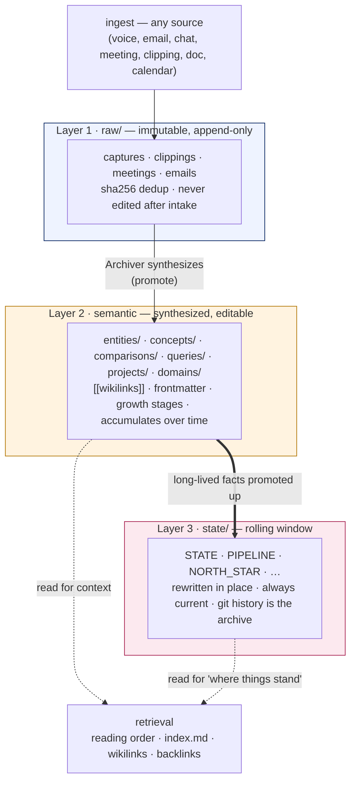
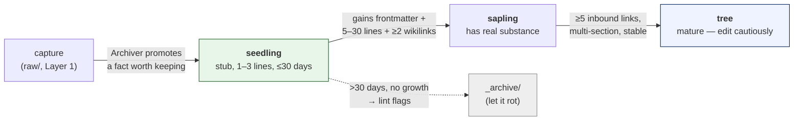

# Knowledge-Base Methodology — `karpathy-3layer`

> **Scope.** This doc specifies *the knowledge model* the `kb` capability ships: the three
> layers, the page schema, how knowledge is synthesized and retrieved, and how the whole
> thing is packaged as a swappable methodology. Its sibling [kb-authorization.md](kb-authorization.md)
> specifies *who may write what and how items are routed across multiple KBs* — a separate
> concern that sits on top of this one. ARCHITECTURE §4.4 is the two-paragraph summary; this
> is the design.
>
> `karpathy-3layer` is the **one methodology v0.1 ships**. It is not the only possible one —
> §7 defines the seam a second methodology would plug into — but it is the default, and it is
> extracted from a KB that has run this exact pattern in production since June 2026.

---

## 1. The core idea: knowledge has three tempos

A knowledge base fails when it treats a fast-changing status note and an immutable meeting
transcript the same way. `karpathy-3layer` (after Karpathy's LLM-wiki pattern) splits a KB
into **three layers by write-tempo**:



- **Layer 1 `raw/`** — the immutable substrate. Every source lands here verbatim, deduped by
  `source_sha256`, and is **never edited after intake**. If a raw item is wrong, you don't fix
  it — you write a correction in Layer 2 that links back to it. This is what makes the KB
  auditable: the sources never move under you.
- **Layer 2 semantic** — the synthesized wiki. Human/agent-readable pages with frontmatter and
  `[[wikilinks]]`, one per entity/concept/comparison/etc. Knowledge **accumulates** here; pages
  grow through defined stages (§4). This is what you actually read and retrieve from.
- **Layer 3 `state/`** — the rolling window of *current truth* (what's going on right now:
  status, priorities, north star). Unlike Layers 1–2, state is **rewritten in place** — never
  an archive; the archive of state is `git log -p`. This is what lets any agent cold-start into
  "where things stand" without replaying history. (Its single-writer + staleness rules are in
  [kb-authorization.md §7](kb-authorization.md).)

The load-bearing consequence: **an agent reads Layer 3 to orient, Layer 2 to understand, and
Layer 1 only to verify a source.** Retrieval cost scales with how deep you need to go, and most
queries never touch `raw/`.

---

## 2. A KB on disk

`kb init` scaffolds exactly this; `kb adopt` registers an existing tree and lint-reports how far
it diverges (never rewriting it):

```
<kb-root>/
  AGENTS.md          # the contract every agent reads first: layers, the ## Grants table,
                     #   write rules, required reading order (see kb-authorization.md)
  SCHEMA.md          # frontmatter · naming · growth stages · tags · wikilinks (this doc §3)
  index.md           # map-of-content (MOC): what exists, where — the retrieval entry point
  log.md             # append-only event log, one line per mutation (§6)

  raw/               # Layer 1 — immutable
    captures/  clippings/  meetings/  emails/  calendar/
  entities/          # Layer 2 — people/ companies/ communities/ products/
  concepts/          # Layer 2 — synthesized concept pages
  comparisons/  queries/  projects/  domains/<domain>/
  state/             # Layer 3 — STATE.md, PIPELINE.md, NORTH_STAR.md, …

  _ops/              # KB machinery: lint reports, review queues, needs-entity-queue,
                     #   backlinks-index.json
  _archive/          # let-it-rot graveyard (nothing deleted; moved here)
```

Everything above `_ops/` is knowledge; `_ops/` and `_archive/` are the KB's own housekeeping.

---

## 3. The page schema

Every Layer-2/3 page carries YAML frontmatter. The **universal fields**:

```yaml
---
title: "Acme Corp"          # human-readable; non-ASCII OK here
type: company               # controlled vocab (below)
slug: acme-corp             # matches filename
created: 2026-06-30
updated: 2026-06-30
growth_stage: seedling      # seedling | sapling | tree  (§4)
confidence: medium          # low | medium | high        (§5)
tags: [client, active]      # secondary index, lowercase-hyphenated
aliases: ["Acme", "ACME"]   # variant spellings for the entity matcher
---
```

`raw/` pages add the provenance/dedup fields (`source`, `source_sha256`, `source_at`,
`source_origin`, `captured_by`, `triage`); per-type pages add their own (a `person` adds
`role`/`org`/`relationship`/`last_touch`; a `project` adds `status`/`deadline`/`next_action`).

**Type is a controlled vocabulary** — `person · company · community · product · concept ·
comparison · query · project · review · capture · meeting · clipping · email · session-log ·
plan`. Adding a type means editing the schema *first*, committing, then using it. That friction
is deliberate: it keeps the type axis meaningful (rule-of-two applied to a KB's own vocabulary).

**Naming = stable URL.** Slugs are lowercase-hyphen-ASCII; the filename never changes once set
(rename = broken wikilinks), so the body carries any non-ASCII title, not the filename.

---

## 4. The page lifecycle: how knowledge grows

A page is not born mature. It moves through **growth stages** (Karpathy's term), and the
Archiver's lint enforces the transitions:



- **`seedling`** — a stub, expected to grow; ≤30 days old. A stale seedling (>30d, no growth) is
  lint-flagged: it either grows or gets archived. Nothing accumulates as dead weight.
- **`sapling`** — real substance: frontmatter + 5–30 lines + ≥2 outbound `[[wikilinks]]`.
- **`tree`** — mature, multi-section, ≥5 inbound links, stable. Edited cautiously.

**Page-or-inline (the anti-sprawl rule).** A new concept earns its own page only if it is
referenced from ≥2 places, or the user explicitly asks for it. Otherwise it stays an inline note
inside its parent page. This is what stops a KB from degenerating into thousands of one-line
orphan stubs — the failure mode of every "just make a note for everything" system.

---

## 5. Trust: confidence, contested facts, links

The methodology treats *knowledge quality* as a first-class, auditable property.

- **Confidence** (`low | medium | high`) is frontmatter, never silently upgraded — a promotion
  from `low` to `high` must write its reason in the body or `log.md`. `high` means the user
  confirmed it, or ≥3 independent sources agree.
- **Contested facts are not resolved by guessing.** When two sources disagree, both are written
  inline with provenance and a `Contested` flag — the KB records the disagreement rather than
  laundering it into a false certainty:

  > **Founding year:** 2019 (per `[[raw/clippings/2026-06-15-acme-blog]]`) | 2020 (per a
  > contact, `[[raw/captures/2026-06-28-call]]`). **Contested — flagged 2026-06-30.**

- **Wikilinks** are `[[entities/people/jane-doe]]` (repo-root path, no `.md`; short form inside a
  zone when unambiguous). An unresolved `@mention` in a capture does **not** auto-create a stub —
  it goes to `_ops/needs-entity-queue.md` for the Archiver to resolve deliberately (auto-stubbing
  is how KBs fill with ghosts). **Backlinks** are computed by lint into
  `_ops/backlinks-index.json`, rebuilt weekly — they power "what references this?" retrieval.

---

## 6. The Archiver: the synthesis engine

Layer 1 → Layer 2 promotion is not automatic; it is the job of a scheduled agent, the
**Archiver** (`capabilities/kb/agents/archiver.agent.yaml`, materialized per harness as a real
scheduled agent). It is a *mechanical librarian* — it surfaces and organizes, it never makes
business judgments (those go to a review queue for the user). On schedule it:

- **Promotes** — drains new `raw/` captures into Layer-2 pages (create seedlings, grow saplings,
  extract entities), respecting page-or-inline.
- **Lints** (weekly) — flags stale seedlings, orphan tags (used <2×), contested pages,
  low-confidence pages, broken wikilinks; rebuilds the backlinks index; runs the authorization
  audit (git-diff × grants, see kb-authorization.md §4.5).
- **Logs** — every mutation appends one line to `log.md`:
  `YYYY-MM-DDTHH:MM±TZ | <agent> | <verb> | <path> | <summary>`, verbs
  `create | promote | merge | archive | flag | resolve | sync-conflict | lint | route | refuse`.
  Append-only; this log plus git history are the KB's two audit substrates.
- **Syncs** — the 5-minute rebase-only git loop per KB (registry `sync:` field), conflicts
  surfaced to the user, never auto-resolved.

Every judgment call the Archiver can't make mechanically (contested facts, ambiguous entities,
anything high-stakes) lands in `_ops/needs-review.md` for the user to drain. The Archiver never
resolves its own judgment calls — that boundary is what makes it safe to run unattended.

---

## 7. Retrieval: how an agent finds knowledge

Retrieval is not a vector search bolted on; it is the structure itself, read in a fixed order
(the "required reading order" in `AGENTS.md`):

1. **`AGENTS.md`** — the contract (layers, grants, rules).
2. **`SCHEMA.md`** — how pages are shaped.
3. **`index.md`** — the map-of-content: what exists and where.
4. **`log.md` tail** — what changed recently.
5. Then **Layer 3 `state/`** to orient, **Layer 2** via `[[wikilinks]]` + the backlinks index to
   go deep, **Layer 1** only to verify a source.

This is why the schema discipline pays off: retrieval quality *is* synthesis quality. A
well-linked, well-typed Layer 2 makes "what do I know about X, and what's connected to it"
answerable by traversal, at near-zero token cost, on any harness — no index server, no embeddings
service. (Vector retrieval can be added by a future methodology, §8; the shipped one is
link-and-structure based, because it needs nothing but files and git.)

---

## 8. Packaging: methodology as a swappable directory contract

`karpathy-3layer` ships inside the `kb` capability as a **methodology** — a directory the kit
could hold others beside. The contract:

```
capabilities/kb/methodologies/karpathy-3layer/
  init/                # templates kb-init scaffolds: AGENTS.md, SCHEMA.md, index.md, dir tree
  SCHEMA.md            # the page-schema fragment (this doc §3)
  archiver.agent.yaml  # the synthesis agent + its prompts
  lint/SKILL.md        # the deterministic lint checks (§6)
```

A KB names its methodology in the registry (`methodology: karpathy-3layer`, kb-authorization.md
§2.1). **v0.1 ships exactly one** — a second (say a vector-retrieval or Zettelkasten variant)
plugs into the same four-part contract, but none ships until someone actually brings one
(rule-of-two: standardize the default, keep the substrate pluggable). This is ARCHITECTURE §4.4's
"pluggable seam," made concrete.

What is **not** part of the methodology — and lives one level up in the `kb` capability, shared
across any methodology — is the multi-KB **registry**, the **router**, and the **authorization**
model. Those are in [kb-authorization.md](kb-authorization.md). The split is deliberate: *how a
single KB organizes knowledge* (this doc) is independent of *how many KBs you have and who may
write to them* (that doc).

---

## Appendix: what makes this the flagship capability

Nearly every use-case capability reads or writes a KB: gtd-capture drains into it, time-blocking
reads working-hours state from it, news-tracker ingests into it, meeting-recap synthesizes into
it. So the methodology here is not just one capability's internal design — it is the **substrate
the composing set is built on**, which is why it is build #1 (ARCHITECTURE §7) and why it gets its
own two design docs. Get the three tempos, the schema, and the synthesis loop right, and the rest
of the kit has something solid to stand on.
