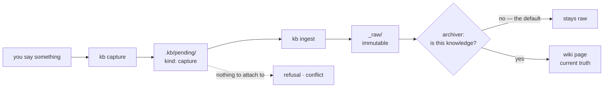
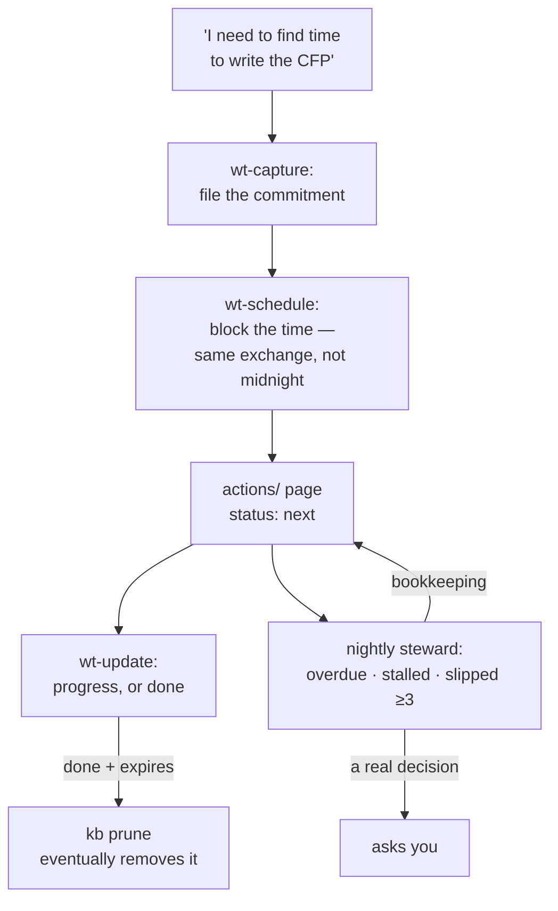

# Concepts — the mental model

This page *explains*; it never *specifies*. Every contract mentioned here is normative
only in [ARCHITECTURE.md on the `spec`
branch](https://github.com/AlmogBaku/aos/blob/spec/ARCHITECTURE.md) — section links
below. If this page and the spec ever disagree, the spec wins (and that's a bug worth a
[BUILD-GAPS](BUILD-GAPS.md) row).

## The big picture


The layering borrows Brad Frost's atomic design
([§1.2](https://github.com/AlmogBaku/aos/blob/spec/ARCHITECTURE.md#12-mental-model-atomic-design)):
**skills** are the atoms, **infra capabilities** (kb, capability-lifecycle) the molecules,
**use-case capabilities** (work-tracker) the organisms. The kit ships **templates** —
generic structure, personalization slots empty. Your harness runs **pages** — the same
capability instantiated with *your* answers. The transform between template and page is
where the whole product lives.

## Capability

*A distro package for your agent* ([§2](https://github.com/AlmogBaku/aos/blob/spec/ARCHITECTURE.md#2-the-capability-package)).
Installing one does many things — places skills, creates an agent, registers schedules,
sometimes installs a tool — and, like a good package, it **declares** all of it so the
installer can perform, record, and reverse it.

A capability is a directory composing five building blocks
([§2.5](https://github.com/AlmogBaku/aos/blob/spec/ARCHITECTURE.md#25-the-capability-lifecycle-briefing-then-building-blocks)):

| Block | What it is | Shipped as |
|---|---|---|
| Skills | knowledge agents load on demand | `skills/<skill>/SKILL.md` — portable [Agent Skills](https://agentskills.io) folders |
| Agents | personas that run scheduled/delegated work | `agents/<name>.agent.yaml` + prompt bodies in `agents/<name>/` |
| Tools | deterministic executables (no LLM inside) | e.g. [`capabilities/kb/tool/`](../capabilities/kb/tool/) |
| Crons | schedules, agent-type or script-direct | `schedules[]` in the manifest |
| Patches | harness modifications, when unavoidable | `adapters/<harness>/` |

Two files have special roles:

- **`CAPABILITY.md` is the installer's briefing** — typed frontmatter (machine-checked)
  plus prose the installing LLM reads for judgment ("create the steward *before* its
  schedule", "this must run before kb's promote"). Consumed at install, never loaded at
  runtime.
- **The entry skill is the runtime face** — every capability ships one skill named after
  itself (`skills/<id>/SKILL.md`): a short map of where things live and which skill/verb
  does which job, with depth one `reference/` hop away. It's the thing an agent can
  always "hold" to understand the capability.
- **A skill's installed name is computed, and single-owner** — your harness keeps one flat
  list of skills, so a name is a claim, not a label. Ids inside a capability are short and
  local (`init`, `drain`); the name a skill actually installs under is
  `<skill_prefix><id>` — `kb-init`, `wt-schedule`, `capability-install` — so it still says
  what it is when it's sitting next to thirty other skills. The installer computes it and
  refuses to install a name something else already owns (yours, another capability's, or a
  skill aos never touched) rather than silently overriding it. **Agents work the same way** —
  they land in a flat per-harness namespace too, so `archiver` installs as `kb-archiver`,
  computed from the same prefix and gated the same way. Skills are named for actions, agents
  for roles.

  Because the name is computed, shipped prose never writes it: a reference is authored as a
  slot (`{{skill: <id>}}`, `{{agent: <id>}}`) and the render substitutes the real name. That
  is what keeps a prefix change from silently invalidating every cross-reference in the kit —
  the render fails loudly on a slot that names nothing, and CI catches a hand-written name.
  The rules live in the `capability-lifecycle` skill's naming reference.

## The household — where aos lives on your machine

([§3.1](https://github.com/AlmogBaku/aos/blob/spec/ARCHITECTURE.md#31-the-overlay-the-personal-root-mirrored-paths))
Everything aos touches sits in one directory — the **household**, `~/aos` by default (a
plain directory, not itself a repo):

```text
~/aos/
├── upstream/    # the kit clone — pristine; nothing personal ever lands here
├── personal/    # your ONE private repo: answers, rendered skills, private capabilities
├── vendor/      # third-party skills the kit references rather than ships (on demand)
└── .aos/        # machine-local state: the lockfile, the kb principal list
```

The words worth keeping: `upstream/` (and any future org root) is a **distribution**;
`personal/` is **your instance**, which travels between machines via its own private
remote; only `.aos/` is machine-local. The split is what lets one clone serve both jobs:
`upstream/` is the aos source your install reads from *and* the clone you'd edit to
contribute, so a branch cut from it is clean by construction — change it only for what
belongs to everybody ([CONTRIBUTING](../CONTRIBUTING.md)).

**Renders are pinned, and harnesses link to them.** Installing doesn't copy a skill into
your harness. Filling a skill's `{{mod}}` slots with your answers is a judgment call, not a
substitution, so the result is written once into `personal/` and committed — that commit
*is* the render's record, an upgrade reviews as a git diff, and rollback is `git revert`.
Your harness then symlinks to that one canonical copy. No second source of truth, and
nothing to reconcile when you edit the render by hand.

## The overlay — why upgrades can't eat your personalization

The one **inviolable** contract
([§3](https://github.com/AlmogBaku/aos/blob/spec/ARCHITECTURE.md#3-overlay--onboarding--the-inviolable-contract)).
Your answers, nuances, and red lines live in `MOD.md` files (one global, one per
capability) plus `kb-registry.yaml` — together, the **overlay family**. Three rules make
them safe:

1. **Upstream never ships them.** The kit ships `MOD.example.md` seeds; your real
   `MOD.md` is written only by the interview (`capability-onboard`), in your `personal/` repo.
2. **Upstream never writes them.** `git pull` cannot touch a path it doesn't contain.
3. **Upgrades re-apply your MOD** — MOD.md is re-applied to the fresh upstream
   (your current install is only checked for uncaptured edits, which get folded in
   first), diff shown before anything lands.

Hand-editing installed artifacts is normal and expected; the agent captures your edits
back into MOD.md when it notices them (the round-trip,
[§3.3](https://github.com/AlmogBaku/aos/blob/spec/ARCHITECTURE.md#33-round-trip-edits-flow-back-to-modmd)).

## Onboarding — typed questions, one interview

Every capability may ship an `ONBOARDING.md`: typed questions in frontmatter (`string`,
`enum`, `path`, …, plus `secret: true` for values that go to the harness's secret store,
never into files), a conversational script in the body. The `capability-onboard` skill runs
it and writes your MOD.md. Re-runs only ask what's missing; `--refresh` re-asks
everything and shows the diff first.

## Knowledge bases — bases, routing, and why shared KBs are special

([§4](https://github.com/AlmogBaku/aos/blob/spec/ARCHITECTURE.md#4-knowledge-bases-registry-routing-authorization))
A KB instance is a **base** (one git repo). You may have several — personal, a shared
work KB your colleagues pull — all registered in your user-owned `kb-registry.yaml`.

- **Routing is rules first.** Channel rules, explicit tags (`work: …`), and keyword
  rules decide deterministically; an LLM is consulted only above a confidence bar, and
  **never for a shared base** — a repo other people pull never accepts LLM-guessed
  writes. Capture latency is sacred: routing never blocks a capture on a question.
- **The base engine** ([§4.4](https://github.com/AlmogBaku/aos/blob/spec/ARCHITECTURE.md#44-the-base-engine-store-curation-state)):
  immutable `_raw/` source material + current-truth wiki pages; a skeptical nightly
  promotion (most captures aren't knowledge — default is empty); one capped attention
  window per person.
- **The `kb` tool** is the deterministic executor for all of it — capture, ingest, find,
  search, lint, sync, grants — files and exit codes, no LLM, no agent. Agents use it;
  they don't reimplement it.
- **Git is the audit trail.** Every write is its own commit: the **author** is the
  person whose knowledge it is, the **committer** is the agent that applied it. That is
  git's own two-identity model, so `blame` and every forge already understand it, and
  there is no second log file to drift from the truth.

### The `.kb/` split — three subdirectories, three questions

A base's own root is for *knowledge*. The tool's bookkeeping lives under `.kb/`, and each
subdirectory answers exactly one question — which is also the test for whether something
belongs there at all:

| Directory | The question it answers | Gitignored? |
|---|---|---|
| `.kb/pending/` | what is **waiting on someone** | no — it syncs |
| `.kb/work/` | what procedure is **in progress** | no — a long import spans days |
| `.kb/cache/` | what is **rebuildable** | yes — deleting it loses nothing |

Anything fitting none of the three does not belong under `.kb/`. That is why there is no
log file (git is the audit trail), no report file (the report *is* the tool's stdout), and
no archive directory (`kb archive` is a `git rm` with a reason, and git remembers).

### Pending is the only queue

A queue *file* is only justified when the work item has no artifact of its own.

This is worth stating because the obvious design is wrong. A capture already *is* a file;
an unresolved `[[mention]]` already *is* text in a page. Giving either its own queue entry
means two places to keep in step, and the queue is the one that rots — it goes stale
silently, because nothing breaks when it disagrees with reality.

Only two things genuinely have nothing to attach to: a **refusal** (the write never
happened, so there is no file) and a **sync conflict** (nothing was committed). Everything
else in `.kb/pending/` is a pointer to a real artifact, and `kind:` says which sort:
`capture` · `entity` · `finding` · `refusal` · `conflict`.

`waits_on:` is the field that makes it a queue rather than a pile — `agent` or `human`.
Those are two different reads of the same directory, and picking the wrong one returns an
empty list at exit 0: `kb inbox` is an *agent's* ingest work, scoped to one principal;
`kb pending list --where waits_on=human` is the *human's* drain queue.



### `expires` is the only lifecycle rule

One field decides whether anything is ever deleted: `expires`. `kb prune` reads it and
nothing else. That is the whole lifecycle model, and the restraint is deliberate — a store
with several competing notions of "old" is one where nobody can predict what will vanish.

Two fields look like it and are not:

- **`due:`** is a deadline. It says when something *matters*, and nothing about it deletes
  anything — a commitment whose `due` has passed is late, not gone.
- **`review_by:`** means *ask me again*. It is the exact opposite of *delete it*, which is
  why it was never migrated into `expires`: mechanically renaming it would have turned
  "remind me about this" into "throw it away".

`kb prune` reads `expires` alone, not `status`. An `expires` on a live commitment deletes
a live commitment. "Only set it when the thing is finished" is a discipline the writer
keeps, never a guarantee the tool makes.

### The principal — git already models this

Two identities are involved in every write, and git has had the vocabulary all along: the
**author** is the human whose knowledge it is, the **committer** is the agent that applied
it. So there is nothing to invent and no log to maintain — `git log --format='%an %cn'`
answers "whose is this, and who wrote it down".

The list mapping this machine's humans to their bases is `<home>/.aos/kb-principal.yml`,
written by the tool on first use. You are never prompted for it: with no git identity
configured, the write still lands, lint reports it, and onboarding fixes it later. Blocking
a capture to ask who you are would trade the one property capture cannot lose.

### Curation modes — and why centralized ingestion is a non-goal

`curation: self` (the default) means everyone drains their own captures. `designated`
means one named principal holds the wiki write grants while the others capture and
propose.

The tempting third option — one agent ingests for everybody — is deliberately absent. It
loses the property that makes capture good in the first place: the capturing agent was
*there*, holding the conversation the capture came from. A central ingester has the text
and none of the context, and on a shared base it also means one household's agent reads
everyone else's raw material.

### When more than one person shares a base

A shared base is a repo other humans pull, so a handful of things that were free for one
person stop being free.

- **Everyone ingests their own.** Your agent captures with your context — that is the
  whole advantage, and it stays. `kb inbox` shows *your* pending captures; somebody
  else's raw material never enters your agent's context, which matters because that
  agent can write shared knowledge.
- **Every shared record is one file.** Captures, review-queue entries, and each person's
  attention window are separate files, so two machines syncing have nothing to merge.
  This is the same rule that made the inbox a view rather than a file, applied
  everywhere it should have been.
- **Who promotes is a choice you make, not a setting.** Either everyone curates their
  own captures (the default), or one person holds the wiki write grants and the others
  capture and propose. The grants table already says which; no new configuration exists.
- **Nothing neutral watches a shared base yet.** The deterministic checks exist — the
  grants audit, "no LLM-routed write ever reached this base", index drift, unattributed
  commits — and any member can run them with `kb lint`. What does not exist is a
  neutral actor to run them on everyone's behalf: whichever household runs the checks is
  also the one whose agent reads everybody else's raw material. CI was the obvious
  candidate and is deliberately not shipped, because it answers the mechanical half while
  the half that matters — who decides what gets promoted — is still open. Worth knowing
  if you are relying on a forge to enforce anything: on a private repo, GitHub gates
  rulesets, branch protection and CODEOWNERS to its paid plans, so a free-plan repo
  cannot block a bad push at all.

## Work-tracker — the speech-act split, and GTD as prior art

The whole capability rests on one distinction, and it is not about content words:

| You said | It is | What happens |
|---|---|---|
| *"write the CFP"* | an instruction to the agent | it writes it. Nothing is filed. |
| *"I need to find time to write the CFP"* | a commitment of yours | it gets filed, and time gets found |
| *"Robin says the venue is booked"* | knowledge | it goes to your KB, not your list |

The first two share nearly every word. Getting the split wrong in either direction is the
failure mode: file everything and your list becomes a transcript of your chat history; file
nothing and the capability may as well not exist. This is why the judgment is *whose work
is it*, not *does this sound like a task*.

**A list is a view, never a file.** There is no list file to fall out of date,
because "what's next" is a query (`kb find --where status=next`) over pages that each carry
their own state. Four statuses are the entire lifecycle: `next` · `waiting` · `someday` ·
`done`. `someday` is what protects the list from every passing musing becoming a scheduled
commitment, and `done` carrying an `expires` is what stops it becoming a graveyard.

**GTD is prior art we borrow vocabulary from, not a methodology we implement.** Next
actions, waiting-on, someday/maybe — the words are useful and widely understood, so we use
them. The rituals are not implemented: no weekly review ceremony, no contexts, no
inbox-zero discipline. A nightly steward keeps the backlog honest instead, and it only ever
does maintenance — it never captures new work and never does anything you are waiting on,
because both of those happen the moment you speak.



## Install — the LLM is the installer

([§5](https://github.com/AlmogBaku/aos/blob/spec/ARCHITECTURE.md#5-installation-the-harness-installs-the-batteries))
There is no installer program — and after bootstrap, not even a bootstrap file: the
**capability-lifecycle** capability puts install/upgrade/remove/evolve into your harness
as skills. [`BOOTSTRAP.md`](../BOOTSTRAP.md) only welcomes you, checks prerequisites,
and installs that one capability; its skills do the rest, loading your harness runtime's
cheat-sheet at the steps that need it. Four mechanisms keep it honest:

- **Cheat-sheets, not adapters.** Per-harness support is one lean doc
  (`capabilities/capability-lifecycle/skills/capability-lifecycle/reference/harness-<harness-runtime>.md`) teaching the mapping (agent → Hermes profile,
  schedule → `hermes cron create`, secret → `.env`). Knowledge, not glue code — a new
  harness costs one document, and even that is an aid, not a gate: without one, the
  agent derives the mapping itself per BOOTSTRAP.
- **The diff gate.** Every write is shown to you in full before it lands. Never
  optional.
- **The lockfile.** Everything materialized is recorded in `.aos/installs.lock.yaml`
  (paths, hashes, links, owned schedule ids) — written and verified by the `aos-cap` tool,
  never by the model. Removal walks it backwards; no record, no artifact. And your
  `MOD.md` *states what you changed*: upgrades re-apply it to fresh upstream, and the evolve skill
  writes your changes into it so they survive.
- **One render, linked.** What the installer writes is a render committed in `personal/`;
  what your harness gets is a symlink to it. Copies are refused, so "what is installed" has
  exactly one answer, and the safety net for all of it is your `personal/` git history.

A skill the kit doesn't own is referenced, never vendored in: `capability-lifecycle` keeps
Anthropic's [`skill-creator`](https://github.com/anthropics/skills) under `vendor/` (or via
your harness's plugin mechanism) and links to it — recorded like anything else, so removal
is exact. It's best-effort: no network, no `skill-creator`, no drama.

If a host feature is missing (no cron, no `uv`), the capability **degrades, declared**:
schedules become invocable run-cards, tools fall back to prose procedures — each
capability names its degraded modes up front. "Missing" means the *harness* can't express
the feature, read off the cheat-sheet — a channel it supports but you haven't paired yet is
a setup note, not a refused install.

**What aos writes into your own agent is one block, and only one.** Agents aos *creates*
(the archiver, the steward) get their whole identity file from us. The agent you already
had is yours: it receives a single marked context block — the rule that says *stop and plan
before creating standing automation* — and nothing else. Your identity facts stay in
`MOD.md` and are applied at render time, because your harness already owns user context and
a second copy would only drift
([§5.3](https://github.com/AlmogBaku/aos/blob/spec/ARCHITECTURE.md#53-what-the-cheat-sheets-direct-the-llm-to-write)).

## How decisions evolve

([§8](https://github.com/AlmogBaku/aos/blob/spec/ARCHITECTURE.md#8-decision-index))
Every design decision is either a **firm position** (has a rationale and a section
number; challenge it with an issue *plus a counter-proposal*) or an **open RFC** (the
eight contested cores — naming, multi-KB routing, permission vocabulary, …). Building
against the current text is always allowed; resolving an RFC quietly inside a doc never
is. When building reveals the spec is wrong, the spec gets fixed — the
[BUILD-GAPS ledger](BUILD-GAPS.md) is the audit trail of every such fix.

## Glossary

| Term | Meaning |
|---|---|
| **harness** | The agent product you already run (Hermes, NanoClaw, OpenClaw, …) |
| **harness runtime** | The program hosting your agent — names its cheat-sheet (see BOOTSTRAP.md) |
| **household** | `~/aos` — the one directory aos lives in: `upstream/`, `personal/`, `vendor/`, `.aos/` |
| **distribution / instance** | `upstream/` (and future org roots) ship capabilities; `personal/` is *your* instance of them |
| **capability** | An installable directory of skills/agents/tools/crons/patches |
| **entry skill** | `skills/<id>/` — the capability's runtime face and map |
| **installed name** | The name a skill ships under: `<skill_prefix><id>`, computed by `aos-cap skills`, unique across the harness. An agent's is computed the same way, from the same prefix, by `aos-cap agents` |
| **overlay** | Your `MOD.md` files + `kb-registry.yaml`; user-owned, never shipped |
| **base** | One KB instance == one git repo, registered in `kb-registry.yaml` |
| **materialize** | The installer writing a capability's artifacts into your harness |
| **render (pinned)** | A capability's files with your `MOD.md` applied, committed in `personal/`; your harness symlinks to it |
| **vendor** | `~/aos/vendor` — third-party skills the kit references and keeps current, never copies into itself |
| **context block** | A marked (`aos:<capability>:<block-id>@<version>`) passage aos maintains inside an agent's own file |
| **cheat-sheet** | `capabilities/capability-lifecycle/skills/capability-lifecycle/reference/harness-<harness-runtime>.md` — the harness half of the mapping, loaded per operation |
| **lockfile** | `.aos/installs.lock.yaml` — the honest record of what was installed |
| **diff gate** | You see every write before it happens; never optional |
| **degraded mode** | A capability's declared behavior when a host feature is absent |
