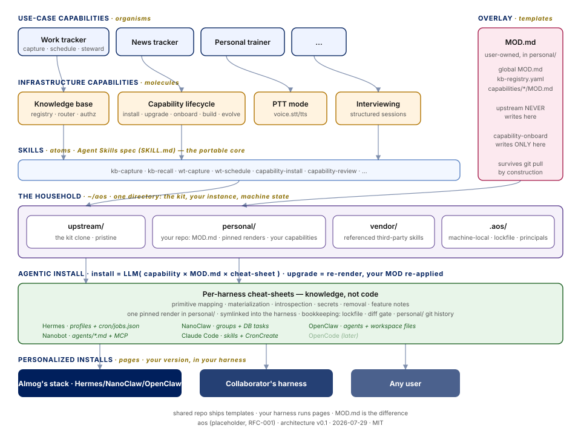

# Concepts — the mental model

This page *explains*; it never *specifies*. Every contract mentioned here is normative
only in [ARCHITECTURE.md on the `spec`
branch](https://github.com/AlmogBaku/aos/blob/spec/ARCHITECTURE.md) — section links
below. If this page and the spec ever disagree, the spec wins (and that's a bug worth a
[BUILD-GAPS](BUILD-GAPS.md) row).

## The big picture



The layering borrows Brad Frost's atomic design
([§1.2](https://github.com/AlmogBaku/aos/blob/spec/ARCHITECTURE.md#12-mental-model-atomic-design)):
**skills** are the atoms, **infra capabilities** (kb, capability-lifecycle) the molecules,
**use-case capabilities** (gtd-capture) the organisms. The kit ships **templates** —
generic structure, personalization slots empty. Your harness runs **pages** — the same
capability instantiated with *your* answers. The transform between template and page is
where the whole product lives.

## Capability

*A distro package for your agent* ([§2](https://github.com/AlmogBaku/aos/blob/spec/ARCHITECTURE.md#2-the-capability-package)).
Installing one does many things — places skills, creates an agent, registers schedules,
sometimes installs a tool — and, like a good package, it **declares** all of it so the
installer can perform, record, and reverse it.

A capability is a directory composing five building blocks
([§2.5](https://github.com/AlmogBaku/aos/blob/spec/ARCHITECTURE.md#25-the-capability-lifecycle-briefing-then-building-blocks)):

| Block | What it is | Shipped as |
|---|---|---|
| Skills | knowledge agents load on demand | `skills/<skill>/SKILL.md` — portable [Agent Skills](https://agentskills.io) folders |
| Agents | personas that run scheduled/delegated work | `agents/<name>.agent.yaml` + prompt bodies in `agents/<name>/` |
| Tools | deterministic executables (no LLM inside) | e.g. [`capabilities/kb/tool/`](../capabilities/kb/tool/) |
| Crons | schedules, agent-type or script-direct | `schedules[]` in the manifest |
| Patches | harness modifications, when unavoidable | `adapters/<harness>/` |

Two files have special roles:

- **`CAPABILITY.md` is the installer's briefing** — typed frontmatter (machine-checked)
  plus prose the installing LLM reads for judgment ("create the drainer *before* its
  schedule", "this must run before kb's promote"). Consumed at install, never loaded at
  runtime.
- **The entry skill is the runtime face** — every capability ships one skill named after
  itself (`skills/<id>/SKILL.md`): a short map of where things live and which skill/verb
  does which job, with depth one `reference/` hop away. It's the thing an agent can
  always "hold" to understand the capability.
- **A skill's installed name is computed, and single-owner** — your harness keeps one flat
  list of skills, so a name is a claim, not a label. Ids inside a capability are short and
  local (`init`, `drain`); the name a skill actually installs under is
  `<skill_prefix><id>` — `kb-init`, `gtd-drain`, `capability-install` — so it still says
  what it is when it's sitting next to thirty other skills. The installer computes it and
  refuses to install a name something else already owns (yours, another capability's, or a
  skill aos never touched) rather than silently overriding it. Skills are named for actions,
  agents for roles. The rules live in the lifecycle capability's
  `reference/naming.md`.

## The household — where aos lives on your machine

([§3.1](https://github.com/AlmogBaku/aos/blob/spec/ARCHITECTURE.md#31-the-overlay-the-personal-root-mirrored-paths))
Everything aos touches sits in one directory — the **household**, `~/aos` by default (a
plain directory, not itself a repo):

```text
~/aos/
├── upstream/    # the kit clone — pristine; nothing personal ever lands here
├── personal/    # your ONE private repo: answers, rendered skills, private capabilities
├── vendor/      # third-party skills the kit references rather than ships (on demand)
└── .aos/        # machine-local state: the lockfile
```

The words worth keeping: `upstream/` (and any future org root) is a **distribution**;
`personal/` is **your instance**, which travels between machines via its own private
remote; only `.aos/` is machine-local. The split is what lets your daily install double as
your dev checkout — a branch cut from `upstream/` is clean by construction
([CONTRIBUTING](../CONTRIBUTING.md)).

**Renders are pinned, and harnesses link to them.** Installing doesn't copy a skill into
your harness. Filling a skill's `{{mod}}` slots with your answers is a judgment call, not a
substitution, so the result is written once into `personal/` and committed — that commit
*is* the render's record, an upgrade reviews as a git diff, and rollback is `git revert`.
Your harness then symlinks to that one canonical copy. No second source of truth, and
nothing to reconcile when you edit the render by hand.

## The overlay — why upgrades can't eat your personalization

The one **inviolable** contract
([§3](https://github.com/AlmogBaku/aos/blob/spec/ARCHITECTURE.md#3-overlay--onboarding--the-inviolable-contract)).
Your answers, nuances, and red lines live in `MOD.md` files (one global, one per
capability) plus `kb-registry.yaml` — together, the **overlay family**. Three rules make
them safe:

1. **Upstream never ships them.** The kit ships `MOD.example.md` seeds; your real
   `MOD.md` is written only by the interview (`capability-onboard`), in your `personal/` repo.
2. **Upstream never writes them.** `git pull` cannot touch a path it doesn't contain.
3. **Upgrades re-apply your MOD** — MOD.md is re-applied to the fresh upstream
   (your current install is only checked for uncaptured edits, which get folded in
   first), diff shown before anything lands.

Hand-editing installed artifacts is normal and expected; the agent captures your edits
back into MOD.md when it notices them (the round-trip,
[§3.3](https://github.com/AlmogBaku/aos/blob/spec/ARCHITECTURE.md#33-round-trip-edits-flow-back-to-modmd)).

## Onboarding — typed questions, one interview

Every capability may ship an `ONBOARDING.md`: typed questions in frontmatter (`string`,
`enum`, `path`, …, plus `secret: true` for values that go to the harness's secret store,
never into files), a conversational script in the body. The `capability-onboard` skill runs
it and writes your MOD.md. Re-runs only ask what's missing; `--refresh` re-asks
everything and shows the diff first.

## Knowledge bases — bases, routing, and why shared KBs are special

([§4](https://github.com/AlmogBaku/aos/blob/spec/ARCHITECTURE.md#4-knowledge-bases-registry-routing-authorization))
A KB instance is a **base** (one git repo). You may have several — personal, a shared
work KB your colleagues pull — all registered in your user-owned `kb-registry.yaml`.

- **Routing is rules first.** Channel rules, explicit tags (`work: …`), and keyword
  rules decide deterministically; an LLM is consulted only above a confidence bar, and
  **never for a shared base** — a repo other people pull never accepts LLM-guessed
  writes. Capture latency is sacred: routing never blocks a capture on a question.
- **The base engine** ([§4.4](https://github.com/AlmogBaku/aos/blob/spec/ARCHITECTURE.md#44-the-base-engine-store-curation-state)):
  immutable `raw/` captures + current-truth wiki pages; a skeptical nightly promotion
  (most captures aren't knowledge — default is empty); one capped `state.yaml`
  attention window per base.
- **The `base` tool** is the deterministic executor for all of it — capture, inbox,
  search, lint, sync, grants — files and exit codes, no LLM, no agent. Agents use it;
  they don't reimplement it.

## Install — the LLM is the installer

([§5](https://github.com/AlmogBaku/aos/blob/spec/ARCHITECTURE.md#5-installation-the-harness-installs-the-batteries))
There is no installer program — and after bootstrap, not even a bootstrap file: the
**capability-lifecycle** capability puts install/upgrade/remove/evolve into your harness
as skills. [`BOOTSTRAP.md`](../BOOTSTRAP.md) only welcomes you, checks prerequisites,
and installs that one capability; its skills do the rest, loading your harness runtime's
cheat-sheet at the steps that need it. Four mechanisms keep it honest:

- **Cheat-sheets, not adapters.** Per-harness support is one lean doc
  (`capabilities/capability-lifecycle/skills/capability-lifecycle/reference/harness-<harness-runtime>.md`) teaching the mapping (agent → Hermes profile,
  schedule → `hermes cron create`, secret → `.env`). Knowledge, not glue code — a new
  harness costs one document, and even that is an aid, not a gate: without one, the
  agent derives the mapping itself per BOOTSTRAP.
- **The diff gate.** Every write is shown to you in full before it lands. Never
  optional.
- **The lockfile.** Everything materialized is recorded in `.aos/installs.lock.yaml`
  (paths, hashes, links, owned schedule ids) — written and verified by the `aos-lock` tool,
  never by the model. Removal walks it backwards; no record, no artifact. And your
  `MOD.md` *states what you changed*: upgrades re-apply it to fresh upstream, and the evolve skill
  writes your changes into it so they survive.
- **One render, linked.** What the installer writes is a render committed in `personal/`;
  what your harness gets is a symlink to it. Copies are refused, so "what is installed" has
  exactly one answer, and the safety net for all of it is your `personal/` git history.

A skill the kit doesn't own is referenced, never vendored in: `capability-lifecycle` keeps
Anthropic's [`skill-creator`](https://github.com/anthropics/skills) under `vendor/` (or via
your harness's plugin mechanism) and links to it — recorded like anything else, so removal
is exact. It's best-effort: no network, no `skill-creator`, no drama.

If a host feature is missing (no cron, no `uv`), the capability **degrades, declared**:
schedules become invocable run-cards, tools fall back to prose procedures — each
capability names its degraded modes up front. "Missing" means the *harness* can't express
the feature, read off the cheat-sheet — a channel it supports but you haven't paired yet is
a setup note, not a refused install.

**What aos writes into your own agent is one block, and only one.** Agents aos *creates*
(the drainer, the archiver) get their whole identity file from us. The agent you already
had is yours: it receives a single marked context block — the rule that says *stop and plan
before creating standing automation* — and nothing else. Your identity facts stay in
`MOD.md` and are applied at render time, because your harness already owns user context and
a second copy would only drift
([§5.3](https://github.com/AlmogBaku/aos/blob/spec/ARCHITECTURE.md#53-what-the-cheat-sheets-direct-the-llm-to-write)).

## How decisions evolve

([§8](https://github.com/AlmogBaku/aos/blob/spec/ARCHITECTURE.md#8-decision-index))
Every design decision is either a **firm position** (has a rationale and a section
number; challenge it with an issue *plus a counter-proposal*) or an **open RFC** (the
eight contested cores — naming, multi-KB routing, permission vocabulary, …). Building
against the current text is always allowed; resolving an RFC quietly inside a doc never
is. When building reveals the spec is wrong, the spec gets fixed — the
[BUILD-GAPS ledger](BUILD-GAPS.md) is the audit trail of every such fix.

## Glossary

| Term | Meaning |
|---|---|
| **harness** | The agent product you already run (Hermes, NanoClaw, OpenClaw, …) |
| **harness runtime** | The program hosting your agent — names its cheat-sheet (see BOOTSTRAP.md) |
| **household** | `~/aos` — the one directory aos lives in: `upstream/`, `personal/`, `vendor/`, `.aos/` |
| **distribution / instance** | `upstream/` (and future org roots) ship capabilities; `personal/` is *your* instance of them |
| **capability** | An installable directory of skills/agents/tools/crons/patches |
| **entry skill** | `skills/<id>/` — the capability's runtime face and map |
| **installed name** | The name a skill ships under: `<skill_prefix><id>`, computed by `aos-lock skills`, unique across the harness |
| **overlay** | Your `MOD.md` files + `kb-registry.yaml`; user-owned, never shipped |
| **base** | One KB instance == one git repo, registered in `kb-registry.yaml` |
| **materialize** | The installer writing a capability's artifacts into your harness |
| **render (pinned)** | A capability's files with your `MOD.md` applied, committed in `personal/`; your harness symlinks to it |
| **vendor** | `~/aos/vendor` — third-party skills the kit references and keeps current, never copies into itself |
| **context block** | A marked (`aos:<capability>:<block-id>@<version>`) passage aos maintains inside an agent's own file |
| **cheat-sheet** | `capabilities/capability-lifecycle/skills/capability-lifecycle/reference/harness-<harness-runtime>.md` — the harness half of the mapping, loaded per operation |
| **lockfile** | `.aos/installs.lock.yaml` — the honest record of what was installed |
| **diff gate** | You see every write before it happens; never optional |
| **degraded mode** | A capability's declared behavior when a host feature is absent |
